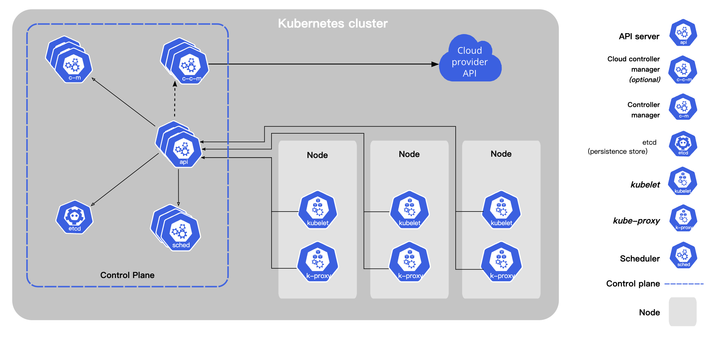
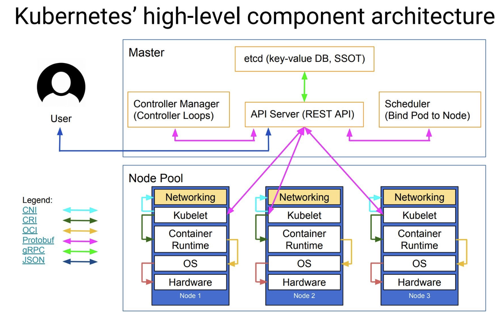

### 一、快速入门

#### 1.1 Kubernete简介

[Kubernetes](https://kubernetes.io/) 一词来自希腊语，意思是 “飞行员” 或 “舵手”。这个名字很贴切，Kubernetes 可以帮助你在波涛汹涌的容器海洋中航行。

Kubernetes 是做什么的？什么是 Docker？什么是容器编排？Kubernetes 是如何工作和扩展的？你可能还有很多其他的问题，本文将一一为你解答。

这篇文章适合初学者，尤其是那些工作忙碌，没有办法抽出太多时间来了解 Kubernetes 和云原生的开发者们，希望本文可以帮助你进入 Kubernetes 的世界。

简而言之，Kubernetes 提供了一个平台或工具来帮助你快速协调或扩展容器化应用，特别是在 [Docker](https://docker.com/) 容器。让我们深入了解一下这些概念。

#### 1.2 容器和容器化

那么什么是容器呢？

要讨论容器化首先要谈到虚拟机 (VM)：

**虚拟机**：包含了整个操作系统及所有的库，对应用程序来说，这个镜像过于臃肿，其中大部分组件并没有被应用程序直接调用。如果你需要重新创建、备份或扩展这个应用程序，就需要复制整个环境（虚拟机镜像），在新环境中启动应用通常需要几十秒甚至几分钟时间。如果你想单独升级应用中的某个组件，比如说 Vue 应用，就需要重建整个虚拟机镜像。另外，如果你的两个应用依赖同一个底层镜像，升级底层镜像会同时影响这两个应用，而有时候，你只需要升级其中一个应用的依赖而已。这就是所谓的 “依赖陷阱”

**容器**：是继虚拟机之后更高层次的抽象，在这层抽象中，整个应用程序的每个组件被单独打包成一个个独立的单元，这个单元就是所谓的容器。通过这种方式，可以将代码和应用服务从底层架构中分离出来，实现了完全的可移植性（在任何操作系统或环境上运行应用的能力）。

#### 1.3 从docker开始

现在你已经对容器有一定了解了吧？Docker 是最常用的容器化工具，也是最流行的容器运行时。

Docker 开源于 2013 年。用于打包和创建容器，管理基于容器的应用。所有 Linux 发行版、Windows 和 macOS 都支持 Docker。

还有其他的容器化工具，如 [CoreOS rkt](https://coreos.com/rkt/)、[Mesos Containerizer](https://mesos.apache.org/documentation/latest/mesos-containerizer/) 和 [LXC](https://linuxcontainers.org/)。但是目前，绝大多数的容器化应用都是在 Docker 上运行的。

#### 1.4 再到Kuberbetes

首先，简单介绍一下历史。Kubernetes 是 Google 基于其内部容器调度平台 Borg 的经验开发的。2014 年开源，并作为 CNCF（云原生计算基金会）的核心发起项目。

那么 Kubernetes 又跟容器是什么关系呢？让我们再回到上面的例子。假设我们的应用爆火，每天的注册用户越来越多。

现在，我们需要增加后端资源，使浏览我们网站的用户在浏览页面时加载时间不会过长或者超时。最简单的方式就是增加容器的数量，然后使用负载均衡器将传入的负载（以用户请求的形式）分配给容器。

这样做虽然行之有效，但也只能在用户规模有限的情况下使用。当用户请求达到几十万或几百万时，这种方法也是不可扩展的。你需要管理几十个也许是几百个负载均衡器，这本身就是另一个令人头疼的问题。如果我们想对网站或应用进行任何升级，也会遇到问题，因为负载均衡不会考虑到应用升级的问题。我们需要单独配置每个负载均衡器，然后升级该均衡器所服务的容器。想象一下，当你有 20 个负载均衡器和每周 5 或 6 个小的更新时，你将不得不进行大量的手工劳动。

我们需要的是一种可以一次性将变更传递给所有受控容器的方法，同时也需要一种可以轻松地调度可用容器的方法，这个过程还必须要是自动化的，这正是 Kubernetes 所做的事情。

接下来，我们将探讨 Kubernetes 究竟是如何工作的，它的各种组件和服务，以及更多关于如何使用 Kubernetes 来编排、管理和监控容器化环境。为了简单起见，假设我们使用的是 Docker 容器，尽管如前所述，Kubernetes 除了支持 Docker 之外，还支持其他几种容器平台。

#### 1.5 kubernetes 架构和组件

首先，最重要的是你需要认识到 Kubernetes 利用了 “期望状态” 原则。就是说，你定义了组件的期望状态，而 Kubernetes 要将它们始终调整到这个状态。

例如，你想让你的 Web 服务器始终运行在 4 个容器中，以达到负载均衡的目的，你的数据库复制到 3 个不同的容器中，以达到冗余的目的。这就是你想要的状态。如果这 7 个容器中的任何一个出现故障，Kubernetes 引擎会检测到这一点，并自动创建出一个新的容器，以确保维持所需的状态。

例如，你想让你的 Web 服务器始终运行在 4 个容器中，以达到负载均衡的目的，你的数据库复制到 3 个不同的容器中，以达到冗余的目的。这就是你想要的状态。如果这 7 个容器中的任何一个出现故障，Kubernetes 引擎会检测到这一点，并自动创建出一个新的容器，以确保维持所需的状态。

现在我们来定义一些 Kubernetes 的重要组件。

当你第一次设置 Kubernetes 时，你会创建一个集群。所有其他组件都是集群的一部分。你也可以创建多个虚拟集群，称为命名空间 (namespace)，它们是同一个物理集群的一部分。这与你可以在同一物理服务器上创建多个虚拟机的方式非常相似。如果你不需要，也没有明确定义的命名空间，那么你的集群将在始终存在的默认命名空间中创建。

Kubernetes 运行在节点 (node) 上，节点是集群中的单个机器。如果你有自己的硬件，节点可能对应于物理机器，但更可能对应于在云中运行的虚拟机。节点是部署你的应用或服务的地方，是 Kubernetes 工作的地方。有 2 种类型的节点 ——master 节点和 worker 节点，所以说 Kubernetes 是主从结构的。

主节点是一个控制其他所有节点的特殊节点。一方面，它和集群中的任何其他节点一样，这意味着它只是另一台机器或虚拟机。另一方面，它运行着控制集群其他部分的软件。它向集群中的所有其他节点发送消息，将工作分配给它们，工作节点向主节点上的 API Server 汇报。

Master 节点本身也包含一个名为 API Server 的组件。这个 API 是节点与控制平面通信的唯一端点。API Server 至关重要，因为这是 worker 节点和 master 节点就 pod、deployment 和所有其他 Kubernetes API 对象的状态进行通信的点。

Worker 节点是 Kubernetes 中真正干活的节点。当你在应用中部署容器或 pod（稍后定义）时，其实是在将它们部署到 worker 节点上运行。Worker 节点托管和运行一个或多个容器的资源。

Kubernetes 中的逻辑而非物理的工作单位称为 pod。一个 pod 类似于 Docker 中的容器。记得我们在前面讲到，容器可以让你创建独立、隔离的工作单元，可以独立运行。但是要创建复杂的应用程序，比如 Web 服务器，你经常需要结合多个容器，然后在一个 pod 中一起运行和管理。这就是 pod 的设计目的 —— 一个 pod 允许你把多个容器，并指定它们如何组合在一起来创建应用程序。而这也进一步明确了 Docker 和 Kubernetes 之间的关系 —— 一个 Kubernetes pod 通常包含一个或多个 Docker 容器，所有的容器都作为一个单元来管理。

Kubernetes 中的 service 是一组逻辑上的 pod。把一个 service 看成是一个 pod 的逻辑分组，它提供了一个单一的 IP 地址和 DNS 名称，你可以通过它访问服务内的所有 pod。有了服务，就可以非常容易地设置和管理负载均衡，当你需要扩展 Kubernetes pod 时，这对你有很大的帮助，我们很快就会看到。

ReplicationController 或 ReplicaSet 是 Kubernetes 的另一个关键功能。它是负责实际管理 pod 生命周期的组件 —— 当收到指令时或 pod 离线或意外停止时启动 pod，也会在收到指示时杀死 pod，也许是因为用户负载减少。所以换句话说，ReplicationController 有助于实现我们所期望的指定运行的 pod 数量的状态。

#### 1.6 什么是Kubectl？

kubectl 是一个命令行工具，用于与Kubernetes集群和其中的 pod 通信。使用它你可以查看集群的状态，列出集群中的所有 pod，进入 pod 中执行命令等。你还可以使用 YAML 文件定义资源对象，然后使用kubectl 将其应用到集群中。

#### 1.7 Kubernetes 中的自动扩展

自动缩放时通过集群设置来实现的，当服务器需求增加时，增加节点数量，当需求减少时，则减少节点数量。但也要记住，节点是 “物理”结构 --- 我们把 “物理” 放在引号里，因为要记住，很多时候，他们实际上是虚拟机。

无论如何，节点是物理机器的事实意味着我们的云平台必须允许 kubernetes 引擎创建新机器。各种云提供商对 Kubernetes 支持基本都满足这一点。

#### 1.8 什么是kuberbetes Ingress 和 Egress？

外部用户或应用程序与 kubernets pod 交互，就像 pod 是一个真正的服务器一样。我们需要设置安全规则，允许那些流量可以进入和离开 “服务器”。就像我们为托管应用程序的服务器定义安全规则一样。

进入 Kubernetes pod 的流量成为 Ingress ，而从 pod 到集群外的出栈流量成为 egress。我们创建入口策略和出口策略的目的是限制不需要流量进入和流出服务。而这些策略也是定义 pod 使用的端口来接受传入和传输传出数据 / 流量的地方。

#### 1.9 什么是 Ingress Controller？

但是在定义入口和出口策略之前，你必须首先启动被称为 Ingress Controller（入口控制器）的组件；这个在集群中默认不启动。有不同类型的入口控制器，Kubernetes 项目默认只支持 Google Cloud 和开箱即用的 Nginx 入口控制器。通常云供应商都会提供自己的入口控制器。

#### 1.10 什么是 Replica 和 ReplicaSet？

为了保证应用程序的弹性，需要在不同节点上创建多个 pod 的副本。这些被称为 Replica。假设你所需的状态策略是 “让名为 webserver-1 的 pod 始终维持在 3 个副本”，这意味着 ReplicationController 或 ReplicaSet 将监控活动副本的数量，如果其中有任何一个 replica 因任何原因不可用（例如节点的故障），那么 Deployment Controller 将自动创建一个新的系统（定义如下）。

所需状态是在 deployment 中定义的。 Master 节点的中有一个子系统叫做 Deployment Controller，负责实际执行并使当前状态不断趋向于所需状态。

因此，举例来说，如果你目前有 2 个 pod 的副本，而你所希望的状态应该有 3 个，那么 Replication Controller 或 ReplicaSet 会自动检测到这个要求，并指示 Deployment Controller 根据预定义的设置部署一个新的 pod。

#### 1.11 什么是服务网格？

[服务网格 (Service Mesh)](https://jimmysong.io/blog/what-is-a-service-mesh/) 用于管理服务之间的网络流量，是云原生的网络基础设施层，也是 [Kubernetes 次世代的云原生应用](https://jimmysong.io/blog/post-kubernetes-era/) 的重要组成部分。

服务网格利用容器之间的网络设置来控制或改变应用程序中不同组件之间的交互。下面，我们用一个例子来说明。假设你想测试 Nginx 的新版本，检查它是否与你的 Web 应用兼容。你用新的 Nginx 版本创建了一个新的容器 (Container2)，并从当前容器 (Container1) 中复制了当前的 Nginx webserver 配置。但你不想影响组成 web 应用的其他微服务（假设每个容器对应一个单独的微服务）—— 就是 MySQL 数据库、Node.js 前端、负载均衡器等。

所以使用服务网格，你可以立即只把 webserver 微服务改成 Container2（新 Nginx 版本的那个）进行测试。如果确定它不能工作，比如因为它导致网站出现一些兼容性问题，那么你就调用服务网格来快速切换回原来的 Container1。而这一切都不需要对其他容器进行任何配置变更 —— 这些变更对其他容器是完全透明的。

如果没有服务网格，对容器来说这项工作将十分繁琐，因为这涉及到逐一更改所有其他容器上的配置，将它们所包含的服务从 Container1 指向 Container2，然后在测试失败后，将它们全部改回来。

在前面这部分 Kubernetes 指南中，我们介绍了一些与 Kubernetes 网络相关的概念。Kubernetes 中的网络可能很棘手，很难理解，如果你刚刚开始，你可能需要一些实践来理解这里。关于服务网格的更多内容请参考 [《Istio 服务网格》](https://jimmysong.io/istio-handbook/)。

### 二、Kubernetes 架构



> **ApiServer** : 资源操作的唯一入口，接收用户输入的命令，提供认证、授权、API注册和发现等机制
>
> **Scheduler** : 负责集群资源调度，按照预定的调度策略将Pod调度到相应的node节点上
>
> **ControllerManager** : 负责维护集群的状态，比如程序部署安排、故障检测、自动扩展、滚动更新等
>
> **Etcd** ：负责存储集群中各种资源对象的信息

Kubernetes 主要由以下几个核心组件组成：

- etcd 保存了整个集群的状态。
- apiserver 提供了资源操作的唯一入口，并提供认证，授权，访问控制，API注册和发现等机制；
- controller manager 负责维护集群的状态，比如故障检测，自动扩展，滚动更新等；
- schedule 负责资源的调度，按照预定的调度策略将 POD 调度到相应的机器上；
- kubelet 服务维护容器的生命周期，同时负责 Volume（CSI）和网络（CNI）的管理；
- Container runtime 负责镜像管理以及 Pod 和容器的真正运行（CRI）；
- kube-proxy 负责为 Service 提供 cluster 内部的服务发现和负载均衡；

除了核心组件，还有一些推荐的插件，其中有的已经成为 CNCF 中的托管项目：

- CoreDNS 负责为整个集群提供 DNS 服务。
- Ingress Controller 为服务提供外网入口。
- Prometheus 提供资源监控。
- Dashboard 提供GUI。
- Federation 提供跨可用区的集群。

#### 2.1 kubernetes 架构示意图

##### 2.1.1 整体架构

下图清晰表明了 Kubernetes 的架构设计以及组件之间的通信协议。



下面是一个更抽象的一个视图：


**Master架构**


**Node 架构**


**分层架构**

Kubernetes 设计理念和功能其实就是一个类似 Linux 的分层架构，如下图所示。


- 核心层：Kubernetes 最核心的功能，对外提供API构建高层的应用，对内向提供插件式应用执行环境。
- 应用层：部署（无状态应用，有状态应用，批处理任务，集群应用等）和路由（服务发现，DNS解析等），Service Mesh（部分位于应用层）。
- 管理层：系统度量（如基础设施，容器和网络的度量），自动化（如自动扩展，动态Provision等）以及策略管理（RBAC，Quota，PSP，NetworkPolicy等），Service Mesh （部分位于管理层）
- 接口层：kubectl 命令行工具，客户端SDK以及集群联邦。
- 生态系统：在接口层之上的庞大容器集群调度的承台系统，可以划分为两个范畴
  1. Kubernetes 外部：日志、监控、配置管理、CI/CD、Workflow、FaaS、OTS 应用、ChatOps、GitOps、SecOps 等。
  2. Kubernetes 内部：[CRI](https://jimmysong.io/kubernetes-handbook/concepts/cri.html)（容器运行时接口）、[CNI](https://jimmysong.io/kubernetes-handbook/concepts/cni.html)（容器网络通用接口）、[CSI](https://jimmysong.io/kubernetes-handbook/concepts/csi.html)（容器存储接口）、镜像仓库、Cloud Provider、集群自身的配置和管理等。


/usr/local/mongodb/bin./mongod --dbpath=/usr/local/mongodb/data/ --logpath=/usr/local/mongodb/logs/mongodb.log --logappend --port=27017 --fork

```bash
mongod --dbpath /usr/local/mongodb/data --logpath /usr/local/mongodb/logs/mongo.log --port=27017 --fork

/usr/local/mongodb/bin/mongod --dbpath=/usr/local/mongodb/data/ --logpath=/usr/local/mongodb/logs/mongodb.log --logappend --port=27017 --fork

mongod  --shutdown  --dbpath /usr/local/mongodb/data/
```

```bash
$MYSQL test -u root << EOF
show databases;
show tables;
selec
```

```bash
mongo 127.0.0.1:27017 -u appdb -p fox --authenticationDatabase=appdb

curl -fsSL https://get.pnpm.io/install.sh | env PNPM_VERSION=8.4.0 sh -


 WARN  using --force I sure hope you know what you are doing
Copying pnpm CLI from /private/var/folders/qr/htx6ks8n6hl9kblb8wjqzv2w0000gn/T/tmp.SpsPQsGI/pnpm to /Users/yooome/Library/pnpm/pnpm
Appended new lines to /Users/yooome/.zshrc

Next configuration changes were made:
export PNPM_HOME="/Users/yooome/Library/pnpm"
case ":$PATH:" in
  *":$PNPM_HOME:"*) ;;
  *) export PATH="$PNPM_HOME:$PATH" ;;
esac

To start using pnpm, run:
source /Users/yooome/.zshrc
yooome@192 ~ % 
```


