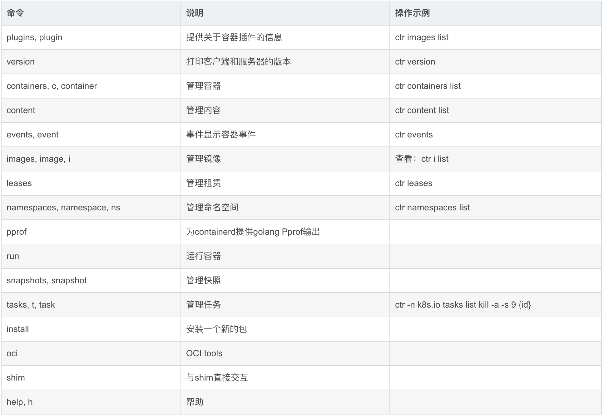
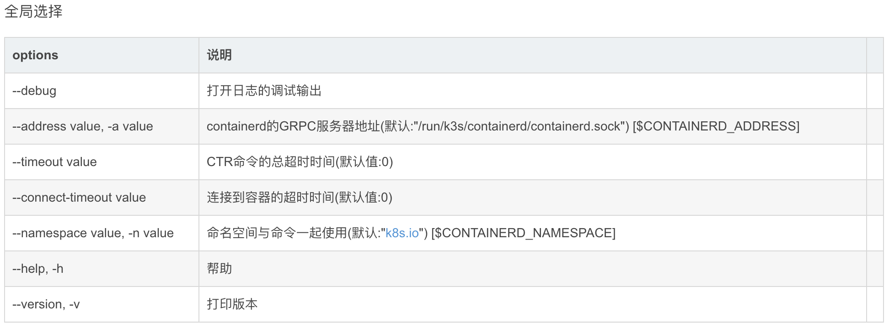
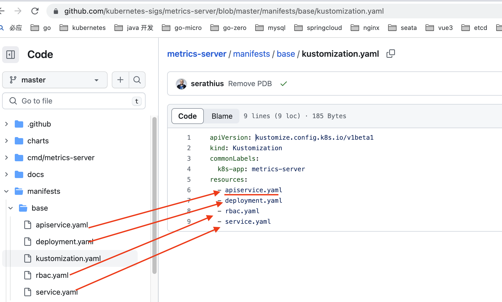

### 一、k8s 安装步骤

#### 1.1 安装docker及containerd容器

```bash
#前提.设置每个机器自己的hostname
hostnamectl set-hostname xxx

# 1.移除docker
sudo yum remove docker \
                  docker-client \
                  docker-client-latest \
                  docker-common \
                  docker-latest \
                  docker-latest-logrotate \
                  docker-logrotate \
                  docker-engine
# 2.安装yum-utils包（它提供了yum-config-manager实用程序）并设置存储库。                
sudo yum install -y yum-utils
sudo yum-config-manager \
    --add-repo \
    https://download.docker.com/linux/centos/docker-ce.repo  
      
# 3.安装 Docker 引擎、容器和 Docker 组合:
sudo yum install -y docker-ce-20.10.23 docker-ce-cli-20.10.23 containerd.io-1.6.15 

#以下是在安装k8s的时候使用
# yum install -y docker-ce-20.10.7 docker-ce-cli-20.10.7  containerd.io-1.4.6

#	4.启动&开机启动docker
systemctl enable docker --now

# 5.docker加速配置
sudo mkdir -p /etc/docker
sudo tee /etc/docker/daemon.json <<-'EOF'
{
  "registry-mirrors": ["https://wkxfupsi.mirror.aliyuncs.com"],
  "exec-opts": ["native.cgroupdriver=systemd"],
  "log-driver": "json-file",
  "log-opts": {
    "max-size": "100m"
  },
  "storage-driver": "overlay2"
}
EOF
# 6.后台程序重新加载
sudo systemctl daemon-reload

# 7.启动Docker
sudo systemctl restart docker

# 8.通过运行hello-world镜像来验证Docker引擎安装是否成功。
sudo docker run hello-world
```

#### 1.2、设置每台服务器的参数

```bash
#1.设置每个机器自己的hostname
hostnamectl set-hostname xxx

#2.将 SELinux 设置为 permissive 模式（相当于将其禁用）
sudo setenforce 0
sudo sed -i 's/^SELINUX=enforcing$/SELINUX=permissive/' /etc/selinux/config

#3.关闭swap
swapoff -a  
sed -ri 's/.*swap.*/#&/' /etc/fstab

#4.转发 IPv4 并让 iptables 看到桥接流量
cat <<EOF | sudo tee /etc/modules-load.d/k8s.conf
overlay
br_netfilter
EOF

sudo modprobe overlay
sudo modprobe br_netfilter

#5.设置所需的 sysctl 参数，参数在重新启动后保持不变
cat <<EOF | sudo tee /etc/sysctl.d/k8s.conf
net.bridge.bridge-nf-call-iptables  = 1
net.bridge.bridge-nf-call-ip6tables = 1
net.ipv4.ip_forward                 = 1
EOF
#6.应用 sysctl 参数而不重新启动
sudo sysctl --system
```

#### 1.3、安装kubelet、kubeadm、kubectl

```bash
#1.配置k8s的yum源地址
cat <<EOF | sudo tee /etc/yum.repos.d/kubernetes.repo
[kubernetes]
name=Kubernetes
baseurl=http://mirrors.aliyun.com/kubernetes/yum/repos/kubernetes-el7-x86_64
enabled=1
gpgcheck=1
gpgkey=http://mirrors.aliyun.com/kubernetes/yum/doc/yum-key.gpg
   http://mirrors.aliyun.com/kubernetes/yum/doc/rpm-package-key.gpg
EOF
# 2.查看kubernetes版本
# yum list kubelet kubeadm kubectl  --showduplicates | sort -r
#3.安装 kubelet，kubeadm，kubectl
# sudo yum install -y kubelet-1.27.1 kubeadm-1.27.1 kubectl-1.27.1
# 3.1 为了安装kuberspher 安装1.24.6版本 
sudo yum install -y kubeadm-1.24.6 kubectl-1.24.6 kubelet-1.24.6
#4.启动kubelet
sudo systemctl enable --now kubelet
#5.所有机器配置master域名
echo "172.31.0.2  master" >> /etc/hosts
```

#### 1.4、修改 kubelet 的 cgroup 和 docker 的 cgroup-driver 保持一致

```bash
为了实现docker使用的cgroupdriver与kubelet使用的cgroup的一致性，建议修改如下文件内容。

# vim /etc/sysconfig/kubelet
KUBELET_EXTRA_ARGS="--cgroup-driver=systemd"

#sed -i 's#KUBELET_EXTRA_ARGS=""#KUBELET_EXTRA_ARGS="--cgroup-driver=systemd"#g' /etc/sysconfig/kubelet
设置kubelet为开机自启动即可，由于没有生成配置文件，集群初始化后自动启动
# systemctl enable kubelet

```

#### 1.5、使用containerd 默认容器的配置

说明：
如果你从软件包（例如，RPM 或者 .deb）中安装 containerd，你可能会发现其中默认禁止了 CRI 集成插件。

你需要启用 CRI 支持才能在 Kubernetes 集群中使用 containerd。 要确保 cri 没有出现在 /etc/containerd/config.toml 文件中 disabled_plugins 列表内。如果你更改了这个文件，也请记得要重启 containerd。

如果你在初次安装集群后或安装 CNI 后遇到容器崩溃循环，则随软件包提供的 containerd 配置可能包含不兼容的配置参数。考虑按照 getting-started.md 中指定的 containerd config default > /etc/containerd/config.toml 重置 containerd 配置，然后相应地设置上述配置参数。

```bash
#1.使用如下命令重置config.toml文件
containerd config default > /etc/containerd/config.toml
#2.编辑配置文件
vim /etc/containerd/config.toml
# SystemdCgroup = false 改为 SystemdCgroup = true
sed -i 's#SystemdCgroup = false#SystemdCgroup = true#g' /etc/containerd/config.toml

# 3.修改 sandbox_image = "k8s.gcr.io/pause:3.6"
#sandbox_image = "registry.cn-hangzhou.aliyuncs.com/google_containers/pause:3.9"

sed -i 's#sandbox_image = "registry.k8s.io/pause:3.6"#sandbox_image = "registry.cn-hangzhou.aliyuncs.com/google_containers/pause:3.9"#g' /etc/containerd/config.toml

# 4.设置开机自启动
systemctl enable containerd

# 5.重新启动containerd
systemctl restart containerd
# 6. 列出containerd所有镜像命令
ctr images ls

```

#### 1.6、使用kubeadm进行初始化

```bash
# 在master节点上执行

kubeadm init \
--apiserver-advertise-address=172.31.0.2 \
--control-plane-endpoint=master \
--image-repository registry.cn-hangzhou.aliyuncs.com/google_containers \
--kubernetes-version v1.24.6 \
--service-cidr=10.96.0.0/16 \
--pod-network-cidr=192.168.0.0/16

# 上面参数说明
--apiserver-advertise-address 集群通告地址
--image-repository 由于默认拉取镜像地址k8s.gcr.io国内无法访问，这里指定阿里云镜像仓库地址
--kubernetes-version K8s版本，与上面安装的一致
--service-cidr 集群内部虚拟网络，Pod统一访问入口
--pod-network-cidr Pod网络，，与下面部署的CNI网络组件yaml中保持一致
```

#### 1.7、初始化成功

```bash
Your Kubernetes control-plane has initialized successfully!

To start using your cluster, you need to run the following as a regular user:

  mkdir -p $HOME/.kube
  sudo cp -i /etc/kubernetes/admin.conf $HOME/.kube/config
  sudo chown $(id -u):$(id -g) $HOME/.kube/config

Alternatively, if you are the root user, you can run:

  export KUBECONFIG=/etc/kubernetes/admin.conf

You should now deploy a pod network to the cluster.
Run "kubectl apply -f [podnetwork].yaml" with one of the options listed at:
  https://kubernetes.io/docs/concepts/cluster-administration/addons/

You can now join any number of control-plane nodes by copying certificate authorities
and service account keys on each node and then running the following as root:

  kubeadm join master:6443 --token bgh00y.71sw9kf1ruk04m6l \
        --discovery-token-ca-cert-hash sha256:4010d64b3c65acc29d0e41064f83126a797f19fbf621c843cf33fed6e0e8a276 \
        --control-plane 

Then you can join any number of worker nodes by running the following on each as root:

kubeadm join master:6443 --token bgh00y.71sw9kf1ruk04m6l \
        --discovery-token-ca-cert-hash sha256:4010d64b3c65acc29d0e41064f83126a797f19fbf621c843cf33fed6e0e8a276 
[root@master sysconfig]# 
```

#### 1.8、集群部署calico网络插件

```bash
网络组件有很多种，只需要部署其中一个即可，推荐Calico。
Calico是一个纯三层的数据中心网络方案，Calico支持广泛的平台，包括Kubernetes、OpenStack等。
Calico 在每一个计算节点利用 Linux Kernel 实现了一个高效的虚拟路由器（ vRouter） 来负责数据转发，而每个 vRouter 通过 BGP 协议负责把自己上运行的 workload 的路由信息向整个 Calico 网络内传播。
此外，Calico 项目还实现了 Kubernetes 网络策略，提供ACL功能。
#1.下载Calico

curl https://docs.tigera.io/archive/v3.25/manifests/calico.yaml -O

# 2.注意此处 CALICO_IPV4POOL_CIDR 的 value 要和 --pod-network-cidr 后面的值一致
vim calico.yaml
# 在calico.yaml文件中,找到此处value 修改和 --pod-network-cidr 后面的值一致
- name: CALICO_IPV4POOL_CIDR
  value: "192.168.0.0/16"
...
#3.使用命令执行网络插件
kubectl apply -f calico.yaml

sudo tee /etc/docker/daemon.json <<-'EOF'
{
  "registry-mirrors": ["https://wkxfupsi.mirror.aliyuncs.com"],
  "exec-opts": ["native.cgroupdriver=systemd"],
  "log-driver": "json-file",
  "log-opts": {
    "max-size": "100m"
  },
  "storage-driver": "overlay2"
}
EOF

#4.安装时镜像拉取失败，配置镜像加速器
[root@localhost ~]# 
s
#5.由于默认的Calico清单文件中所使用的镜像来源于docker.io国外镜像源，上面我们配置了Docker镜像加速，应删除docker.io前缀以使镜像从国内镜像加速站点下载。
[root@master ~]# cat calico.yaml |grep 'image:'
          image: docker.io/calico/cni:v3.25.0
          image: docker.io/calico/cni:v3.25.0
          image: docker.io/calico/node:v3.25.0
          image: docker.io/calico/node:v3.25.0
          image: docker.io/calico/kube-controllers:v3.25.0
[root@master ~]# sed -i 's#docker.io/##g' calico.yaml
[root@master ~]# cat calico.yaml |grep 'image:'
          image: calico/cni:v3.25.0
          image: calico/cni:v3.25.0
          image: calico/node:v3.25.0
          image: calico/node:v3.25.0
          image: calico/kube-controllers:v3.25.0
#6.如果镜像下载失败
下载网站[https://github.com/projectcalico/calico/releases]
下载完成后解压，image为docker镜像文件，使用docker load 命令进行镜像还原
```

### 二、containerd镜像加速

#### 2.1 containerd 镜像加速配置

- 修改Config.toml文件

```toml
#1.修改配置文件
vim /etc/containerd/config.toml

[plugins."io.containerd.grpc.v1.cri".registry]
      config_path = "/etc/containerd/certs.d"  # 镜像地址配置文件
      
#2.使用下面的命令进行替换      
sed -i 's#config_path = ""#config_path = "/etc/containerd/certs.d"#g' /etc/containerd/config.toml

      [plugins."io.containerd.grpc.v1.cri".registry.auths]

      [plugins."io.containerd.grpc.v1.cri".registry.configs]

      [plugins."io.containerd.grpc.v1.cri".registry.headers]

      [plugins."io.containerd.grpc.v1.cri".registry.mirrors]
```

- 创建相应目录

```bash
mkdir /etc/containerd/certs.d/docker.io -pv
```

- Containerd配置加速

```toml
cat > /etc/containerd/certs.d/docker.io/hosts.toml << EOF
server = "https://docker.io"
[host."https://wkxfupsi.mirror.aliyuncs.com"]
  capabilities = ["pull", "resolve"]
[host."https://registry-1.docker.io"]
	capabilities = ["pull", "resolve"]
EOF
```

- 重启containerd容器

```bash
systemctl restart containerd
```

- 拉去mysql 镜像

```bash
ctr i pull docker.io/library/mysql:latest
```

#### 2.2 containerd 常用镜像命令

1. containerd的概述

> 名字：ctr （containerd CLI）
>
> 用法：CTR [global options] command [command options] [arguments…]
>
> 描述：CTR是一个不受支持的用于交互的调试和管理客户机使用容器守护进程。因为它不受支持，选项和操作不能保证向后兼容或容器项目从一个版本到另一个版本都是稳定的

注：如果没有指定默认名称空间的话，则要 （-n 名称空间）

> 命令										说明												操作示例
>
> plugins, plugin			 		 提供关于容器插件的信息			 ctr images list
>
> version						   		打印客户端和服务器的版本		 ctr version
>
> containers, c, container	   管理容器									   ctr containers list
>
> content								   管理内容									   ctr content list
>
> events, event						 事件显示容器事件						ctr events
>
> images, image, i	         	   管理镜像	查看：						ctr i list
>
> leases									  管理租赁									   ctr leases
>
> namespaces, namespace, ns	管理命名空间						  ctr namespaces list
>
> pprof	                 					为containerd提供golang Pprof输出	
>
> run										   运行容器	
>
> snapshots, snapshot		    管理快照	
>
> tasks, t, task						   管理任务										 ctr -n k8s.io tasks list kill -a -s 9 {id}
>
> install									   安装一个新的包	
>
> oci											OCI tools	
>
> shim									    与shim直接交互	
>
> help, h									 帮助														打印版本






#### 2.3 ctr日常操作示例

操作示例

```bash
# 查看镜像
~]# ctr images list 或  ctr i ls
# 如没有指定名称空间则需指定
~]# ctr namespaces list  或 ctr ns list
NAME   LABELS 
k8s.io
~]# ctr -n k8s.io images list
​
# 镜像标记
~]# ctr -n k8s.io images tag registry.cn-hangzhou.aliyuncs.com/google_containers/pause:3.2 k8s.gcr.io/pause:3.2

# 删除镜像
~]# ctr -n k8s.io images rm k8s.gcr.io/pause:3.2

# 拉取镜像
~]# ctr -n k8s.io images pull -k k8s.gcr.io/pause:3.2

# 导出镜像
~]# ctr -n k8s.io images export pause.tar k8s.gcr.io/pause:3.2

# 导入镜像;不支持 build,commit 镜像
~]# ctr -n k8s.io i import pause.tar

# 运行容器
~]# ctr -n k8s.io run --null-io --net-host -d –env PASSWORD=$drone_password –mount type=bind,src=/etc,dst=/host-etc,options=rbind:rw –mount type=bind,src=/root/.kube,dst=/root/.kube,options=rbind:rw $image sysreport bash /sysreport/run.sh

–null-io: 将容器内标准输出重定向到/dev/null
–net-host: 主机网络
-d: 当task执行后就进行下一步shell命令,如没有选项,则会等待用户输入,并定向到容器内

# 查看容器
~]# ctr containers list 或 ctr c ls
# 如没有指定名称空间则需指定
~]# ctr -n k8s.io c ls

# 先找出容器然后搜索容器名
~]# ctr -n k8s.io c ls 
CONTAINER      IMAGE                     RUNTIME 
06.....86      pause:3.2              io.containerd.runc.v2
# 找出容器名
~]# ctr -n k8s.io tasks list 
# 停止容器 
~]# kill -a -s 9 {id}
```

#### 2.4 containerd 从jar包中导出镜像到指定的名称空间

```bash
#!/bin/bash
#

# https://github.com/kubernetes-sigs/metrics-server
# wget https://github.com/kubernetes-sigs/metrics-server/releases/latest/download/components.yaml
# sed '/args:/a\        - --kubelet-insecure-tls' components.yaml

# download and change yaml
# wget -O- https://github.com/kubernetes-sigs/metrics-server/releases/latest/download/components.yaml \
#   | sed '/args:/a\        - --kubelet-insecure-tls' - > components.yaml

# use ali registry to speed up
repo=registry.aliyuncs.com/google_containers

name=k8s.gcr.io/metrics-server/metrics-server:v0.6.1

# remove prefix
#src_name=${name#k8s.gcr.io/}
#src_name=${name#metrics-server/}
src_name=metrics-server:v0.6.1

ctr -n=k8s.io image pull $repo/$src_name

# rename to fit k8s
ctr -n=k8s.io image tag $repo/$src_name $name
ctr -n=k8s.io image rm $repo/$src_name
ctr -n=k8s.io image load -i
# add args: - --kubelet-insecure-tls
kubectl apply -f components.yaml

# docker 导出/导入命令
docker save -o xxx.tar $imageList
docker load -i  xxx.tar
# containerd 容器导出/导入命令 
ctr -n=k8s.io image export  xxx.tar  $imageList
ctr -n=k8s.io images import  xxx.tar

#containerd 容器从 tar 包中导出镜像命令
ctr -n k8s.io images export calico-cni.tar docker.io/calico/cni:v3.25.0
ctr -n k8s.io images export calico-node.tar docker.io/calico/node:v3.25.0
ctr -n k8s.io images export calico-kube-controllers.tar docker.io/calico/kube-controllers:v3.25.0
# docker 下载指定sha256 版本的镜像
docker.io/calico/cni:v3.20.6@sha256:00e1c39c1d3d9e91e6c0abb37b2f7a436127a8c9f8ec1db76fade7d8099de0e2
```


```bash
 14267/TCP, 14268/TCP, 14269/TCP, 14250/TCP

16686/TCP, 16687/TCP
 
 Limits:
      cpu:     100m
      memory:  128Mi
    Requests:
      cpu:      20m
      memory:   50Mi
    Liveness:   http-get http://:14269/ delay=5s timeout=1s period=15s #success=1 #failure=5
    Readiness:  http-get http://:14269/ delay=1s timeout=1s period=10s #success=1 #failure=3
    Environment:
      SPAN_STORAGE_TYPE:           elasticsearch
      COLLECTOR_ZIPKIN_HOST_PORT:  :9411
    Mounts:
      /etc/jaeger/sampling from jaeger-sampling-configuration-volume (ro)
      /var/run/secrets/kubernetes.io/serviceaccount from kube-api-access-gl9cd (ro)
```


#### 2.5 containerd 卸载命令

```bash
#一.创建脚本
cat > remove.sh <<EOF
#!/bin/bash
# 删除contained命令及配置
rm -rf /usr/local/bin/
rm -rf /etc/containerd/
# 删除containerd服务
rm -rf /usr/local/lib/systemd/system/containerd.service
# 删除runc
rm -rf /usr/local/sbin/runc
# 删除CNI插件
rm -rf /opt/containerd/
# 删除ctr命令
rm -rf /usr/bin/ctr
EOF

#二.赋权限及执行脚本
chmod +x remove.sh
./remove.sh

```


### 三、安装KubeSphere前置环境

#### 3.1 nfs文件系统

##### 3.1.1 安装 nfs-server

```bash
# 在每个机器。
yum install -y nfs-utils

# 在master 执行以下命令 
echo "/nfs/data/ *(insecure,rw,sync,no_root_squash)" > /etc/exports

# 执行以下命令，启动 nfs 服务;创建共享目录
mkdir -p /nfs/data

# 在master执行
systemctl enable rpcbind
systemctl enable nfs-server
systemctl start rpcbind
systemctl start nfs-server

# 使配置生效
exportfs -r

#检查配置是否生效
exportfs
```

##### 3.1.2 配置nfs-client（选做）

```bash
showmount -e 172.31.0.2
mkdir -p /nfs/data
mount -t nfs 172.31.0.2:/nfs/data /nfs/data
```

##### 3.1.3 配置默认存储

默认存储参考官网地址：https://github.com/kubernetes-sigs/nfs-subdir-external-provisioner/blob/master/deploy/kustomization.yaml

- class.yaml
- rbac.yaml
- deploymnet.yaml

```yml
## 创建了一个存储类
apiVersion: storage.k8s.io/v1
kind: StorageClass
metadata:
  name: nfs-storage
  annotations:
    storageclass.kubernetes.io/is-default-class: "true"
provisioner: k8s-sigs.io/nfs-subdir-external-provisioner
parameters:
  archiveOnDelete: "true"  ## 删除pv的时候，pv的内容是否要备份

---
apiVersion: apps/v1
kind: Deployment
metadata:
  name: nfs-client-provisioner
  labels:
    app: nfs-client-provisioner
  # replace with namespace where provisioner is deployed
  namespace: default
spec:
  replicas: 1
  strategy:
    type: Recreate
  selector:
    matchLabels:
      app: nfs-client-provisioner
  template:
    metadata:
      labels:
        app: nfs-client-provisioner
    spec:
      serviceAccountName: nfs-client-provisioner
      containers:
        - name: nfs-client-provisioner
          image: registry.cn-hangzhou.aliyuncs.com/lfy_k8s_images/nfs-subdir-external-provisioner:v4.0.2
          # resources:
          #    limits:
          #      cpu: 10m
          #    requests:
          #      cpu: 10m
          volumeMounts:
            - name: nfs-client-root
              mountPath: /persistentvolumes
          env:
            - name: PROVISIONER_NAME
              value: k8s-sigs.io/nfs-subdir-external-provisioner
            - name: NFS_SERVER
              value: 172.31.0.2 ## 指定自己nfs服务器地址
            - name: NFS_PATH  
              value: /nfs/data  ## nfs服务器共享的目录
      volumes:
        - name: nfs-client-root
          nfs:
            server: 172.31.0.2
            path: /nfs/data
---
apiVersion: v1
kind: ServiceAccount
metadata:
  name: nfs-client-provisioner
  # replace with namespace where provisioner is deployed
  namespace: default
---
kind: ClusterRole
apiVersion: rbac.authorization.k8s.io/v1
metadata:
  name: nfs-client-provisioner-runner
rules:
  - apiGroups: [""]
    resources: ["nodes"]
    verbs: ["get", "list", "watch"]
  - apiGroups: [""]
    resources: ["persistentvolumes"]
    verbs: ["get", "list", "watch", "create", "delete"]
  - apiGroups: [""]
    resources: ["persistentvolumeclaims"]
    verbs: ["get", "list", "watch", "update"]
  - apiGroups: ["storage.k8s.io"]
    resources: ["storageclasses"]
    verbs: ["get", "list", "watch"]
  - apiGroups: [""]
    resources: ["events"]
    verbs: ["create", "update", "patch"]
---
kind: ClusterRoleBinding
apiVersion: rbac.authorization.k8s.io/v1
metadata:
  name: run-nfs-client-provisioner
subjects:
  - kind: ServiceAccount
    name: nfs-client-provisioner
    # replace with namespace where provisioner is deployed
    namespace: default
roleRef:
  kind: ClusterRole
  name: nfs-client-provisioner-runner
  apiGroup: rbac.authorization.k8s.io
---
kind: Role
apiVersion: rbac.authorization.k8s.io/v1
metadata:
  name: leader-locking-nfs-client-provisioner
  # replace with namespace where provisioner is deployed
  namespace: default
rules:
  - apiGroups: [""]
    resources: ["endpoints"]
    verbs: ["get", "list", "watch", "create", "update", "patch"]
---
kind: RoleBinding
apiVersion: rbac.authorization.k8s.io/v1
metadata:
  name: leader-locking-nfs-client-provisioner
  # replace with namespace where provisioner is deployed
  namespace: default
subjects:
  - kind: ServiceAccount
    name: nfs-client-provisioner
    # replace with namespace where provisioner is deployed
    namespace: default
roleRef:
  kind: Role
  name: leader-locking-nfs-client-provisioner
  apiGroup: rbac.authorization.k8s.io
```

### 四、Service Account

#### 4.1 简介

​	本页介绍了Kubernetes中的ServiceAccount对象，提供了有关服务帐户如何工作、用例、限制、替代方案以及资源链接的信息，以获得更多指导。

#### 4.2 什么是服务帐户？

​	服务帐户是一种非人类帐户，在Kubernetes中，它在Kubernet集群中提供不同的身份。集群内外的应用程序吊舱、系统组件和实体可以使用特定ServiceAccount的凭据来标识为该ServiceAccount。此身份在各种情况下都很有用，包括对API服务器进行身份验证或实现基于身份的安全策略。

​	服务帐户作为ServiceAccount对象存在于API服务器中。服务帐户具有以下属性：

- **Namespaced**：每个服务帐户都绑定到一个Kubernetes命名空间。每个命名空间在创建时都会获得一个默认的ServiceAccount。

- **轻量级**：服务帐户存在于集群中，并在Kubernetes API中定义。您可以快速创建服务帐户以启用特定任务。

- **可移植**：复杂容器化工作负载的配置包可能包括系统组件的服务帐户定义。服务帐户的轻量级特性和命名空间标识使配置具有可移植性。

**服务帐户与用户帐户不同**，用户帐户是集群中经过身份验证的人工用户。默认情况下，用户帐户在Kubernetes API服务器中不存在；相反，API服务器将用户身份视为不透明数据。您可以使用多种方法作为用户帐户进行身份验证。一些Kubernetes发行版可能会添加自定义扩展API来表示API服务器中的用户帐户。

| Description    | ServiceAccount                                               | User or group                                                |
| -------------- | ------------------------------------------------------------ | ------------------------------------------------------------ |
| Location       | Kubernetes API (ServiceAccount object)                       | External                                                     |
| Access control | Kubernetes RBAC or other [authorization mechanisms](https://kubernetes.io/docs/reference/access-authn-authz/authorization/#authorization-modules) | Kubernetes RBAC or other identity and access management mechanisms |
| Intended use   | Workloads, automation                                        | People                                                       |

#### 4.3 默认服务帐户

创建集群时，Kubernetes会自动为集群中的每个命名空间创建一个名为default的ServiceAccount对象。默认情况下，除了Kubernetes在启用基于角色的访问控制（RBAC）时授予所有经过身份验证的主体的默认API发现权限外，每个命名空间中的默认服务帐户没有其他权限。如果删除名称空间中的默认ServiceAccount对象，则控制平面会将其替换为新对象。

如果您在一个命名空间中部署了一个Pod，并且没有手动为该Pod分配ServiceAccount，那么Kubernetes会将该命名空间的默认ServiceAccount分配给Pod。

#### 4.4 Kubernetes服务帐户的用例

作为一般准则，您可以在以下情况下使用服务帐户来提供身份：

- 您的Pods需要与Kubernetes API服务器通信，例如在以下情况下：
  - 提供对机密中存储的敏感信息的只读访问。
  - 授予跨命名空间访问权限，例如允许Pod-in-namespace示例读取、列出和监视kube节点租赁命名空间中的Lease对象。

- 您的Pods需要与外部服务进行通信。例如，工作负载Pod需要商用云API的身份，而商用提供商允许配置合适的信任关系。

- 使用imagePullSecret对专用映像注册表进行身份验证。

- 外部服务需要与Kubernetes API服务器通信。例如，作为CI/CD管道的一部分对集群进行身份验证。

- 您在集群中使用第三方安全软件，该软件依赖于不同Pod的ServiceAccount标识，将这些Pod分组到不同的上下文中。

#### 4.5 如何使用服务帐户

要使用Kubernetes服务帐户，请执行以下操作：

1. 使用Kubernetes客户端（如kubectl）或定义对象的清单创建ServiceAccount对象。

2. 使用授权机制（如RBAC）向ServiceAccount对象授予权限。

3. 在Pod创建过程中将ServiceAccount对象分配给Pod。

4. 如果您正在使用来自外部服务的标识，请检索ServiceAccount令牌，然后从该服务使用它。

有关说明，请参阅配置Pods的服务帐户。

#### 4.6 向服务帐户授予权限

您可以使用内置的Kubernetes基于角色的访问控制（RBAC）机制来授予每个服务帐户所需的最低权限。您创建一个授予访问权限的角色，然后将该角色绑定到您的ServiceAccount。RBAC允许您定义一组最小权限，以便服务帐户权限遵循最小权限原则。使用该服务帐户的Pod所获得的权限不会超过正常运行所需的权限。

有关说明，请参阅ServiceAccount权限

#### 4.7 使用ServiceAccount进行跨命名空间访问

您可以使用RBAC来允许一个命名空间中的服务帐户对集群中不同命名空间中的资源执行操作。例如，考虑一个场景，其中您在dev命名空间中有一个服务帐户和Pod，并且您希望Pod看到Jobs在维护命名空间中运行。您可以创建一个角色对象，该对象授予列出作业对象的权限。然后，在维护命名空间中创建一个RoleBinding对象，将Role绑定到ServiceAccount对象。现在，dev命名空间中的Pods可以使用该服务帐户列出维护命名空间中的Job对象。

#### 4.8 为Pod分配服务帐户

要将ServiceAccount分配给Pod，请在Pod规范中设置spec.serviceAccountName字段。然后，Kubernetes会自动向Pod提供该ServiceAccount的凭据。在v1.22及更高版本中，Kubernetes使用TokenRequest API获得一个短期的、自动旋转的令牌，并将该令牌装载为投影卷。

默认情况下，Kubernetes为Pod提供指定ServiceAccount的凭据，无论是默认的ServiceAccount还是您指定的自定义ServiceAccount。

为了防止Kubernetes自动注入指定ServiceAccount或默认ServiceAccount的凭据，请将Pod规范中的automountServiceAccountToken字段设置为false。

在1.22之前的版本中，Kubernetes为Pod提供了一个长期的静态令牌作为Secret。

#### 4.9 手动检索ServiceAccount凭据

如果需要ServiceAccount的凭据才能装入非标准位置，或者需要非API服务器的访问群体的凭据，请使用以下方法之一：

- TokenRequest API（推荐）：从您自己的应用程序代码中请求短期服务帐户令牌。代币自动到期，到期后可以轮换。如果您有一个不知道Kubernetes的遗留应用程序，您可以在同一个pod中使用sidecar容器来获取这些令牌，并使其可用于应用程序工作负载。

- [Token Volume Projection](https://kubernetes.io/docs/tasks/configure-pod-container/configure-service-account/#serviceaccount-token-volume-projection) （也推荐）：在Kubernetes v1.20及更高版本中，使用Pod规范告诉kubelet将服务帐户 token 作为投影数量添加到Pod中。预计的 tokens 会自动到期，kubelet会在代币到期前对其进行轮换。

- [Service Account Token Secrets](https://kubernetes.io/docs/tasks/configure-pod-container/configure-service-account/#manually-create-an-api-token-for-a-serviceaccount) （不推荐）：您可以在Pods中将服务帐户令牌作为Kubernetes机密挂载。这些 tokens 不会过期，也不会轮换。不建议使用此方法，尤其是在规模上，因为存在与静态、长期凭据相关的风险。在Kubernetes v1.24及更高版本中，LegacyServiceAccountTokenNoAutoGeneration功能门阻止Kubernete自动为ServiceAccounts创建这些令牌。LegacyServiceAccountTokenNoAutoGeneration默认启用；换句话说，Kubernetes不会创建这些令

```tex
注：
对于在Kubernetes集群之外运行的应用程序，您可能会考虑创建一个存储在Secret中的长期ServiceAccount令牌。这允许身份验证，但Kubernetes项目建议您避免这种方法。长期持有的token代表着一种安全风险，因为一旦被披露，token可能会被滥用。相反，考虑使用替代方案。例如，您的外部应用程序可以使用受良好保护的私钥和证书进行身份验证，也可以使用自定义机制（如您自己实现的身份验证webhook）进行身份验证。

您还可以使用TokenRequest为您的外部应用程序获取短期令牌。
```

#### 4.11 测试使用默认存储

```yaml
kind: PersistentVolumeClaim
apiVersion: v1
metadata:
  name: nginx-pvc
spec:
  accessModes:
    - ReadWriteMany
  resources:
    requests:
      storage: 200Mi
```

### 五、metrics-server

如何去写metrics-server.yaml文件，最好的答案还是去官网找。




汇总得到5.1 的metrics-server.yaml文件

#### 5.1 创建集群指标监控组件

```yml
apiVersion: v1
kind: ServiceAccount
metadata:
  labels:
    k8s-app: metrics-server
  name: metrics-server
  namespace: kube-system
---
apiVersion: rbac.authorization.k8s.io/v1
kind: ClusterRole
metadata:
  labels:
    k8s-app: metrics-server
    rbac.authorization.k8s.io/aggregate-to-admin: "true"
    rbac.authorization.k8s.io/aggregate-to-edit: "true"
    rbac.authorization.k8s.io/aggregate-to-view: "true"
  name: system:aggregated-metrics-reader
rules:
- apiGroups:
  - metrics.k8s.io
  resources:
  - pods
  - nodes
  verbs:
  - get
  - list
  - watch
---
apiVersion: rbac.authorization.k8s.io/v1
kind: ClusterRole
metadata:
  labels:
    k8s-app: metrics-server
  name: system:metrics-server
rules:
- apiGroups:
  - ""
  resources:
  - pods
  - nodes
  - nodes/stats
  - namespaces
  - configmaps
  verbs:
  - get
  - list
  - watch
---
apiVersion: rbac.authorization.k8s.io/v1
kind: RoleBinding
metadata:
  labels:
    k8s-app: metrics-server
  name: metrics-server-auth-reader
  namespace: kube-system
roleRef:
  apiGroup: rbac.authorization.k8s.io
  kind: Role
  name: extension-apiserver-authentication-reader
subjects:
- kind: ServiceAccount
  name: metrics-server
  namespace: kube-system
---
apiVersion: rbac.authorization.k8s.io/v1
kind: ClusterRoleBinding
metadata:
  labels:
    k8s-app: metrics-server
  name: metrics-server:system:auth-delegator
roleRef:
  apiGroup: rbac.authorization.k8s.io
  kind: ClusterRole
  name: system:auth-delegator
subjects:
- kind: ServiceAccount
  name: metrics-server
  namespace: kube-system
---
apiVersion: rbac.authorization.k8s.io/v1
kind: ClusterRoleBinding
metadata:
  labels:
    k8s-app: metrics-server
  name: system:metrics-server
roleRef:
  apiGroup: rbac.authorization.k8s.io
  kind: ClusterRole
  name: system:metrics-server
subjects:
- kind: ServiceAccount
  name: metrics-server
  namespace: kube-system
---
apiVersion: v1
kind: Service
metadata:
  labels:
    k8s-app: metrics-server
  name: metrics-server
  namespace: kube-system
spec:
  ports:
  - name: https
    port: 443
    protocol: TCP
    targetPort: https
  selector:
    k8s-app: metrics-server
---
apiVersion: apps/v1
kind: Deployment
metadata:
  labels:
    k8s-app: metrics-server
  name: metrics-server
  namespace: kube-system
spec:
  selector:
    matchLabels:
      k8s-app: metrics-server
  strategy:
    rollingUpdate:
      maxUnavailable: 0
  template:
    metadata:
      labels:
        k8s-app: metrics-server
    spec:
      containers:
      - args:
        - --cert-dir=/tmp
        - --kubelet-insecure-tls
        - --secure-port=4443
        - --kubelet-preferred-address-types=InternalIP,ExternalIP,Hostname
        - --kubelet-use-node-status-port
        image: registry.cn-hangzhou.aliyuncs.com/lfy_k8s_images/metrics-server:v0.4.3
        imagePullPolicy: IfNotPresent
        livenessProbe:
          failureThreshold: 3
          httpGet:
            path: /livez
            port: https
            scheme: HTTPS
          periodSeconds: 10
        name: metrics-server
        ports:
        - containerPort: 4443
          name: https
          protocol: TCP
        readinessProbe:
          failureThreshold: 3
          httpGet:
            path: /readyz
            port: https
            scheme: HTTPS
          periodSeconds: 10
        securityContext:
          readOnlyRootFilesystem: true
          runAsNonRoot: true
          runAsUser: 1000
        volumeMounts:
        - mountPath: /tmp
          name: tmp-dir
      nodeSelector:
        kubernetes.io/os: linux
      priorityClassName: system-cluster-critical
      serviceAccountName: metrics-server
      volumes:
      - emptyDir: {}
        name: tmp-dir
---
apiVersion: apiregistration.k8s.io/v1
kind: APIService
metadata:
  labels:
    k8s-app: metrics-server
  name: v1beta1.metrics.k8s.io
spec:
  group: metrics.k8s.io
  groupPriorityMinimum: 100
  insecureSkipTLSVerify: true
  service:
    name: metrics-server
    namespace: kube-system
  version: v1beta1
  versionPriority: 100
```

#### 5.2 文本内容替换命令

```bash
sed -i 's#calico/node/#docker.io/calico/node/#g' calico.yaml
```

#### 5.3 强制删除pod命令

```bash
# 强制删除pod命令
# kubectl delete po <your-pod-name> -n <name-space> --force --grace-period=0
kubectl delete po calico-kube-controllers-84c476996d-djgt8 -n kube-system --force --grace-period=0
```

#### 5.4 Deployment yaml 参数详解-1

```yaml
apiVersion: apps/v1  # 指定api版本，此值必须在kubectl api-versions中  
kind: Deployment  # 指定创建资源的角色/类型   
metadata:  # 资源的元数据/属性 
  name: demo  # 资源的名字，在同一个namespace中必须唯一
  namespace: default # 部署在哪个namespace中
  labels:  # 设定资源的标签
    app: demo
    version: stable
spec: # 资源规范字段
  replicas: 1 # 声明副本数目
  revisionHistoryLimit: 3 # 保留历史版本
  selector: # 选择器
    matchLabels: # 匹配标签
      app: demo
      version: stable
  strategy: # 策略
    rollingUpdate: # 滚动更新
      maxSurge: 30% # 最大额外可以存在的副本数，可以为百分比，也可以为整数
      maxUnavailable: 30% # 示在更新过程中能够进入不可用状态的 Pod 的最大值，可以为百分比，也可以为整数
    type: RollingUpdate # 滚动更新策略
  template: # 模版
    metadata: # 资源的元数据/属性 
      annotations: # 自定义注解列表
        sidecar.istio.io/inject: "false" # 自定义注解名字
      labels: # 设定资源的标签
        app: demo
        version: stable
    spec: # 资源规范字段
      containers:
      - name: demo # 容器的名字   
        image: demo:v1 # 容器使用的镜像地址   
        imagePullPolicy: IfNotPresent # 每次Pod启动拉取镜像策略，三个选择 Always、Never、IfNotPresent
                                      # Always，每次都检查；Never，每次都不检查（不管本地是否有）；IfNotPresent，如果本地有就不检查，如果没有就拉取 
        resources: # 资源管理
          limits: # 最大使用
            cpu: 300m # CPU，1核心 = 1000m
            memory: 500Mi # 内存，1G = 1024Mi
          requests:  # 容器运行时，最低资源需求，也就是说最少需要多少资源容器才能正常运行
            cpu: 100m
            memory: 100Mi
        livenessProbe: # pod 内部健康检查的设置
          httpGet: # 通过httpget检查健康，返回200-399之间，则认为容器正常
            path: /healthCheck # URI地址
            port: 8080 # 端口
            scheme: HTTP # 协议
            # host: 127.0.0.1 # 主机地址
          initialDelaySeconds: 30 # 表明第一次检测在容器启动后多长时间后开始
          timeoutSeconds: 5 # 检测的超时时间
          periodSeconds: 30 # 检查间隔时间
          successThreshold: 1 # 成功门槛
          failureThreshold: 5 # 失败门槛，连接失败5次，pod杀掉，重启一个新的pod
        readinessProbe: # Pod 准备服务健康检查设置
          httpGet:
            path: /healthCheck
            port: 8080
            scheme: HTTP
          initialDelaySeconds: 30
          timeoutSeconds: 5
          periodSeconds: 10
          successThreshold: 1
          failureThreshold: 5
        #也可以用这种方法   
        #exec: 执行命令的方法进行监测，如果其退出码不为0，则认为容器正常   
        #  command:   
        #    - cat   
        #    - /tmp/health   
        #也可以用这种方法   
        #tcpSocket: # 通过tcpSocket检查健康  
        #  port: number 
        ports:
          - name: http # 名称
            containerPort: 8080 # 容器开发对外的端口 
            protocol: TCP # 协议
      imagePullSecrets: # 镜像仓库拉取密钥
        - name: harbor-certification
      affinity: # 亲和性调试
        nodeAffinity: # 节点亲和力
          requiredDuringSchedulingIgnoredDuringExecution: # pod 必须部署到满足条件的节点上
            nodeSelectorTerms: # 节点满足任何一个条件就可以
            - matchExpressions: # 有多个选项，则只有同时满足这些逻辑选项的节点才能运行 pod
              - key: beta.kubernetes.io/arch
                operator: In
                values:
                - amd64
```

#### 5.5 Deployment yaml 参数详解-2

```yaml
mkdir /opt/demo

vim nginx-demo1.yaml
apiversion: apps/v1    #指定api版本标签】
kind: Deployment       
#定义资源的类型/角色】，deployment为副本控制器，此处资源类型可以是Deployment、Job、Ingress、Service等
metadata :          #定义资源的元数据信息，比如资源的名称、namespace、标签等信息
  name: nginx-demo1 #定义资源的名称，在同一个namespace空间中必须是唯一的
  labels:    #定义资源标签(Pod的标签)
    app: nginx
spec:  #定义deployment资源需要的参数属性，诸如是否在容器失败时重新启动容器的属性
  replicas: 3       #定义副本数量
  selector:         #定义标签选择器
    matchLabels :   #定义匹配标签
      app: nginx    #匹配上面的标签，需与上面的标签定义的app保持一致
  template:         #【定义业务模板】，如果有多个副本，所有副本的属性会按照模板的相关配置进行匹配
    metadata:
      labels:
        app: nginx
    spec:
      containers:       #定义容器属性
        - name: nginx   #定义一个容器名，一个- name:定义一个容器
        image: nginx:1.15.4   #定义容器使用的镜像以及版本
        imagePullPolicy: IfNotPresent #镜像拉取策略
        ports:
        - containerPort: 80   #定义容器的对外的端口
```

#### 5.6例子：deployment.yaml 文件详解-3

```yaml
deployment.yaml文件详解

apiVersion: extensions/v1beta1   #接口版本
kind: Deployment                 #接口类型
metadata:
  name: cango-demo               #Deployment名称
  namespace: cango-prd           #命名空间
  labels:
    app: cango-demo              #标签
spec:
  replicas: 3
  strategy:
    rollingUpdate:  ##由于replicas为3,则整个升级,pod个数在2-4个之间
      maxSurge: 1      #滚动升级时会先启动1个pod
      maxUnavailable: 1 #滚动升级时允许的最大Unavailable的pod个数
  template:         
    metadata:
      labels:
        app: cango-demo  #模板名称必填
    sepc: #定义容器模板，该模板可以包含多个容器
      containers:                                                                   
        - name: cango-demo                                                           #镜像名称
          image: swr.cn-east-2.myhuaweicloud.com/cango-prd/cango-demo:0.0.1-SNAPSHOT #镜像地址
          command: [ "/bin/sh","-c","cat /etc/config/path/to/special-key" ]    #启动命令
          args:                                                                #启动参数
            - '-storage.local.retention=$(STORAGE_RETENTION)'
            - '-storage.local.memory-chunks=$(STORAGE_MEMORY_CHUNKS)'
            - '-config.file=/etc/prometheus/prometheus.yml'
            - '-alertmanager.url=http://alertmanager:9093/alertmanager'
            - '-web.external-url=$(EXTERNAL_URL)'
    #如果command和args均没有写，那么用Docker默认的配置。
    #如果command写了，但args没有写，那么Docker默认的配置会被忽略而且仅仅执行.yaml文件的command（不带任何参数的）。
    #如果command没写，但args写了，那么Docker默认配置的ENTRYPOINT的命令行会被执行，但是调用的参数是.yaml中的args。
    #如果如果command和args都写了，那么Docker默认的配置被忽略，使用.yaml的配置。
          imagePullPolicy: IfNotPresent  #如果不存在则拉取
          livenessProbe:       #表示container是否处于live状态。如果LivenessProbe失败，LivenessProbe将会通知kubelet对应的container不健康了。随后kubelet将kill掉container，并根据RestarPolicy进行进一步的操作。默认情况下LivenessProbe在第一次检测之前初始化值为Success，如果container没有提供LivenessProbe，则也认为是Success；
            httpGet:
              path: /health #如果没有心跳检测接口就为/
              port: 8080
              scheme: HTTP
            initialDelaySeconds: 60 ##启动后延时多久开始运行检测
            timeoutSeconds: 5
            successThreshold: 1
            failureThreshold: 5
          readinessProbe:
            httpGet:
              path: /health #如果没有心跳检测接口就为/
              port: 8080
              scheme: HTTP
            initialDelaySeconds: 30 ##启动后延时多久开始运行检测
            timeoutSeconds: 5
            successThreshold: 1
            failureThreshold: 5
          resources:              ##CPU内存限制
            requests:
              cpu: 2
              memory: 2048Mi
            limits:
              cpu: 2
              memory: 2048Mi
          env:                    ##通过环境变量的方式，直接传递pod=自定义Linux OS环境变量
            - name: LOCAL_KEY     #本地Key
              value: value
            - name: CONFIG_MAP_KEY  #局策略可使用configMap的配置Key，
              valueFrom:
                configMapKeyRef:
                  name: special-config   #configmap中找到name为special-config
                  key: special.type      #找到name为special-config里data下的key
          ports:
            - name: http
              containerPort: 8080 #对service暴露端口
          volumeMounts:     #挂载volumes中定义的磁盘
          - name: log-cache
            mount: /tmp/log
          - name: sdb       #普通用法，该卷跟随容器销毁，挂载一个目录
            mountPath: /data/media    
          - name: nfs-client-root    #直接挂载硬盘方法，如挂载下面的nfs目录到/mnt/nfs
            mountPath: /mnt/nfs
          - name: example-volume-config  #高级用法第1种，将ConfigMap的log-script,backup-script分别挂载到/etc/config目录下的一个相对路径path/to/...下，如果存在同名文件，直接覆盖。
            mountPath: /etc/config       
          - name: rbd-pvc                #高级用法第2中，挂载PVC(PresistentVolumeClaim)
 
#使用volume将ConfigMap作为文件或目录直接挂载，其中每一个key-value键值对都会生成一个文件，key为文件名，value为内容，
  volumes:  # 定义磁盘给上面volumeMounts挂载
  - name: log-cache
    emptyDir: {}
  - name: sdb  #挂载宿主机上面的目录
    hostPath:
      path: /any/path/it/will/be/replaced
  - name: example-volume-config  # 供ConfigMap文件内容到指定路径使用
    configMap:
      name: example-volume-config  #ConfigMap中名称
      items:
      - key: log-script           #ConfigMap中的Key
        path: path/to/log-script  #指定目录下的一个相对路径path/to/log-script
      - key: backup-script        #ConfigMap中的Key
        path: path/to/backup-script  #指定目录下的一个相对路径path/to/backup-script
  - name: nfs-client-root         #供挂载NFS存储类型
    nfs:
      server: 10.42.0.55          #NFS服务器地址
      path: /opt/public           #showmount -e 看一下路径
  - name: rbd-pvc                 #挂载PVC磁盘
    persistentVolumeClaim:
      claimName: rbd-pvc1         #挂载已经申请的pvc磁盘

```

#### 5.7 例子：Pod yaml 文件详解

```yaml
//Pod yaml文件详解

apiVersion: v1			#必选，版本号，例如v1
kind: Pod				#必选，Pod
metadata:				#必选，元数据
  name: string			  #必选，Pod名称
  namespace: string		  #必选，Pod所属的命名空间
  labels:				  #自定义标签
    - name: string		    #自定义标签名字
  annotations:			    #自定义注释列表
    - name: string
spec:					#必选，Pod中容器的详细定义
  containers:			  #必选，Pod中容器列表
  - name: string		    #必选，容器名称
    image: string		    #必选，容器的镜像名称
    imagePullPolicy: [Always | Never | IfNotPresent]	#获取镜像的策略：Alawys表示总是下载镜像，IfnotPresent表示优先使用本地镜像，否则下载镜像，Nerver表示仅使用本地镜像
    command: [string]		#容器的启动命令列表，如不指定，使用打包时使用的启动命令
    args: [string]			#容器的启动命令参数列表
    workingDir: string		#容器的工作目录
    volumeMounts:			#挂载到容器内部的存储卷配置
    - name: string			  #引用pod定义的共享存储卷的名称，需用volumes[]部分定义的的卷名
      mountPath: string		  #存储卷在容器内mount的绝对路径，应少于512字符
      readOnly: boolean		  #是否为只读模式
    ports:					#需要暴露的端口库号列表
    - name: string			  #端口号名称
      containerPort: int	  #容器需要监听的端口号
      hostPort: int			  #容器所在主机需要监听的端口号，默认与Container相同
      protocol: string		  #端口协议，支持TCP和UDP，默认TCP
    env:					#容器运行前需设置的环境变量列表
    - name: string			  #环境变量名称
      value: string			  #环境变量的值
    resources:				#资源限制和请求的设置
      limits:				  #资源限制的设置
        cpu: string			    #Cpu的限制，单位为core数，将用于docker run --cpu-shares参数
        memory: string			#内存限制，单位可以为Mib/Gib，将用于docker run --memory参数
      requests:				  #资源请求的设置
        cpu: string			    #Cpu请求，容器启动的初始可用数量
        memory: string		    #内存清楚，容器启动的初始可用数量
    livenessProbe:     		#对Pod内个容器健康检查的设置，当探测无响应几次后将自动重启该容器，检查方法有exec、httpGet和tcpSocket，对一个容器只需设置其中一种方法即可
      exec:					#对Pod容器内检查方式设置为exec方式
        command: [string]	  #exec方式需要制定的命令或脚本
      httpGet:				#对Pod内个容器健康检查方法设置为HttpGet，需要制定Path、port
        path: string
        port: number
        host: string
        scheme: string
        HttpHeaders:
        - name: string
          value: string
      tcpSocket:			#对Pod内个容器健康检查方式设置为tcpSocket方式
         port: number
       initialDelaySeconds: 0	#容器启动完成后首次探测的时间，单位为秒
       timeoutSeconds: 0		#对容器健康检查探测等待响应的超时时间，单位秒，默认1秒
       periodSeconds: 0			#对容器监控检查的定期探测时间设置，单位秒，默认10秒一次
       successThreshold: 0
       failureThreshold: 0
       securityContext:
         privileged:false
    restartPolicy: [Always | Never | OnFailure]		#Pod的重启策略，Always表示一旦不管以何种方式终止运行，kubelet都将重启，OnFailure表示只有Pod以非0退出码退出才重启，Nerver表示不再重启该Pod
    nodeSelector: obeject		#设置NodeSelector表示将该Pod调度到包含这个label的node上，以key：value的格式指定
    imagePullSecrets:			#Pull镜像时使用的secret名称，以key：secretkey格式指定
    - name: string
    hostNetwork:false			#是否使用主机网络模式，默认为false，如果设置为true，表示使用宿主机网络
    volumes:					#在该pod上定义共享存储卷列表
    - name: string				  #共享存储卷名称 （volumes类型有很多种）
      emptyDir: {}				  #类型为emtyDir的存储卷，与Pod同生命周期的一个临时目录。为空值
      hostPath: string			  #类型为hostPath的存储卷，表示挂载Pod所在宿主机的目录
        path: string			    #Pod所在宿主机的目录，将被用于同期中mount的目录
      secret:					#类型为secret的存储卷，挂载集群与定义的secre对象到容器内部
        scretname: string  
        items:     
        - key: string
          path: string
      configMap:				#类型为configMap的存储卷，挂载预定义的configMap对象到容器内部
        name: string
        items:
        - key: string
```

#### 5.8 例子：Service yaml 文件详解

```yaml
Service yaml文件详解

apiVersion: v1
kind: Service
matadata:                                #元数据
  name: string                           #service的名称
  namespace: string                      #命名空间  
  labels:                                #自定义标签属性列表
    - name: string
  annotations:                           #自定义注解属性列表  
    - name: string
spec:                                    #详细描述
  selector: []                           #label selector配置，将选择具有label标签的Pod作为管理 
                                         #范围
  type: string                           #service的类型，指定service的访问方式，默认为 
                                         #clusterIp
  clusterIP: string                      #虚拟服务地址      
  sessionAffinity: string                #是否支持session
  ports:                                 #service需要暴露的端口列表
  - name: string                         #端口名称
    protocol: string                     #端口协议，支持TCP和UDP，默认TCP
    port: int                            #服务监听的端口号
    targetPort: int                      #需要转发到后端Pod的端口号
    nodePort: int                        #当type = NodePort时，指定映射到物理机的端口号
  status:                                #当spce.type=LoadBalancer时，设置外部负载均衡器的地址
    loadBalancer:                        #外部负载均衡器    
      ingress:                           #外部负载均衡器 
        ip: string                       #外部负载均衡器的Ip地址值
        hostname: string                 #外部负载均衡器的主机名
```

### 六、部署 KubeSphere

#### 6.1 下载核心文件

```bash
# 下载 kubesphere 文件
wget https://github.com/kubesphere/ks-installer/releases/download/v3.3.2/kubesphere-installer.yaml

wget https://github.com/kubesphere/ks-installer/releases/download/v3.3.2/cluster-configuration.yaml

```

#### 6.2 修改cluster-configuration.yaml 中参数

> 在 cluster-configuration.yaml中指定我们需要开启的功能
>
> 参照官网“启用可插拔组件” 
>
> https://kubesphere.io/zh/docs/v3.3/pluggable-components/

#### 6.3 执行安装

```bash
kubectl apply -f kubesphere-installer.yaml

kubectl apply -f cluster-configuration.yaml
```


#### 6.4 查看执行进度

```bash
kubectl logs -n kubesphere-system $(kubectl get pod -n kubesphere-system -l 'app in (ks-install, ks-installer)' -o jsonpath='{.items[0].metadata.name}') -f

```

#### 6.5 密码

```bash
Console: http://172.31.0.2:30880
Account: admin
Password: #Yooo85100736
NOTES：
  1. After you log into the console, please check the
     monitoring status of service components in
     "Cluster Management". If any service is not
     ready, please wait patiently until all components 
     are up and running.
  2. Please change the default password after login.

#####################################################
https://kubesphere.io             2023-05-06 16:43:16
####################################################
```

#### 6.6 k8s 查看log日志信息命令

```bash
#1.查看指定名称空间的pod详细信息
kubectl get pods -n ${命名空间名} -o wide
例：kubectl get pods -n kube-system -o wide
#2.查看指定名称空间的服务执行的日志
kubectl log -f ${podID} -n ${命名空间名}
例：kubectl logs -f xxx-podId-xxx -n kube-system
# 将k8s上的日志下载到本地。
kubectl get pods -n ${命名空间名} -o wide

# kubectl logs ${podID} -n ${命名空间名} > log.txt
```


```yaml
spring:
  main:
    allow-bean-definition-overriding: true
  autoconfigure:
    exclude: com.alibaba.druid.spring.boot.autoconfigure.DruidDataSourceAutoConfigure

#请求处理的超时时间
ribbon:
  ReadTimeout: 10000
  ConnectTimeout: 10000

# feign 配置
feign:
  sentinel:
    enabled: true
  okhttp:
    enabled: true
  httpclient:
    enabled: false
  client:
    config:
      default:
        connectTimeout: 10000
        readTimeout: 10000
  compression:
    request:
      enabled: true
    response:
      enabled: true

# 暴露监控端点
management:
  endpoints:
    web:
      exposure:
        include: '*'
```


encrypted_data_key LONG VARCHAR DEFAULT NULL,

```bash
docker tag 1916ac3a9846 registry.cn-hangzhou.aliyuncs.com/yooome/ruoyi-visual:v1
docker tag 05932522cba1 registry.cn-hangzhou.aliyuncs.com/yooome/ruoyi-system:v1
docker tag 3c4fcae27531 registry.cn-hangzhou.aliyuncs.com/yooome/ruoyi-job:v1
docker tag 0fdb86e50e96 registry.cn-hangzhou.aliyuncs.com/yooome/ruoyi-gateway:v1
docker tag 90f24fc1e88a registry.cn-hangzhou.aliyuncs.com/yooome/ruoyi-file:v1
docker tag 0da34a8fdd98 registry.cn-hangzhou.aliyuncs.com/yooome/ruoyi-auth:v1

docker push registry.cn-hangzhou.aliyuncs.com/yooome/ruoyi-visual:v2
docker push registry.cn-hangzhou.aliyuncs.com/yooome/ruoyi-system:v2
docker push registry.cn-hangzhou.aliyuncs.com/yooome/ruoyi-job:v2
docker push registry.cn-hangzhou.aliyuncs.com/yooome/ruoyi-gateway:v2
docker push registry.cn-hangzhou.aliyuncs.com/yooome/ruoyi-file:v2
docker push registry.cn-hangzhou.aliyuncs.com/yooome/ruoyi-auth:v2
docker push registry.cn-hangzhou.aliyuncs.com/yooome/ruoyi-ui:v2

docker build -t registry.cn-hangzhou.aliyuncs.com/yooome/ruoyi-visual:v2 -f Dockerfile .
docker build -t registry.cn-hangzhou.aliyuncs.com/yooome/ruoyi-system:v2 -f Dockerfile .
docker build -t registry.cn-hangzhou.aliyuncs.com/yooome/ruoyi-job:v2 -f Dockerfile .
docker build -t registry.cn-hangzhou.aliyuncs.com/yooome/ruoyi-gateway:v2 -f Dockerfile .
docker build -t registry.cn-hangzhou.aliyuncs.com/yooome/ruoyi-file:v2 -f Dockerfile .
docker build -t registry.cn-hangzhou.aliyuncs.com/yooome/ruoyi-auth:v2 -f Dockerfile .
docker build -t registry.cn-hangzhou.aliyuncs.com/yooome/ruoyi-ui:v2 -f dockerfile .


docker pull registry.cn-hangzhou.aliyuncs.com/yooome/ruoyi-visual:v1
docker pull registry.cn-hangzhou.aliyuncs.com/yooome/ruoyi-system:v1
docker pull registry.cn-hangzhou.aliyuncs.com/yooome/ruoyi-job:v1
docker pull registry.cn-hangzhou.aliyuncs.com/yooome/ruoyi-gateway:v1
docker pull registry.cn-hangzhou.aliyuncs.com/yooome/ruoyi-file:v1
docker pull registry.cn-hangzhou.aliyuncs.com/yooome/ruoyi-auth:v1


ctr -n k8s.io images rm registry.cn-hangzhou.aliyuncs.com/yooome/ruoyi-visual:v2
ctr -n k8s.io images rm registry.cn-hangzhou.aliyuncs.com/yooome/ruoyi-system:v2
ctr -n k8s.io images rm registry.cn-hangzhou.aliyuncs.com/yooome/ruoyi-job:v2
ctr -n k8s.io images rm registry.cn-hangzhou.aliyuncs.com/yooome/ruoyi-file:v2
ctr -n k8s.io images rm registry.cn-hangzhou.aliyuncs.com/yooome/ruoyi-gateway:v2
ctr -n k8s.io images rm registry.cn-hangzhou.aliyuncs.com/yooome/ruoyi-auth:v2


```

### 七、商易通：

#### 7.1 中间件

| 中间件        | 集群内地址                       | 外部访问地址                                      |
| ------------- | -------------------------------- | ------------------------------------------------- |
| Nacos         | his-nacos.his:8848               | http://139.198.117.77:31644/nacos                 |
| MySQL         | his-mysql.his:3306               | [139.198.117.77](http://139.198.117.77):30974     |
| Redis         | his-redis.his:6379               | [139.198.117.77](http://139.198.117.77):31099     |
| Sentinel      | his-sentinel.his:8080            | http://139.198.117.77:30011/                      |
| MongoDB       | mongodb.his:**27017**            | [139.198.117.77](http://139.198.117.77):30869     |
| RabbitMQ      | rabbitm-e0q9dy-rabbitmq.his:5672 | [139.198.117.77](http://139.198.117.77):**31289** |
| ElasticSearch | his-es.his:9200                  | [139.198.117.77](http://139.198.117.77):31300     |


