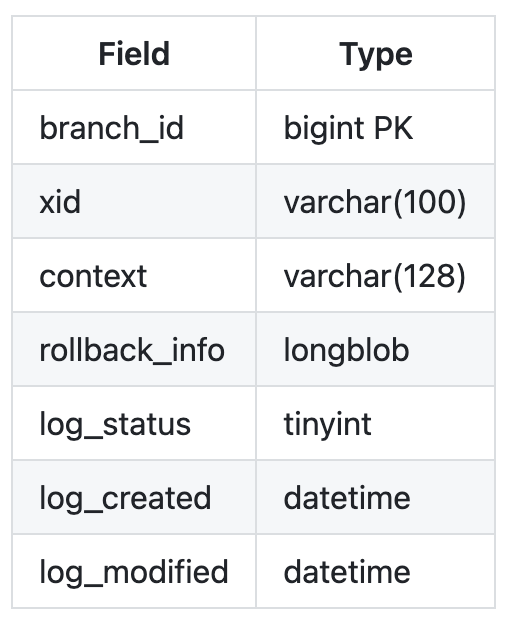
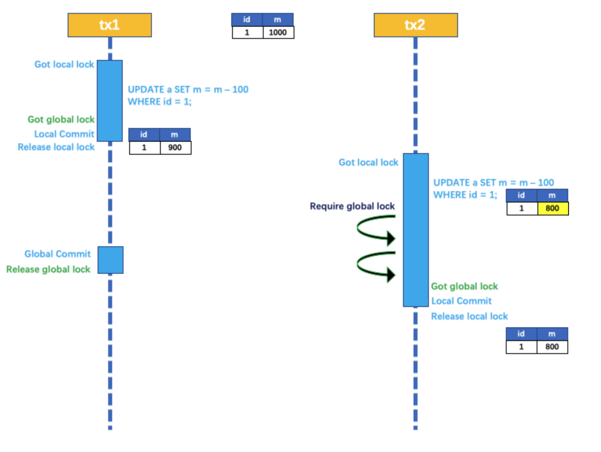
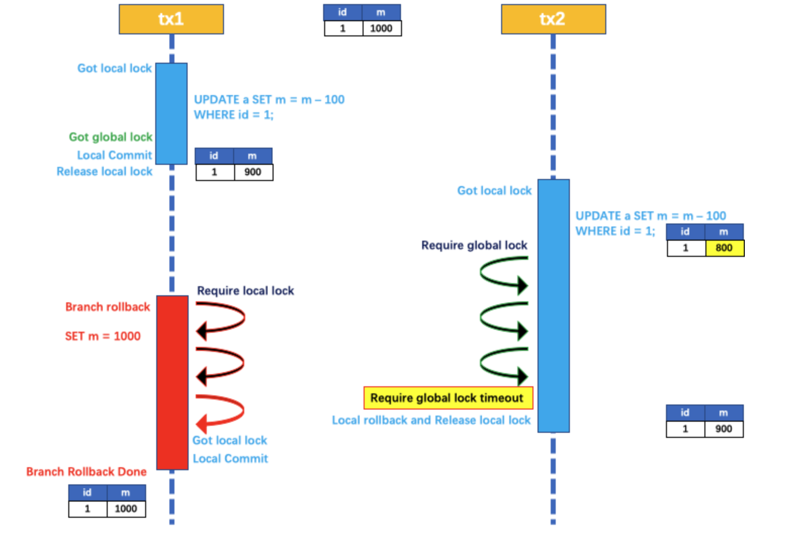
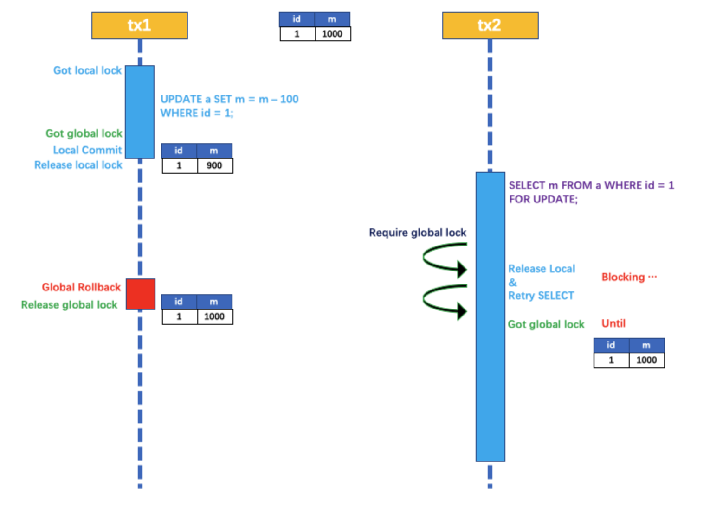

### Seata框架详解

### 一、Seata是什么？

#### 1.1 前言

Seata 是一款开源的分布式事务解决方案，致力于提供高性能和简单易用的分布式事务服务。Seata降为用户提供了AT，TCC，SAGA 和 XA 事务模式，为用户打造一站式的分布式解决方案。

#### 1.2 Seata术语

```java
1. TC(Transaction Coordinator) 事务协调者：维护全局和分支事务的状态，驱动全局失误提交或回滚
2. TM (Trancsction Manager) 事务管理器：定义全局事务的范围：开始全局事务，提交或回滚全局事务。
3. RM（Resource Manager）资源管理器：管理分支事务处理的资源，与TC交谈以注册分支事务和报告分支事务的状态，并驱动分支事务提交或回滚。
```

##### 1.2.1 **理解**：

- 首先来看TM，是定义分布式事务范围的作用。类似于本地事务的 begin...commit...rolback 的作用。只不过其定义的是全局分布式事务范围，这就需要知道有几个分布式分支的事务完成后才 commit。
- 然后再看TC，TC是具体的协调和执行者。它监控每个分布式分支事务执行成功与否，然后判断整体分布式事务是提交还是回滚。TM定义范围，TC用于联络各分支与TM的范围，推动总体分布式事务进程。

- RM是各分布式分支的监控器。监控各分支本地事务执行情况，然后通知给TC，同时驱动各分支本地事务的退静，是提交还是回滚。

##### 1.2.2 总体概括

​	TM是一个分布式事务的发起者和终结者，TC负责维护分布式事务的运行状态，而RM则负责本地事务的运行。

##### 1.2.3 分布式事务执行流程


官网扒下来的图，借助此图解释一下SEATA执行分布式事务的流程，同时体会TC、TM和RM之间的关系和作用。

在上图中，涉及到四个微服务系统，分别是Business系统，Stock系统，Order系统和Account系统。当执行某个业务时，**Bussiness系统** 远程调用了 **Stock系统** 和 **Order系统** ，**Order系统 **又远程调用了**Account系统** ，相当于发生了三次远程调用，才执行完这个业务操作。而且这几个远程调用的方法要求具有原子性，即出现了分布式事务场景。

1. 使用Seata框架，在 Bussiness系统发生的远程调用，所以Business是TM角色，定义分布式事务的范围，并向TC申请开启一个全局事务。TC生成一个全局事务并发生一个全局唯一 XID返回给 TM。
2. TM 获取到 XID 后，携带 XID 进行远程调用，XID 在微服务链路中进行传递。
3. 各分支事务获取到 XID 后，与 TC 进行通信，注册各分支本地事务，并执行本地事务，执行结果(提交/回滚)提交给 TC 。
4. TM 根据 TC 中记录的各分支事务的提交状态，发起全局事务的提交或回滚。

5. TC 调度 XID 下所有分支事务进行提交或回滚操作。

以上就是SEATA 执行分布式事务整体流程。

##### 1.2.4 问题：

理解了上述过程后，会有几个问题在脑海中出现，

```java
1. 由上图可以看到，TM和RM 都与 TC 进行通信，那么 TC 到底是个什么东西？
2. RM 执行各自分支的事务，加入有的分支事务提交了，有的分支事务回滚了，那么在第五步中，TC 是要对所有分支事务进行回滚的，而执行成功的分支事务，如何在回滚回去呢？
```

#### 1.3 Seata 几种不同的事务模式

> Seata 将为用户提供了 AT、TCC、SAGA 和 XA 事务模式，为用户打造一站式的分布式解决方案。

下面分别学习这几种事务模式特性和区别。

##### 1.3.1 AT模式

###### 1.3.1.1 **前提**：

- 基于支持本地 ACID 事务的关系型数据库。
- Java应用，通过JDBC访问数据库。

###### 1.3.1.2 **整体机制**：

```java
两阶段提交协议的演变：
  1. 一阶段: 业务数据和回滚日志记录在同一个本地事务中提交，释放本地锁和链接资源。
  2. 二阶段: 
			提交异步化，非常快速的完成。
      回滚通过一阶段的回滚日志进行反向补偿。
```

可以看到，AT模式通过回滚日志，来回滚提交成功后的事务。这也解答了上面问题中的第二个问题。具体是如何通过回滚日志回滚的呢？看下面的工作机制。

###### 1.3.1.3 **工作机制**：

seata为我们提供了日志回滚表，不同的数据库回滚表结构有差异，Mysql数据日志回滚表结构如下：



```mysql
-- 注意此处0.7.0+ 增加字段 context
CREATE TABLE `undo_log` (
  `id` bigint(20) NOT NULL AUTO_INCREMENT,
  `branch_id` bigint(20) NOT NULL,
  `xid` varchar(100) NOT NULL,
  `context` varchar(128) NOT NULL,
  `rollback_info` longblob NOT NULL,
  `log_status` int(11) NOT NULL,
  `log_created` datetime NOT NULL,
  `log_modified` datetime NOT NULL,
  PRIMARY KEY (`id`),
  UNIQUE KEY `ux_undo_log` (`xid`,`branch_id`)
) ENGINE=InnoDB AUTO_INCREMENT=1 DEFAULT CHARSET=utf8;
```

将这个表加入到各个分支事务系统的数据库中。


下面以 product 微服务系统为例，介绍 seata 中提交回滚过程：

假设某个分布式事务业务中某个分支需要更改 product 表中数据，执行一下 sql 语句。

```mysql
update product set name = 'GTS' where name = 'TXC';
```

###### 1.3.1.4 **一阶段**：

1. 首先，seata框架解析sql，得到SQL的类型（UPDATE），表（product），条件（where name='TXC'）等相关的信息。

2. 然后，根据要更新的数据，查询该条数据查询前的数据镜像，如下sql：

   ```sql
   select id, name, since from product where name = 'TXC';
   ```

   这样就得到了更改的这条数据更改之前的镜像，如下图：

| id   | name | since |
| ---- | ---- | ----- |
| 1    | TXC  | 2014  |

3. 执行业务 SQL：更新这条记录的 name 为 'GTS'。

4. 查询更改后镜像：因为获取到数据的id，可以根据id查询更改后的数据：

   ```mysql
   select id, name, since from product where id = 1;
   ```

得到更新后的镜像：

| id   | name | since |
| ---- | ---- | ----- |
| 1    | GTS  | 2014  |

5. 插入回滚日志：把前后镜像数据以及业务员SQL相关的信息组成一条回滚日志记录，插入到 UNDO_LOG表中。

   ```mysql
   {
   	"branchId": 641789253,
   	"undoItems": [{
   		"afterImage": {
   			"rows": [{
   				"fields": [{
   					"name": "id",
   					"type": 4,
   					"value": 1
   				}, {
   					"name": "name",
   					"type": 12,
   					"value": "GTS"
   				}, {
   					"name": "since",
   					"type": 12,
   					"value": "2014"
   				}]
   			}],
   			"tableName": "product"
   		},
   		"beforeImage": {
   			"rows": [{
   				"fields": [{
   					"name": "id",
   					"type": 4,
   					"value": 1
   				}, {
   					"name": "name",
   					"type": 12,
   					"value": "TXC"
   				}, {
   					"name": "since",
   					"type": 12,
   					"value": "2014"
   				}]
   			}],
   			"tableName": "product"
   		},
   		"sqlType": "UPDATE"
   	}],
   	"xid": "xid:xxx"
   }
   ```

可以看出，里面记录了xid，branchId 等事务相关的信息，还记录了sqlType、tableName 等数据操作相关的信息，还记录了afterImage 和 beforeImage 这些数据变化前后的信息。以此来保证后续回滚操作的正常执行。

6. 向TC注册分支，申请 product 表中的id为1的数据全局锁。
7. 本地事务提交：业务数据的更新和前面步骤中生成的 UNDO LOG 一并提交。在此前，本地数据一直没有提交，在这里才提交本地事务。 undo log 表数据也在事务内提交，如果提交不成功，也会回滚。
8. 将本地事务执行结果汇报给 TC。

这里一阶段就执行完毕了。一阶段主要做的工作是执行本地事务和 undo 表数据，并将本地事务状态汇报给 TC，是本地事务提交阶段。

###### 1.3.1.5 **二阶段**：

二阶段即 TC 根据所有分支的本地事务的状态，决定全局分布式事务是提交还是回滚，然后通知各分支分布式事务的状态，让本地事务根据全局事务是提交还是回滚，来对各自本子事务执行后续的操作。这里分为全局事务回滚和提交两种情况来看二阶段本地事务是如何执行的；

###### 1.3.1.6 **回滚**：

加入在其他分支中，某个本地事务进行了回滚，则全局事务回滚。虽然 product 表事务执行了成功，但是也需要回滚，具体流程如下：

1. product 收到 TC 的分支回滚请求，开启一个本地事务，执行如下操作。

2. 通过 XID 和 Branch ID 查找到相应的 UNDO  LOG 记录。

3. 数据校验：拿 UNDO LOG 中的后镜与当前数据进行比较，如果有不同，说明数据被当前全局事务之外的动作做了修改。这种情况，需要根据配置策略来做处理，详细的说明在另外的文档中介绍。

4. 根据 UNDO LOG 中前镜像和业务 SQL 的相关信息生成并执行回滚的语句：

   ```sql
   update product set name = 'TXC' where id = 1;
   ```

5. 提交本地事务。并把本地事务的执行结果（即分支事务回滚的结果）上报给TC。

###### 1.3.1.7 **提交**：

如果全局事务执行成功，则TC也会给各分支发送提交的信息，此时，各分支主要是将 undo log 表中相关的日志数据删除操作。

###### 1.3.1.8 **问题**：

在回操作的第三步，数据检查中，会检查现在的数据和本次事务中修改后的数据是否一致，如果一致，说明没有其他食物操作这条数据，如果不一致，说明其他事务修改过这条数据。此时，回滚操作就很复杂了。具体seata有哪些策略，在官网没有介绍，这里先不深入研究，等实战中在遇到，研究。

###### 1.3.1.9 **写隔离**

AT 模式的写隔离是指，在第一阶段提交时，多个食物对同一条数据的写操作，时安全的。不会出现并发问题。而在第二阶段，其他食物或线程是可以对第一阶段的操作过程的数据进行修改的，此时就没有隔离机智了。这种情况其实就是上面提到的回滚阶段的数据检查那个步骤的原因。

> - 一阶段本地事务提交前，需要确保先拿到全局锁。
> - 拿不到 全局锁，不能提交本地事务。
> - 拿 全局锁 的尝试被限制在一定范围内，超出范围将放弃，并回滚本地事务，释放本地锁。

下面举例说明：
两个全局事务 tx1 和 tx2，分别对 a 表的 m 字段进行更新操作，m 的初始值 1000。

tx1 先开始，开启本地事务，拿到本地锁，更新操作 m = 1000 - 100 = 900。本地事务提交前，先拿到该记录的 **全局锁** ，本地提交释放本地锁。 tx2 后开始，开启本地事务，拿到本地锁，更新操作 m = 900 - 100 = 800。本地事务提交前，尝试拿该记录的 **全局锁** ，tx1 全局提交前，该记录的全局锁被 tx1 持有，tx2 需要重试等待 **全局锁** 。



tx1 二阶段全局提交，释放 **全局锁** 。tx2 拿到 **全局锁** 提交本地事务。



如果 tx1 的二阶段全局回滚，则 tx1 需要重新获取该数据的本地锁，进行反向补偿的更新操作，实现分支的回滚。

此时，如果 tx2 仍在等待该数据的 **全局锁**，同时持有本地锁，则 tx1 的分支回滚会失败。分支的回滚会一直重试，直到 tx2 的 **全局锁** 等锁超时，放弃 **全局锁** 并回滚本地事务释放本地锁，tx1 的分支回滚最终成功。

因为整个过程 **全局锁** 在 tx1 结束前一直是被 tx1 持有的，所以不会发生 **脏写** 的问题。

###### 1.3.1.10 **读隔离**

在数据库本地事务隔离级别 **读已提交（Read Committed）** 或以上的基础上，Seata（AT 模式）的默认全局隔离级别是 **读未提交（Read Uncommitted）** 。

如果应用在特定场景下，必需要求全局的 **读已提交** ，目前 Seata 的方式是通过 `SELECT FOR UPDATE` 语句的代理。



SELECT FOR UPDATE 语句的执行会申请 **全局锁** ，如果 **全局锁** 被其他事务持有，则释放本地锁（回滚 SELECT FOR UPDATE 语句的本地执行）并重试。这个过程中，查询是被 block 住的，直到 **全局锁** 拿到，即读取的相关数据是 **已提交** 的，才返回。

出于总体性能上的考虑，Seata 目前的方案并没有对所有 SELECT 语句都进行代理，仅针对 FOR UPDATE 的 SELECT 语句。

##### 1.3.2 Seata TCC 模式

回顾总览中的描述：一个分布式的全局事务，整体是 **两阶段提交** 的模型。全局事务是由若干分支事务组成的，分支事务要满足 **两阶段提交** 的模型要求，即需要每个分支事务都具备自己的：

- 一阶段 prepare 行为
- 二阶段 commit 或 rollback 行为


根据两阶段行为模式的不同，我们将分支事务划分为 **Automatic (Branch) Transaction Mode** 和 **TCC (Branch) Transaction Mode**.

**AT 模式**（[参考链接 TBD](https://seata.io/zh-cn/docs/dev/mode/tcc-mode.html)）基于 **支持本地 ACID 事务** 的 **关系型数据库**：

- 一阶段 prepare 行为：在本地事务中，一并提交业务数据更新和相应回滚日志记录。
- 二阶段 commit 行为：马上成功结束，**自动** 异步批量清理回滚日志。
- 二阶段 rollback 行为：通过回滚日志，**自动** 生成补偿操作，完成数据回滚。

相应的，**TCC 模式**，不依赖于底层数据资源的事务支持：

- 一阶段 prepare 行为：调用 **自定义** 的 prepare 逻辑。
- 二阶段 commit 行为：调用 **自定义** 的 commit 逻辑。
- 二阶段 rollback 行为：调用 **自定义** 的 rollback 逻辑。

所谓 TCC 模式，是指支持把 **自定义** 的分支事务纳入到全局事务的管理中。


