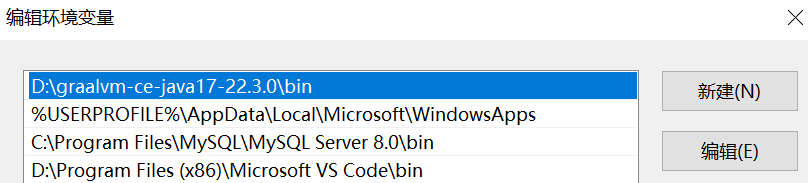
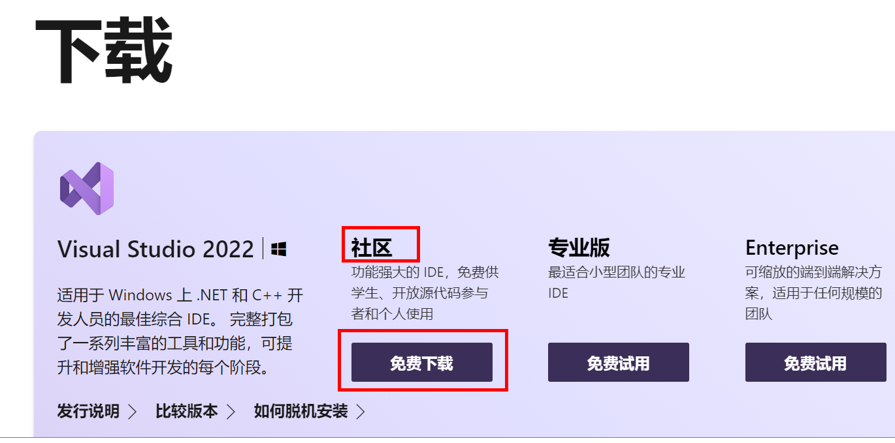
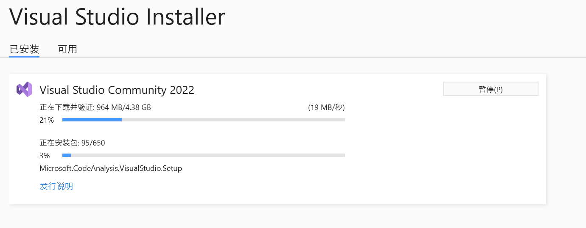
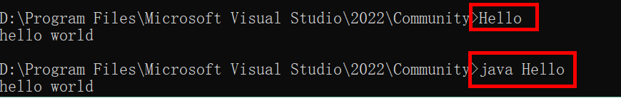

### 一、Spring框架概述

1.1 Spring 是轻量级的开源的 JavaEE 框架。

1.2 Spring 可以解决企业应用开发的复杂。

1.3 Spring 有两个核心部分：IOC 和 AOP。

- IOC：控制反转，把创建对象过程交给Spring进行管理。
- AOP：面向切面，不修改源代码进行功能增强。

1.4 Spring 特点：

- 方便解耦，简化开发。
- AOP编程支持。
- 方便程序测试。
- 方便和其他框架进行整合。
- 方便进行事务操作。
- 降低API开发难度。

### 二、IOC容器

#### 2.1 IOC概念和原理

##### 2.1.1 概念：

- 控制反转，把创建对象和对象的调用过程交给spring进行管理。
- 目的：降低耦合度。
- 底层原理：xml，反射，工厂模式。
- Spring提供IOC容器两种实现方式（两个接口）
  - **BeanFactory**：Spring内部使用的接口，不提倡开发人员使用。特点：加载配置文件时不会创建对象，获取对象时才会创建对象。
  - **ApplicationContext**：BeanFactory的子接口，提供了更多更强大的功能，一般由开发人员使用。特点：加载配置文件时会把配置文件里面的对象进行创建。
  - ApplicationContext两个常用实现类：
    - FileSystemXmlApplication：绝对路径，从盘符开始算起。
    - ClassPathXmlAppliation：相对路径，从src开始算起。


什么是Bean管理？Bean管理是指两个操作：Spring创建对象和Spring注入属性。

Bean管理有两种操作方式：基于xml配置文件方式实现和基于注解方式实现。

##### 2.1.2 IOC操作Bean管理（基于xml）

**xml实现Bean管理**

1. 基于xml方式创建对象：

> //配置User对象
>
> <bean id="user" class="com.yooome.spring6.User"></bean>

- 在Spring配置文件中使用bean标签来创建对象。
- bean标签有很多属性，常用属性：
  - id：唯一标识
  - class：类路径

- 创建对象时，默认执行无参构造函数

2. 基于xml方式注入属性：

**第一种方法**：使用set方法进行注入：

首先为类的属性提供set方法：

```java
public class User {

    private String userName;
    private String userAge;

    public void setUserName(String userName) {
        this.userName = userName;
    }

    public void setUserAge(String userAge) {
        this.userAge = userAge;
    }

    public String getUserName() {
        return userName;
    }

    public String getUserAge() {
        return userAge;
    }
}


```

然后再xml配置文件中通过property标签进行属性注入

```xml
    <!--配置User对象-->
    <bean id="user" class="com.yooome.spring6.User">
        <property name="userName" value="haha"></property>
        <property name="userAge" value="18"></property>
    </bean>
```

这样就完了

```java
ApplicationContext applicationContext = new ClassPathXmlApplicationContext("bean1.xml");
applicationContext.getBean("user",User.class);
System.out.println(user.getUserName() + " " + user.getUserAge());
```

**第二种方法**：使用有参数构造函数进行注入

首先提供有参构造方法：

```java
public class User {

    private String userName;
    private String userAge;

    public User(String userName, String userAge){
        this.userName = userName;
        this.userAge = userAge;
    }
}

```

然后再xml配置文件中通过construct-arg标签进行属性注入

```xml
    <!--配置User对象-->
    <bean id="user" class="com.yooome.spring6.User">
        <property name="userName" value="haha"></property>
        <property name="userAge" value="18"></property>
    </bean>
```

**第三种方法**：p名称空间注入（了解即可）

首先在xml配置文件中添加p名称空间，并且在bean标签中进行操作


然后提供set方法

```java
public class User {

    private String userName;
    private String userAge;

    public User() {
    }

    public void setUserName(String userName) {
        this.userName = userName;
    }

    public void setUserAge(String userAge) {
        this.userAge = userAge;
    }
}

```

3. xml注入其他属性

- null 值

```xml
    <!--配置User对象-->
    <bean id="user" class="com.yooome.spring6.User">
        <property name="userName"> <null/> </property>
    </bean>
```

- 属性值包含特殊符号

假设现在userName属性需要赋值为<haha>

如果像上面那样直接在value中声明的话会报错，因为包含特殊符号 <>


需要通过<![CDATA[值]]>


- 注入属性-外部bean

有两个类：UserService 和 UserDaoImpl ,其中 UserDaoImpl 实现UserDao接口

```java
public class UserService{
  private UserDao userDao;
  public void setUserDao(UserDao userDao){
    this.userDao = userDao;
  }
  
  public void add() {
    System.out.println("add");
  }
}
```

通过ref来制定创建userDaoImpl

```xml
<bean id="userDaoImpl" class="com.yooome.spring6.UserDaoImpl"></bean>

<bean id="userService" class="com.yooome.spring6.UserService">
    <property name="userDao" ref="userDaoImpl"></property>
</bean>

```

- 注入属性-内部bean

不通过ref属性，而是通过嵌套一个bean标签实现

```xml
<!--内部 bean-->
<bean id="emp" class="com.atguigu.spring5.bean.Emp">
     <!--设置两个普通属性-->
     <property name="ename" value="lucy"></property>
     <property name="gender" value="女"></property>
     <!--设置对象类型属性-->
     <property name="dept">
         <bean id="dept" class="com.yooome.spring6.bean.Dept">
        	 <property name="dname" value="安保部"></property>
         </bean>
     </property>
</bean>
```

- 注入属性-级联赋值

写法一：也就是上面所说的外部bean，通过ref属性来获取外部bean。

写法二：

emp 类中有 ename 和 dept 两个属性，其中 dept 有 dname 属性，写法二需要 emp 提供 dept 属性的 get 方法。

```xml
<!--级联赋值-->
<bean id="emp" class="com.yooome.spring6.bean.Emp">
    <!--设置两个普通属性-->
    <property name="ename" value="lucy"></property> <property name="gender" value="女"></property>
    <!--写法一-->
	<property name="dept" ref="dept"></property>
    <!--写法二-->
    <property name="dept.dname" value="技术部"></property>
</bean>
<bean id="dept" class="com.yooome.spring6.bean.Dept">
    <property name="dname" value="财务部"></property>
</bean>

```

6. 注入集合属性（数组，List，Map）

假设有一个Stu类

```java
public class Stu {

    private String[] courses;
    private List<String> list;
    private Map<String,String> map;
    private Set<String> set;

    public void setCourses(String[] courses) {
        this.courses = courses;
    }

    public void setList(List<String> list) {
        this.list = list;
    }

    public void setMap(Map<String, String> map) {
        this.map = map;
    }

    public void setSet(Set<String> set) {
        this.set = set;
    }
}

```

在xml配置文件中对这些集合属性进行注入

```xml
<bean id="stu" class="com.yooome.spring6.Stu">
    <!--数组类型属性注入-->
    <property name="courses">
        <array>
            <value>java课程</value>
            <value>数据库课程</value>
        </array>
    </property>
    <!--List类型属性注入-->
    <property name="list">
        <list>
            <value>张三</value>
            <value>李四</value>
        </list>
    </property>
    <!--Map类型属性注入-->
    <property name="map">
        <map>
            <entry key="JAVA" value="java"></entry>
            <entry key="PHP" value="php"></entry>
        </map>
    </property>
    <!--Set类型属性注入-->
    <property name="set">
        <set>
            <value>Mysql</value>
            <value>Redis</value>
        </set>
    </property>
</bean>

```

- 上面的集合值都是字符串，如果是对象的话，如下：

写法：集合 + 外部 bean

```xml
<!--创建多个 course 对象-->
<bean id="course1" class="com.yooome.spring6.collectiontype.Course">
	<property name="cname" value="Spring6 框架"></property>
</bean>
<bean id="course2" class="com.yooome.spring6.collectiontype.Course">
	<property name="cname" value="MyBatis 框架"></property>
</bean>

<!--注入 list 集合类型，值是对象-->
<property name="courseList">
    <list>
        <ref bean="course1"></ref>
        <ref bean="course2"></ref>
    </list>
</property>

```

- 把集合注入部分提取出来

使用util标签，这样不同的bean都可以使用相同的集合注入部分了。

```xml
<util:list id="booklist">
	<value>已经加</value>
  <value>九阳神功</value>
</util:list>
<bean id="book" class="com.yooome.spring6.Book">
	<property name="list" ref="booklist"></property>
</bean>
```

- FactoryBean

Spring有两种Bean，一种普通的Bean，另一种是工厂Bean（FactoryBean）

这块看不太懂，不知道有啥用，先放着。

#### 2.2 Bean的作用域

##### 2.2.1 在Spring中，默认情况下bean是单实例对象。


##### 2.2.2 通过bean标签的scope属性来设置但实力还是多实例。

###### 2.2.2.1 Scope属性值：

- **singleton**：默认值，表示但实例对象。加载配置文件时就会创建单实例对象。
- **property**：表示多实例对象。不是加载配置文件时创建对象，在调用getBean方法时创建多实例对象。


执行结果不同：


#### 2.3 Bean的生命周期

##### 2.3.1 bean的生命周期

1. 通过构造器创建 bean 实例(无参构造)
2. 为 bean 的属性设置和对其他 bean 引用（调用set方法）
3. 把 bean 实例传递 bean 后置处理器的方法 **postProcessBeforeInitialization**（初始化前的后置处理器）
4. 调用 bean 的初始化的方法（需要进行配置初始化的方法）
5. 把 bean 实例传递 bean 后置处理器的方法 **postProcessAfterInitialization** （初始化后的后置处理器）
6. bean 可以使用了（对象获取到了）
7. 当容器关闭时候，调用 bean 的销毁的方法（需要进行配置销毁的方法）

##### 2.3.2 演示bean的生命周期

```java
public class Orders {
    private String orderName;

    public Orders() {
        System.out.println("第一步：执行无参构造方法创建bean实例");
    }

    public void setOrderName(String orderName) {
        this.orderName = orderName;
        System.out.println("第二步：调用set方法设置属性值");
    }

    //初始化方法
    public void initMethod(){
        System.out.println("第四步：执行初始化方法");
    }

    //销毁方法
    public void destroyMethod(){
        System.out.println("第七步：执行销毁方法");
    }
}

```

```java
//实现后置处理器，需要实现BeanPostProcessor接口
public class MyBeanPost implements BeanPostProcessor {

    @Override
    public Object postProcessBeforeInitialization(Object bean, String beanName) throws BeansException {
        System.out.println("第三步：将bean实例传递给bean后置处理器的postProcessBeforeInitialization方法");
        return bean;
    }

    @Override
    public Object postProcessAfterInitialization(Object bean, String beanName) throws BeansException {
        System.out.println("第五步：将bean实例传递给bean后置处理器的postProcessAfterInitialization方法");
        return bean;
    }
}

```

```xml
<bean id="orders" class="com.oymn.spring5.Orders" init-method="initMethod" destroy-method="destroyMethod">
    <property name="orderName" value="hahah"></property>
</bean>

<!--配置bean后置处理器，这样配置后整个xml里面的bean用的都是这个后置处理器-->
<bean id="myBeanPost" class="com.yooome.spring6.MyBeanPost"></bean>

```

```java
@Test
public void testOrders(){

    ClassPathXmlApplicationContext context = new ClassPathXmlApplicationContext("bean1.xml");

    Orders orders = context.getBean("orders", Orders.class);

    System.out.println("第六步：获取bean实例对象");
    System.out.println(orders);

    //手动让bean实例销毁
    context.close();
}

```


##### 2.3.3 xml自动装配

- 根据指定的配置规则（属性名称或者属性类型），Spring自动将匹配的属性进行注入。
- 根据属性名称自动装配：要求 emp 中属性的名称 dept 和 bean 标签的id值dept一样，才能识别。

```xml
<bean id="emp" class="com.yooome.spring6.Emp" autowire="byName"></bean>
<bean id="dept" class="com.yooome.spring6.Dept"></bean>
```

##### 2.3.4 通过外部属性文件来操作bean：

例如配置数据库信息：

1. 导入德鲁伊连接池jar包。
2. 创建外部属性文件，properties格式文件，写数据库信息。


3. 引入context名称空间，并通过context标签引入外部属性文件，使用 ”${}“ 来获取文件中对应的值


#### 2.4 IOC操作Bean管理（基于注解）

- 格式：@注解名称（属性名=属性值，属性名=属性值，......)
- 注解可以作用在类，属性，方法。
- 使用注解的目的：简化xml配置。

##### 2.4.1 基于注解创建对象

spring提供了四种创建对象的注解：

- @Component：一般用于配置文件
- @Service：一般用于Service层

- @Controller： 一般用于web层
- @Respository：一般用于Dao层

流程：

1. 引入依赖。
2. 开启组件扫描：扫描base-package包下所有有注解的类并为其创建对象。

```xml
<context:component-scan base-package="com.yooome"></context:component-scan>
```

3. com.yooome.spring6.Service有一个stuService类。

```java
//这里通过@Component注解来创建对象,括号中value的值等同于之前xml创建对象使用的id,为了后面使用时通过id来获取对象
//括号中的内容也可以省略,默认是类名并且首字母小写
//可以用其他三个注解
@Component(value="stuService")
public class StuService {
    public void add(){
        System.out.println("addService");
    }
}
```

4. 这样就可以通过getBean方法来获取stuService对象了

```java
ClassPathXmlApplicationContext context = new ClassPathXmlApplicationContext("bean4.xml");
StuService stuService = context.getBean("stuService", StuService.class);
System.out.println(stuService);
stuService.add();
```

##### 2.4.2 开启组件扫描的细节配置：

1. use-default-fileters 设置为false表示不适用默认过滤器，通过include-filter来设置只扫描com.yooome包下的所有 @Controller修饰的类。

```xml
<context:component-scan base-package="com.yooome" use-default-filters="false">
    <context:include-filter type="annotation" expression="org.springframework.stereotype.Controller"/>
</context:component-scan>
```

2. Exclude-filter设置那些注解不被扫描，例子中为@Controller修饰的类不被扫描

```xml
<context:component-scan base-package="com.yooome">
    <context:exclude-filter type="annotation" expression="org.springframework.stereotype.Controller"/>
</context:component-scan>
```

##### 2.4.3 基于注解进行属性注入：

①场景一：Autowird属性注入

- @Autowird：根据属性类型自动装配【默认是byType】

查看源码：

```java
package org.springframework.beans.factory.annotation;

import java.lang.annotation.Documented;
import java.lang.annotation.ElementType;
import java.lang.annotation.Retention;
import java.lang.annotation.RetentionPolicy;
import java.lang.annotation.Target;

@Target({ElementType.CONSTRUCTOR, ElementType.METHOD, ElementType.PARAMETER, ElementType.FIELD, ElementType.ANNOTATION_TYPE})
@Retention(RetentionPolicy.RUNTIME)
@Documented
public @interface Autowired {
    boolean required() default true;
}

```

源码中有两处需要注意：

- 第一处：该注解可以标注在哪里？
  1. 构造方法上。
  2. 方法上。
  3. 形参上。
  4. 属性上。
  5. 注解上。

- 第二处：该注解有一个requirde属性，默认值是true，表示在注入的时候要求背注入的Bean必须是存在的，如果不存在则报错。如果required 属性设置为false，表示注入的Bean存在或者不存在都没关系，存在的话就注入，不存在的话，也不报错。

创建 StuDao 接口和 StuDaoImpl 实现类，为 StuDaoImpl 添加创建对象注解

```java
public interface StuDao {
    public void add();
}
```

```java
@Repository
public class StuDaoImpl implements StuDao {
    @Override
    public void add() {
        System.out.println("StuDaoImpl");
    }
}
```

StuService 类中添加StuDao属性，为其添加 @Autowire 注解，spring回地总为stuDao属性创建StuDaoImpl对象。

```java
@Component(value="stuService")
public class StuService {
    
    @Autowired
    public StuDao stuDao;

    public void add(){
        System.out.println("addService");
        stuDao.add();
    }
}
```

```java
@Test
public void test1(){
    ClassPathXmlApplicationContext context = new ClassPathXmlApplicationContext("bean4.xml");
    StuService stuService = context.getBean("stuService", StuService.class);
    System.out.println(stuService);
    stuService.add();
}
```

②场景二：set注入

UserServiceImpl 类

```java
@Service
public class UserServiceImpl implements UserService {
    private UserDao userDao;
    @Autowired
    public void setUserDao(UserDao userDao) {
        this.userDao = userDao;
    }

    @Override
    public void addUser() {
        userDao.addUser();
        System.out.println("完成添加user信息");
    }
}
```

UserDao类

```java
package com.yooome.bennet.dao;

public interface UserDao {
    void addUser();
}

```

UserDaoImpl 类

```java
package com.yooome.bennet.dao.impl;

import com.yooome.bennet.dao.UserDao;
import org.springframework.stereotype.Repository;

@Repository
public class UserDaoImpl implements UserDao {

    @Override
    public void addUser() {
        System.out.println("dao add user");
    }
}
```


③场景三：构造方法注入

修改UserServiceImpl类

```java
package com.yooome.bennet.service.impl;

import com.yooome.bennet.dao.UserDao;
import com.yooome.bennet.service.UserService;
import org.springframework.beans.factory.annotation.Autowired;
import org.springframework.stereotype.Service;

@Service
public class UserServiceImpl implements UserService {
    private UserDao userDao;

    @Autowired
    public UserServiceImpl(UserDao userDao) {
        this.userDao = userDao;
    }

    @Override
    public void addUser() {
        userDao.addUser();
        System.out.println("完成添加user信息");
    }
}
```

```java
package com.yooome.bennet.controller;

import com.yooome.bennet.service.UserService;
import com.yooome.bennet.spring6.User;
import org.springframework.beans.factory.annotation.Autowired;
import org.springframework.web.bind.annotation.GetMapping;
import org.springframework.web.bind.annotation.PostMapping;
import org.springframework.web.bind.annotation.RestController;

@RestController
public class UserController {
    @Autowired
    private UserService userService;
    @PostMapping("/post/user")
    public void addUser() {
        userService.addUser();
        System.out.println("post 添加用户信息");
    }
}
```


④场景四：形参上注入

修改UserServiceImpl类

```java
package com.yooome.bennet.service.impl;

import com.yooome.bennet.dao.UserDao;
import com.yooome.bennet.service.UserService;
import org.springframework.beans.factory.annotation.Autowired;
import org.springframework.stereotype.Service;

@Service
public class UserServiceImpl implements UserService {
    private UserDao userDao;

    @Autowired
    public UserServiceImpl(UserDao userDao) {
        this.userDao = userDao;
    }

    @Override
    public void addUser() {
        userDao.addUser();
        System.out.println("完成添加user信息");
    }
}
```

修改UserController类

```java
package com.yooome.bennet.controller;

import com.yooome.bennet.service.UserService;
import com.yooome.bennet.spring6.User;
import org.springframework.beans.factory.annotation.Autowired;
import org.springframework.web.bind.annotation.GetMapping;
import org.springframework.web.bind.annotation.PostMapping;
import org.springframework.web.bind.annotation.RestController;

@RestController
public class UserController {

    private UserService userService;
    @GetMapping("/get/user")
    public User getUser() {
        User user = new User();
        user.setUserAge(18);
        user.setUserName("张三");
        return user;
    }
    @PostMapping("/post/user")
    public void addUser() {
        userService.addUser();
        System.out.println("post 添加用户信息");
    }

    public UserController(@Autowired UserService userService) {
        this.userService = userService;
    }
}
```

当有参数的构造方法只有一个时，@Autowired注解可以设略。

⑥场景六：@Autowired注解和@Qualifier注解联合


### 十一、提前编译：AOT


#### 11.1 AOT概述

##### 11.1.1 JIT与AOT的区别

JIT和AOT 这个名词是指两种不同的编译方式，这两种编译方式的主要区别在于是否在“运行时”进行编译

**（1）JIT， Just-in-time,动态(即时)编译，边运行边编译；**

在程序运行时，根据算法计算出热点代码，然后进行 JIT 实时编译，这种方式吞吐量高，有运行时性能加成，可以跑得更快，并可以做到动态生成代码等，但是相对启动速度较慢，并需要一定时间和调用频率才能触发 JIT 的分层机制。JIT 缺点就是编译需要占用运行时资源，会导致进程卡顿。

**（2）AOT，Ahead Of Time，指运行前编译，预先编译。**

AOT 编译能直接将源代码转化为机器码，内存占用低，启动速度快，可以无需 runtime 运行，直接将 runtime 静态链接至最终的程序中，但是无运行时性能加成，不能根据程序运行情况做进一步的优化，AOT 缺点就是在程序运行前编译会使程序安装的时间增加。                                                           

**简单来讲：**JIT即时编译指的是在程序的运行过程中，将字节码转换为可在硬件上直接运行的机器码，并部署至托管环境中的过程。而 AOT 编译指的则是，在程序运行之前，便将字节码转换为机器码的过程。

```
.java -> .class -> (使用jaotc编译工具) -> .so（程序函数库,即编译好的可以供其他程序使用的代码和数据）
```


**（3）AOT的优点**

**简单来讲，**Java 虚拟机加载已经预编译成二进制库，可以直接执行。不必等待及时编译器的预热，减少 Java 应用给人带来“第一次运行慢” 的不良体验。

在程序运行前编译，可以避免在运行时的编译性能消耗和内存消耗
可以在程序运行初期就达到最高性能，程序启动速度快
运行产物只有机器码，打包体积小

**AOT的缺点**

由于是静态提前编译，不能根据硬件情况或程序运行情况择优选择机器指令序列，理论峰值性能不如JIT
没有动态能力，同一份产物不能跨平台运行

第一种即时编译 (JIT) 是默认模式，Java Hotspot 虚拟机使用它在运行时将字节码转换为机器码。后者提前编译 (AOT)由新颖的 GraalVM 编译器支持，并允许在构建时将字节码直接静态编译为机器码。

现在正处于云原生，降本增效的时代，Java 相比于 Go、Rust 等其他编程语言非常大的弊端就是启动编译和启动进程非常慢，这对于根据实时计算资源，弹性扩缩容的云原生技术相冲突，Spring6 借助 AOT 技术在运行时内存占用低，启动速度快，逐渐的来满足 Java 在云原生时代的需求，对于大规模使用 Java 应用的商业公司可以考虑尽早调研使用 JDK17，通过云原生技术为公司实现降本增效。


##### 11.1.2 Graalvm

Spring6 支持的 AOT 技术，这个 GraalVM  就是底层的支持，Spring 也对 GraalVM 本机映像提供了一流的支持。GraalVM 是一种高性能 JDK，旨在加速用 Java 和其他 JVM 语言编写的应用程序的执行，同时还为 JavaScript、Python 和许多其他流行语言提供运行时。 GraalVM 提供两种运行 Java 应用程序的方法：在 HotSpot JVM 上使用 Graal 即时 (JIT) 编译器或作为提前 (AOT) 编译的本机可执行文件。 GraalVM 的多语言能力使得在单个应用程序中混合多种编程语言成为可能，同时消除了外语调用成本。GraalVM 向 HotSpot Java 虚拟机添加了一个用 Java 编写的高级即时 (JIT) 优化编译器。

GraalVM 具有以下特性：

（1）一种高级优化编译器，它生成更快、更精简的代码，需要更少的计算资源

（2）AOT 本机图像编译提前将 Java 应用程序编译为本机二进制文件，立即启动，无需预热即可实现最高性能

（3）Polyglot 编程在单个应用程序中利用流行语言的最佳功能和库，无需额外开销

（4）高级工具在 Java 和多种语言中调试、监视、分析和优化资源消耗

总的来说对云原生的要求不算高短期内可以继续使用 2.7.X 的版本和 JDK8，不过 Spring 官方已经对 Spring6 进行了正式版发布。


##### 11.1.3 Native Image

目前业界除了这种在JVM中进行AOT的方案，还有另外一种实现Java AOT的思路，那就是直接摒弃JVM，和C/C++一样通过编译器直接将代码编译成机器代码，然后运行。这无疑是一种直接颠覆Java语言设计的思路，那就是GraalVM Native Image。它通过C语言实现了一个超微缩的运行时组件 —— Substrate VM，基本实现了JVM的各种特性，但足够轻量、可以被轻松内嵌，这就让Java语言和工程摆脱JVM的限制，能够真正意义上实现和C/C++一样的AOT编译。这一方案在经过长时间的优化和积累后，已经拥有非常不错的效果，基本上成为Oracle官方首推的Java AOT解决方案。
Native Image 是一项创新技术，可将 Java 代码编译成独立的本机可执行文件或本机共享库。在构建本机可执行文件期间处理的 Java 字节码包括所有应用程序类、依赖项、第三方依赖库和任何所需的 JDK 类。生成的自包含本机可执行文件特定于不需要 JVM 的每个单独的操作系统和机器体系结构。


#### 11.2 演示Native Image构建过程

##### 11.2.1 GraalVM安装

##### （1）下载GraalVM

进入官网下载：https://www.graalvm.org/downloads/


##### （2）配置环境变量

**添加GRAALVM_HOME**


**把JAVA_HOME修改为graalvm的位置**


**把Path修改位graalvm的bin位置**



**使用命令查看是否安装成功**


##### （3）安装native-image插件

**使用命令 gu install native-image下载安装**


##### 11.2.2 安装C++的编译环境

##### （1）下载Visual Studio安装软件

https://visualstudio.microsoft.com/zh-hans/downloads/



##### （2）安装Visual Studio




##### （3）添加Visual Studio环境变量

配置INCLUDE、LIB和Path


##### （4）打开工具，在工具中操作


#### 11.2.3 编写代码，构建Native Image

##### （1）编写Java代码

```java
public class Hello {

    public static void main(String[] args) {
        System.out.println("hello world");
    }
}
```

##### （2）复制文件到目录，执行编译


##### （3）Native Image 进行构建


##### （4）查看构建的文件


##### （5）执行构建的文件



可以看到这个Hello最终打包产出的二进制文件大小为11M，这是包含了SVM和JDK各种库后的大小，虽然相比C/C++的二进制文件来说体积偏大，但是对比完整JVM来说，可以说是已经是非常小了。

相比于使用JVM运行，Native Image的速度要快上不少，cpu占用也更低一些，从官方提供的各类实验数据也可以看出Native Image对于启动速度和内存占用带来的提升是非常显著的：


