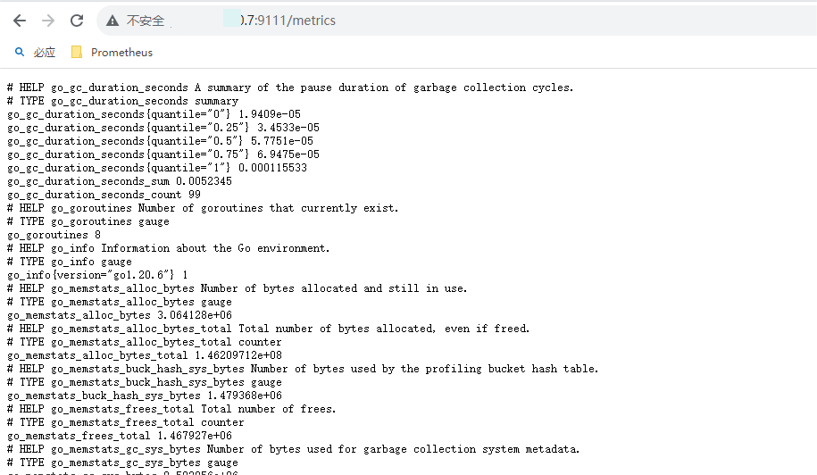

### Linux 集群监控部署：prometheus + node-exporter  + Grafana

### 一、前言

之前我们有用到top、free、iostat等等命令，去监控[服务器](https://activity.huaweicloud.com/discount_area_v5/index.html?utm_source=hwc-csdn&utm_medium=share-op&utm_campaign=&utm_content=&utm_term=&utm_adplace=AdPlace070851)的性能，但是这些命令，我们只针对单台[服务器](https://activity.huaweicloud.com/discount_area_v5/index.html?utm_source=hwc-csdn&utm_medium=share-op&utm_campaign=&utm_content=&utm_term=&utm_adplace=AdPlace070851)进行监控，通常我们线上都是一个集群的项目，难道我们需要每一台[服务器](https://activity.huaweicloud.com/discount_area_v5/index.html?utm_source=hwc-csdn&utm_medium=share-op&utm_campaign=&utm_content=&utm_term=&utm_adplace=AdPlace070851)都去敲命令监控吗？这样显然不是符合逻辑的，Linux中就提供了一个集群监控工具 – prometheus。

### 二、搭建被监测节点 node_exporter 

#### 2.1 查看Linux系统版本

```bash
#该命令仅适合Redhat系列的Linux系统，显示的版本信息也比较简单
cat /etc/redhat-release
```


#### 2.2 部署前的准备

1. 关闭所有Linux机器的防火墙：systemctl stop firewalld.service。
2. 保证所有Linux机器的时间是准确的，执行date命令检查；如果不准确，建议使用。
3. 如果你Linux上的时间不准确，可以使用ntp命令同步网络时间。

```bash
#首先 ntp 需要安装
yun intall -y ntp

#安装成功之后，输入如下命令
ntpdate pool.ntp.org
```

#### 2.3 部署Linux操作系统监控组件

1. 下载监控Linux的exporter（注意选择自己的操作系统，我的操作系统是 Linux centos7.9)，下载链接：https://github.com/prometheus/node_exporter/releases/download/v1.6.1/node_exporter-1.6.1.linux-amd64.tar.gz

2. 将node_export 包上传到需要被监控的Linux服务器上，任意的目录下，执行解压命令。

   ```bash
   #1.解压命令
   tar -zxvf node_exporter-1.6.1.linux-amd64.tar.gz
   #2.使用复制命令复制到 node_exporter 文件夹
   mv node_exporter-1.6.1.linux-amd64 node_exporter
   ```

3. 进入解压后的文件夹中，执行启动脚本。

   ```bash
   #1.进入 node_exporter 文件夹
   cd node_exporter
   #2.执行启动脚本
   nohup ./node_exporter
   #3.查看nohup日志，tail -100 nohup.out，出现如下日志，代表启动成功
   ```

   **注意**：极有可能发生如下，报错信息如下：显示 listen tcp :9100: bind: address already in use 9100[端口被占用](https://so.csdn.net/so/search?q=端口被占用&spm=1001.2101.3001.7020)，那么如何杀掉9100端口的进程呢？

   ```log
   [root@mysql node_exporter-1.3.1.linux-amd64]# systemctl status  node_exporter
   ● node_exporter.service - node_exporter
      Loaded: loaded (/etc/systemd/system/node_exporter.service; enabled; vendor preset: disabled)
      Active: failed (Result: exit-code) since Wed 2023-02-08 14:21:40 CST; 8s ago
     Process: 32897 ExecStart=/opt/module/node_exporter-1.3.1.linux-amd64/node_exporter (code=exited, status=1/FAILURE)
    Main PID: 32897 (code=exited, status=1/FAILURE)
   
   Feb 08 14:21:40 mysql node_exporter[32897]: ts=2023-02-08T06:21:40.435Z caller=node_exporter.go:115 level=info collector=timex
   Feb 08 14:21:40 mysql node_exporter[32897]: ts=2023-02-08T06:21:40.435Z caller=node_exporter.go:115 level=info collector=udp_queues
   Feb 08 14:21:40 mysql node_exporter[32897]: ts=2023-02-08T06:21:40.435Z caller=node_exporter.go:115 level=info collector=uname
   Feb 08 14:21:40 mysql node_exporter[32897]: ts=2023-02-08T06:21:40.435Z caller=node_exporter.go:115 level=info collector=vmstat
   Feb 08 14:21:40 mysql node_exporter[32897]: ts=2023-02-08T06:21:40.435Z caller=node_exporter.go:115 level=info collector=xfs
   Feb 08 14:21:40 mysql node_exporter[32897]: ts=2023-02-08T06:21:40.435Z caller=node_exporter.go:115 level=info collector=zfs
   Feb 08 14:21:40 mysql systemd[1]: Unit node_exporter.service entered failed state.
   Feb 08 14:21:40 mysql node_exporter[32897]: ts=2023-02-08T06:21:40.435Z caller=node_exporter.go:199 level=info msg="Listening on" address=:9100
   Feb 08 14:21:40 mysql node_exporter[32897]: ts=2023-02-08T06:21:40.435Z caller=node_exporter.go:202 level=error err="listen tcp :9100: bind: address already in use"
   Feb 08 14:21:40 mysql systemd[1]: node_exporter.service failed.
   ```

   打开linux系统，在linux的桌面的空白处右击。

- 在弹出的下拉选项里，点击打开终端。
- 在终端窗口中输入 netstat -tln | grep 被占用的端口命令。
- 输入 lsof -i ：被占端口命令，回车后可查看端口被那个进程占用。
- 输入kill -9 进程 id 命令，回车后即可杀死占用的端口进程。（一般情况下不建议直接杀死进程）

我的端口号是被 gitlab-prometeus 占用的


第一种解决方案：kill -9 进程号

```bash
yum install lsof
lsof -i:9100
kill -9 pid进程号

#无法kill掉的时候，可以使用如下的命令
gitlab-ctl stop node_exporter

#查看状态
gitlab-ctl stop node_exporter
```

第二种解决方案：修改 node_exporter 端口号

```bash
#1.新增一个 node_exporter 服务
vi /usr/lib/systemd/system/node_exporter.service
#2.粘贴如下命令
[Service]
ExecStart=/usr/local/node_exporter/node_exporter --web.listen-address=:9111
[Install]
WantedBy=multi-user.target
[Unit]
Description=node_exporter
After=network.target

#3.执行如下的命令重新加载系统服务
systemctl daemon-reload
#4.启动服务
systemctl start node_exporter.service
#5.查看服务状态
systemctl status node_export.service
```


出现如上的结果表示 node_exporter.service 启动成功。

#### 2.4 启动成功之后，访问对应的接口

例如：http://192.168.xx.7:9111/metrics 



出现如上的结果表示结果正常。

### 三、搭建监测节点

#### 3.1 下载包链接：

##### 3.1.1 Linux系统下载

```bash
#1.下载命令
wget https://github.com/prometheus/prometheus/releases/download/v2.46.0/prometheus-2.46.0.linux-amd64.tar.gz

#2.将 Prometheus 上传到一台单独的Linux机器上，然后执行下面的解压命令
tar -zxvf prometheus-2.46.0.linux-amd64.tar.gz

#3.移动修改文件名称
mv prometheus-2.46.0.linux-amd64 prometheus

#4.进入解压后的文件夹中，修改配置文件，添加要监控的服务器信息 ip
vim prometheus.yml
#5.添加如下的命令，其目的是在scrape_configs 配置项下添加 Linux 监控的 job，其中 IP 修改为 node_exporter 机器的ip，端口号默认是9100的，自己修改的端口号写自己的端口号。(复制粘贴下面的配置信息)

 - job_name: "linux"

    # metrics_path defaults to '/metrics'
    # scheme defaults to 'http'.

    static_configs:
      - targets: ["192.168.xx.7:9111"]

#6.保存配置文件，启动prometheus
 nohup ./prometheus &
// 检查nohup.out日志，如果有以下信息，启动成功
#7.在浏览器中访问部署的prometheus：http://ip:9090，点击菜单栏 Status -> Targets，看到页面中有如下node节点，代表 Prometheus 和 node_exporter 链接成功。 出现如下的结果就正常。
```


##### 3.1.2 Windows系统下载


链接：https://github.com/prometheus/prometheus/releases/download/v2.46.0/prometheus-2.46.0.windows-amd64.zip

```bash
#3.移动修改文件名称
mv prometheus-2.46.0.linux-amd64 prometheus

#4.进入解压后的文件夹中，修改配置文件，添加要监控的服务器信息 ip
prometheus.yml
#5.添加如下的命令，其目的是在scrape_configs 配置项下添加 Linux 监控的 job，其中 IP 修改为 node_exporter 机器的ip，端口号默认是9100的，自己修改的端口号写自己的端口号。(复制粘贴下面的配置信息)

 - job_name: "linux"

    # metrics_path defaults to '/metrics'
    # scheme defaults to 'http'.

    static_configs:
      - targets: ["192.168.xx.7:9111"]

#6.在promehteus的文件夹下找到
prometheus.exe 点击运行

#7.在浏览器中访问部署的prometheus：http://ip:9090，点击菜单栏 Status -> Targets，看到页面中有如下node节点，代表 Prometheus 和 node_exporter 链接成功。 出现如下的结果就正常。
```

#### 3.2 部署Grafana

1. 下载安装granfana，（和prometheus 同一台服务器）输入命令安装。

```bash
#1.下载及安装 granfana
sudo yum install -y https://dl.grafana.com/enterprise/release/grafana-enterprise-10.0.0-1.x86_64.rpm

#2.启动 granfana
systemctl start granfana-server

#3.在浏览器访问：http://ip:3000/
#4.用户名/密码：首次登陆用户名/密码为:admin/admin,然后会让你修改密码。如果不设置的话，可以直接点击skip。
```

2. 登陆界面


3. 自定义用户名和密码


4. 添加你的第一个数据源


5. 选择prometheus 进行添加


6. 设置prometheus 的 name 和 url 链接地址


7. 保存及测试


8. 创建自己的面板


9. 创建所需要的 Dashboards


10. 导入 dashboard


11. [官方Dashboard网站](https://grafana.com/grafana/dashboards/?plcmt=footer) 在该页面搜索 Node Export ，直接选择中文的或者选择英文的。


12. 选择对应的 DashBoard ID 


13. 整体效果如下


14. 整体效果-2


### 四、邮件警告

#### 4.1 告警介绍

在Prometheus 平台中，警报由独立的自建 Alertmanager 处理。通常情况下，我们首先告诉 Prometheus Altertmanager 所在的位置，然后在 Prometheus 配置中创建警报规则，最后配置 Altertmanager 来处理警报并发送给接收者(邮件，webhook，slack等)。

在QQ邮箱开通授权码：


#### 4.2 配置 alertmanager.yml 文件

alertmanager.yml

```yml
global:  
  resolve_timeout: 15s
  smtp_smarthost: 'smtp.qq.com:465' #smtp服务
  smtp_from: 'xxxxxx@qq.com' #发送邮箱
  smtp_auth_username: 'xxxxxx@qq.com' #用户邮箱
  smtp_auth_password: 'vkqubunlwssebbij' #授权码
  smtp_hello: '@qq.com'
  smtp_require_tls: false
templates:
  - 'D:\softwore\alertmanager-0.25.0.windows-amd64\tmpl\email.tmpl'  #增加templates配置 不填写，有默认模板
route:
  group_by: ['alertname']
  group_wait: 20s
  group_interval: 5m
  repeat_interval: 5m 
  receiver: 'email'
receivers:
- name: 'email'
  email_configs:
  - to: 'xxxxxx@qq.com' #发给那个邮箱
    html: '{{ template "email.html" . }}' #警告模板
    send_resolved: true
inhibit_rules:
  - source_match:
      severity: 'critical'
    target_match:
      severity: 'warning'
    equal: ['alertname', 'dev', 'instance']

```

#### 4.3 配置 prometheus.yml 文件

prometheus.yml

```yml
# my global config
global:
  scrape_interval: 15s # Set the scrape interval to every 15 seconds. Default is every 1 minute.
  evaluation_interval: 15s # Evaluate rules every 15 seconds. The default is every 1 minute.
  # scrape_timeout is set to the global default (10s).

# Alertmanager configuration
alerting:
  alertmanagers:
    - static_configs:
        - targets: ["127.0.0.1:9093"] # 配置 node-exporter 地址
          # - alertmanager:9093

# Load rules once and periodically evaluate them according to the global 'evaluation_interval'.
rule_files:
  - "rules/rules.yml" # 配置的警告规则 文件
  # - "first_rules.yml"
  # - "second_rules.yml"

# A scrape configuration containing exactly one endpoint to scrape:
# Here it's Prometheus itself.
scrape_configs:
  # The job name is added as a label `job=<job_name>` to any timeseries scraped from this config.
  - job_name: "prometheus"

    # metrics_path defaults to '/metrics'
    # scheme defaults to 'http'.

    static_configs:
      - targets: ["localhost:9090"]
  - job_name: "node-exporter"

    # metrics_path defaults to '/metrics'
    # scheme defaults to 'http'.

    static_configs:
      - targets: ["192.168.50.7:9111"]


  - job_name: "alertmanager"

    # metrics_path defaults to '/metrics'
    # scheme defaults to 'http'.

    static_configs:
      - targets: ["127.0.0.1:9093"]
```

#### 4.4 配置rules.yml 规则

rules.yml

```yml
groups:
- name: general.rules
  rules:
  - alert: "Memory 使用率"
    expr: round(100- node_memory_MemAvailable_bytes/node_memory_MemTotal_bytes*100) > 99
    for: 15s
    labels:
      severity: warning
    annotations:
      summary: "内存使用率过高大于90%,当前使用率{{ $value }}%"
  - alert: InstanceDown
    expr: up{job="node-exporter"} == 0
    for: 10s
    labels:
      severity: warning
    annotations: 
      description: "{{ $labels.instance }} of job {{ $labels.job }} has been down for more than 5 minutes."
      summary: "{{ $labels.instance }} 已停止运行超过 10s！"
  - alert: "CPU使用率过高"
    expr: ceil(100 - sum(increase(node_cpu_seconds_total{job="node-exporter",mode="idle"}[5m]))  by(instance) / sum(increase(node_cpu_seconds_total{job="node-exporter"}[5m])) by(instance)*100) > 90
    for: 10s
    labels:
      severity: warning
    annotations: 
      description: "{{ $labels.instance }} 的 {{ $labels.mountpoint }} CPU使用大于90%"
      summary: "{{ $labels.mountpoint  }} CPU使用率过高！"
  - alert: "Disk 使用率"
    expr: round((1 - (node_filesystem_avail_bytes{fstype=~"ext3|ext4|xfs|nfs",job="node-exporter"} / node_filesystem_size_bytes{fstype=~"ext3|ext4|xfs|nfs",job="node-exporter"})) * 100)  > 90
    for: 10s
    labels:
      severity: warning
    annotations: 
      description: "{{ $labels.instance }}的{{ $labels.mountpoint }} 分区使用大于90% (当前值: {{ $value }}%)"
      summary: "{{ $labels.instance }}:{{ $labels.mountpoint }} 分区使用率过高"
```


#### 4.5 配置 email.tmpl 警告内容通知模板

```bash
{{ define "email.html" }}
{{- if gt (len .Alerts.Firing) 0 -}}
{{- range $index, $alert := .Alerts -}}
======== 异常告警 ======== <br>
告警程序: prometheus_alert <br>
告警级别: {{ $alert.Labels.severity }} 级 <br>
告警名称: {{ $alert.Labels.alertname }} <br>
告警机器: {{ $alert.Labels.instance }} {{ $alert.Labels.device }} <br>
告警主题: {{ $alert.Annotations.summary }} <br>
告警详情: {{ $alert.Annotations.description }} <br>
告警时间: {{ $alert.StartsAt.Format "2006-01-02 15:04:05" }} <br>
========== END ========== <br>
{{- end }}
{{- end }}
{{- if gt (len .Alerts.Resolved) 0 -}}
{{- range $index, $alert := .Alerts -}}
======== 告警恢复 ======== <br>
告警名称: {{ $alert.Labels.alertname }} <br>
告警级别: {{ $alert.Labels.severity }} <br>
告警机器: {{ $alert.Labels.instance }} <br>
告警详情: {{ $alert.Annotations.summary }} <br>
告警时间: {{ $alert.StartsAt.Format "2006-01-02 15:04:05" }} <br>
恢复时间: {{ $alert.EndsAt.Format "2006-01-02 15:04:05" }} <br>
========== END ========== <br>
{{- end }}
{{- end }}
{{- end }}
```

#### 4.6 邮件通知效果如下


#### 4.7 具体内容如下


### 五、自动化部署脚本

#### 5.1 Linux 命令详解

top 命令经常用来监控Linux的系统状况，是常用的性能分析工具，能够实时分析系统中各个进程的资源占用情况。

##### 5.1.1 常用参数

top 的使用方式 top [-d number] | top [-bnp]

|   参数    | 含义                                                         |
| :-------: | ------------------------------------------------------------ |
| -d number | number 代表秒数，表示top命令显示的页数更新一次的间隔（default=5s) |
|    -b     | 以批次的方式执行top                                          |
|    -n     | 与-b配合使用，表示需要进行几次 top 命令的输出结果            |
|    -p     | 指定特定的pid进程号进行观察                                  |

##### 5.1.2 top 命令显示的页面还可以输入一下按键执行相应的功能（注意大小写区分的）

| 参数 | 含义                                     |
| ---- | ---------------------------------------- |
| ？   | 显示在top当中可以输入的命令              |
| P    | 以CPU的使用资源排序显示                  |
| M    | 以内存的使用资源排序显示                 |
| N    | 以 pid 排序显示                          |
| T    | 由进程使用的时间累计排序显示             |
| k    | 给某一个pid一个信号，可以用来杀死进程(9) |
| r    | 给某个pid重新定制一个nice值（即优先级）  |
| q    | 推出 top（用ctr + c也可以退出 top）      |

##### 5.1.3 top 各输出参数含义

1. **top 前五条信息解释**

```bash
top - 13:41:32 up 48 days, 15:36, 3 users, load average: 0.72,0.66,0.68
```

|            内容             | 含义                                                         |
| :-------------------------: | ------------------------------------------------------------ |
|          13:41:32           | 表示当前时间                                                 |
|      up 48 days，15:36      | 系统运行时间，格式为时：分                                   |
|           3 users           | 当前登陆用户数                                               |
| load average:0.72,0.66,0.68 | 系统负载，即任务队列的平均长度。三个数值分别为1分钟，5分钟，15分钟前到现在的平均值 |

2. 第二行的数据

```bash
Tasks: 465 total, 1 running, 644 sleeping, 0 stopped, 0 zombie
```

| 内容            | 含义             |
| --------------- | ---------------- |
| Tasks:465 total | 进程总数         |
| 1 running       | 正在运行的进程数 |
| 644 sleeping    | 睡眠的进程       |
| 0 stopped       | 停止的进程数     |
| 0 zombie        | 僵尸进程数       |

3. 第三行数据

```bash
Cpu(s):3.8%us, 1.8%sy, 0.0%ni,94.3%id, 0.1%wa, 0.0%hi, 0.0%si, 0.0%st
```

|  内容   | 含义                                                     |
| :-----: | -------------------------------------------------------- |
| 3.8%us  | 用户空间占用CPU百分比                                    |
| 1.8%sy  | 内核空间占用CPU百分比                                    |
| 0.0%ni  | 用户进程空间内改变过优先级的进程占用CPU百分比            |
| 94.3%id | 空闲CPU百分比                                            |
| 0.1%wa  | 等待输入输出的CPU时间百分比                              |
| 0.0%hi  | 硬中断（Hardware IRQ）占用CPU的百分比                    |
| 0.0%si  | 软中断（Software Interrupts)占用 CPU 的百分比            |
| 0.0 st  | 用于有虚拟机 cpu 的情况，用来指示被虚拟机偷掉的 cpu 时间 |

4. 第四行数据

```bash
KiB Mem: 32365492 total, 377508 free, 25695388 used, 6292596 buffers/cache
```

| 内容                  | 含义                 |
| --------------------- | -------------------- |
| 32365492 total        | 物理内存总量         |
| 377508 free           | 空闲内从总量         |
| 25695388 used         | 使用的物理内存总量   |
| 6292596 buffers/cache | 用作内核缓存的内存量 |

5. 第五行数据

```bash
KiB Swap: 29360120 total, 13275880 free,16084240 used,  2091316 avail Mem
```

| 内容              | 含义             |
| ----------------- | ---------------- |
| 29360120 total    | 交换区总量       |
| 13275880 free     | 空闲交换区总量   |
| 16084240 used     | 使用的交换区总量 |
| 2091316 avail Mem | 可用交换取总量   |

##### 5.1.4 进程信息

| 列名  | 含义                                                         |
| ----- | ------------------------------------------------------------ |
| PID   | 进程id                                                       |
| USER  | 进程所有者的用户名                                           |
| PR    | 优先级                                                       |
| NI    | nice 值。负值表示高优先级，正值表示低优先级                  |
| VIRT  | 进程使用的虚拟内存总量，单位kb。VIRT=SWAP+RES                |
| RES   | 进程使用的，违背换出的物理内存大小，单位kb。RES = CODE + DATA |
| SHR   | 共享内存大小，单位kb                                         |
| S     | 进程状态。D=不可中断的睡眠状态 R=运行 S=睡眠 T=跟踪/停止 Z=僵尸进程 |
| %CPU  | 上次更新到现在的CPU时间占用百分比                            |
| %MEM  | 进程使用的物理内存百分比                                     |
| TIME+ | 进程使用的CPU时间总计，单位1/100秒                           |

默认进入 top 时，各进程是按照 CPU 的占用了来排序的。


#### 5.2 安装 node_exporter 节点 shell 脚本

##### 5.2.1 创建node_exporter shell 脚本

```shell
#1.创建node_exporter.sh 脚本
touch node_exporter.sh
#2.编辑node_exporter.sh脚本
vim node_exporter.sh
```

粘贴下面内容，到 node_exporter.sh 里面

```bash
#1.首先 ntp 需要安装，进行时间同步
yun intall -y ntp
#2.安装成功之后，输入如下命令
ntpdate pool.ntp.org
#3.下载 node_exporter 安装包
wget https://github.com/prometheus/node_exporter/releases/download/v1.6.1/node_exporter-1.6.1.linux-amd64.tar.gz
#4.解压到当前文件夹或解压到固定文件夹
tar -zxvf node_exporter-1.6.1.linux-amd64.tar.gz
#5.使用复制命令复制到 node_exporter 文件夹
mv node_exporter-1.6.1.linux-amd64 /usr/local/node_exporter

```

##### 5.2.2 使用第6步到第8步进行启动，也可以使用5.2.3方式创建一个 node_exporter 服务

```shell
#6.进入 /usr/local/node_exporter 文件夹
cd node_exporter
#7.执行启动脚本
nohup ./node_exporter
#8.查看nohup日志，tail -100 nohup.out，出现如下日志，代表启动成功
```

##### 5.2.3 创建一个 node_exporter 服务

【**优点**】：可以在服务器任何地方执行，不用进入文件夹下执行命令。

```bash
#1.新增一个 node_exporter 服务
touch /usr/lib/systemd/system/node_exporter.service
filename="/usr/lib/systemd/system/node_exporter.service"
#2.粘贴如下命令
cat>"${filename}" << EOF
[Service]
ExecStart=/usr/local/node_exporter/node_exporter --web.listen-address=:9111
[Install]
WantedBy=multi-user.target
[Unit]
Description=node_exporter
After=network.target
EOF
#3.执行如下的命令重新加载系统服务
systemctl daemon-reload
#4.启动服务
systemctl start node_exporter.service
#5.查看服务状态
systemctl status node_export.service
```

【脚本一】

```shell
#1.首先 ntp 需要安装，进行时间同步
yun intall -y ntp
#2.安装成功之后，输入如下命令
ntpdate pool.ntp.org
#3.下载 node_exporter 安装包
wget https://github.com/prometheus/node_exporter/releases/download/v1.6.1/node_exporter-1.6.1.linux-amd64.tar.gz
#4.解压到当前文件夹或解压到固定文件夹
tar -zxvf node_exporter-1.6.1.linux-amd64.tar.gz
#5.使用复制命令复制到 node_exporter 文件夹
mv node_exporter-1.6.1.linux-amd64 /usr/local/node_exporter

#6.新增一个 node_exporter 服务
touch /usr/lib/systemd/system/node_exporter.service
filename="/usr/lib/systemd/system/node_exporter.service"
#7.粘贴如下命令
cat>"${filename}" << EOF
[Service]
ExecStart=/usr/local/node_exporter/node_exporter --web.listen-address=:9111
[Install]
WantedBy=multi-user.target
[Unit]
Description=node_exporter
After=network.target
EOF
#8.执行如下的命令重新加载系统服务
systemctl daemon-reload
#9.启动服务
systemctl start node_exporter.service
#10.设置node-exporter开机启动
systemctl enable node-exporter.service
#11.查看服务状态
systemctl status node_export.service
```

【脚本二】

```shell
#!/bin/bash
#变量
set -e
COLOR="echo -e \\E[1;32m"
COLOR1="echo -e \\E[1;31m"
END="\\E[0m"
install_dir="/apps"

#函数
node_exporter_install() {
#判断安装目录是否存在
[ -f ${install_dir} ] || mkdir -p $install_dir
#下载软件
cd $install_dir
wget https://github.com/prometheus/node_exporter/releases/download/v1.2.0/node_exporter-1.2.0.linux-amd64.tar.gz &> /dev/null
#解压软件包，并创建软链接
tar xf node_exporter-1.2.0.linux-amd64.tar.gz
ln -sv node_exporter-1.2.0.linux-amd64 node_exporter &> /dev/null
#创建node-exporter的service文件
cat > /usr/lib/systemd/system/node-exporter.service <<EOF
[Unit]
Description=This is prometheus node exporter

[Service]
Type=simple
ExecStart=/apps/node_exporter/node_exporter
ExecReload=/bin/kill -HUP $MAINPID
KillMode=process
Restart=on-failure

[Install]
WantedBy=multi-user.target
EOF
#同步service文件
systemctl daemon-reload
#启动node-exporter
systemctl start node-exporter.service
#设置node-exporter开机启动
systemctl enable node-exporter.service &> /dev/null
}

node_exporter_install

#变量
node_exporter_port=`ss -ntlp | grep -o 9100`
if [ $node_exporter_port == "9100" ];then
    ${COLOR}node-exporter安装成功!${END}
else
    ${COLOR1}node-exporter安装失败!${END}
fi
```

#### 5.3 prometheus shell 脚本

```shell
#1.下载命令
wget https://github.com/prometheus/prometheus/releases/download/v2.46.0/prometheus-2.46.0.linux-amd64.tar.gz

#2.将 Prometheus 上传到一台单独的Linux机器上，然后执行下面的解压命令
tar -zxvf prometheus-2.46.0.linux-amd64.tar.gz

#3.移动修改文件名称
mv prometheus-2.46.0.linux-amd64 prometheus

#4.进入解压后的文件夹中，修改配置文件，添加要监控的服务器信息 ip
cd prometheus

#5.添加如下的命令，其目的是在scrape_configs 配置项下添加 node-exporter 监控的 job，其中 IP 修改为 node_exporter 机器的ip，端口号默认是9100的，自己修改的端口号写自己的端口号。(复制粘贴下面的配置信息)
vim prometheus.yml

 - job_name: "node-exporter"

    # metrics_path defaults to '/metrics'
    # scheme defaults to 'http'.

    static_configs:
      - targets: ["192.168.xx.7:9111"]
      
#6.保存配置文件，启动prometheus
 nohup ./prometheus &
// 检查nohup.out日志，如果有以下信息，启动成功
#7.在浏览器中访问部署的prometheus：http://ip:9090，点击菜单栏 Status -> Targets，看到页面中有如下node节点，代表 Prometheus 和 node_exporter 链接成功。 出现如下的结果就正常。
```

##### 5.4 grafana 脚本

```shell
#1.下载及安装 granfana
sudo yum install -y https://dl.grafana.com/enterprise/release/grafana-enterprise-10.0.0-1.x86_64.rpm

#2.启动 granfana
systemctl start granfana-server
#3.查看端口验证
netstat -nlpt|grep 3000
#4.在浏览器访问：http://ip:3000/
#5.用户名/密码：首次登陆用户名/密码为:admin/admin,然后会让你修改密码。如果不设置的话，可以直接点击skip。
```


