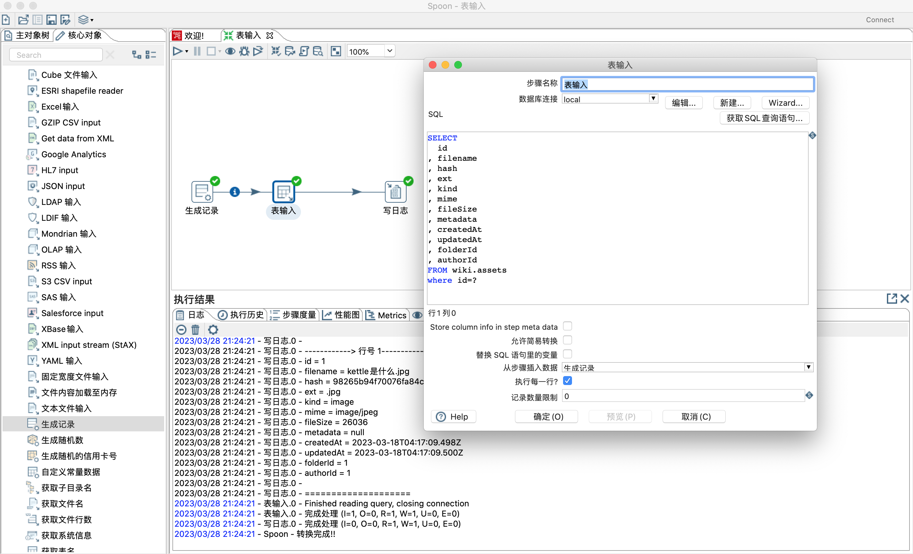
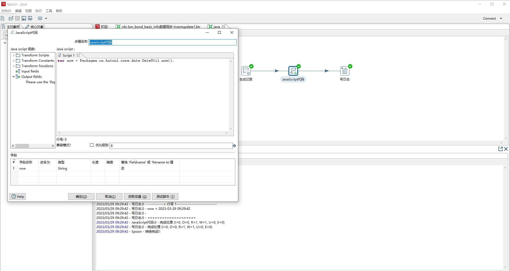
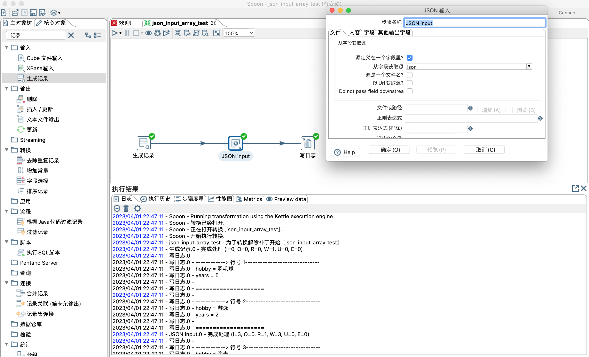
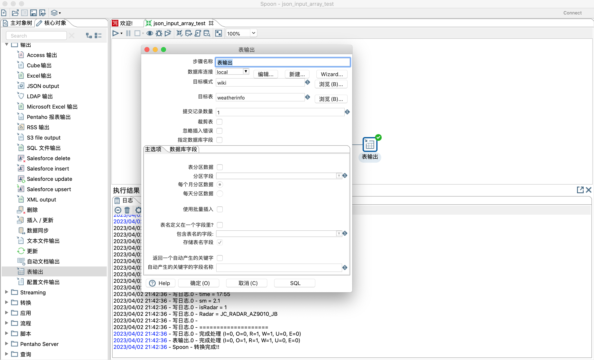
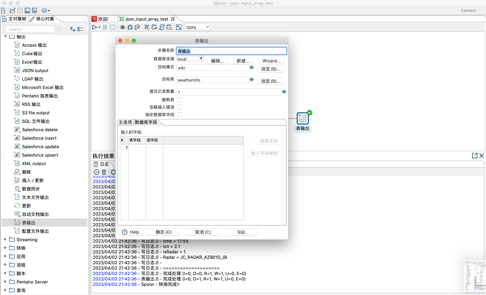
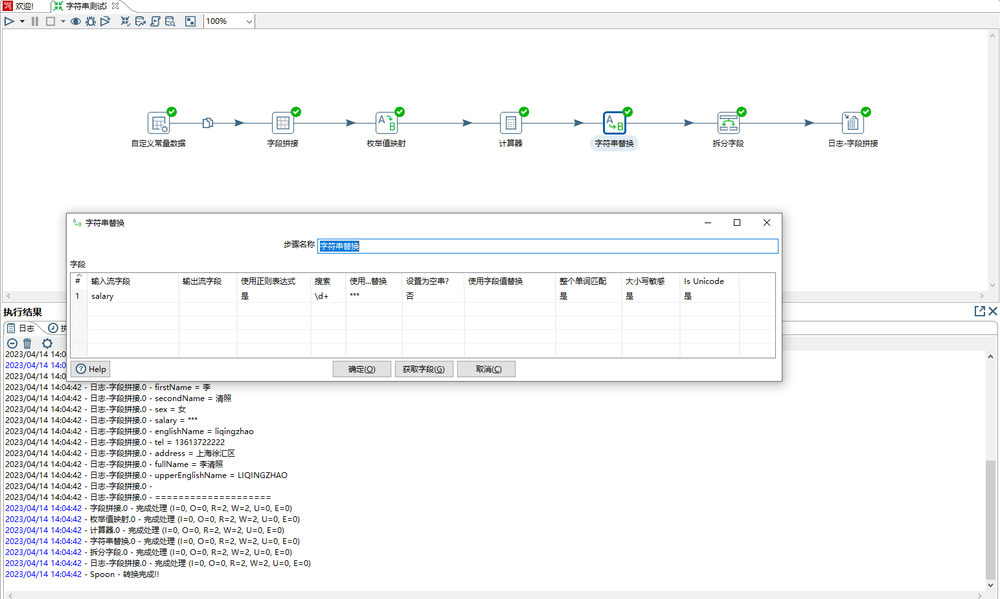
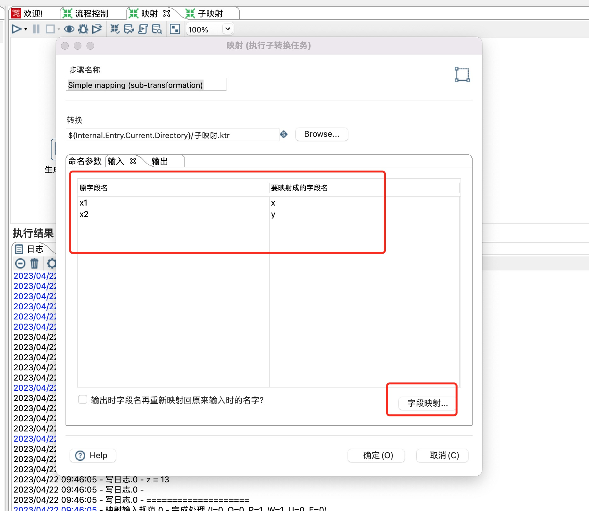
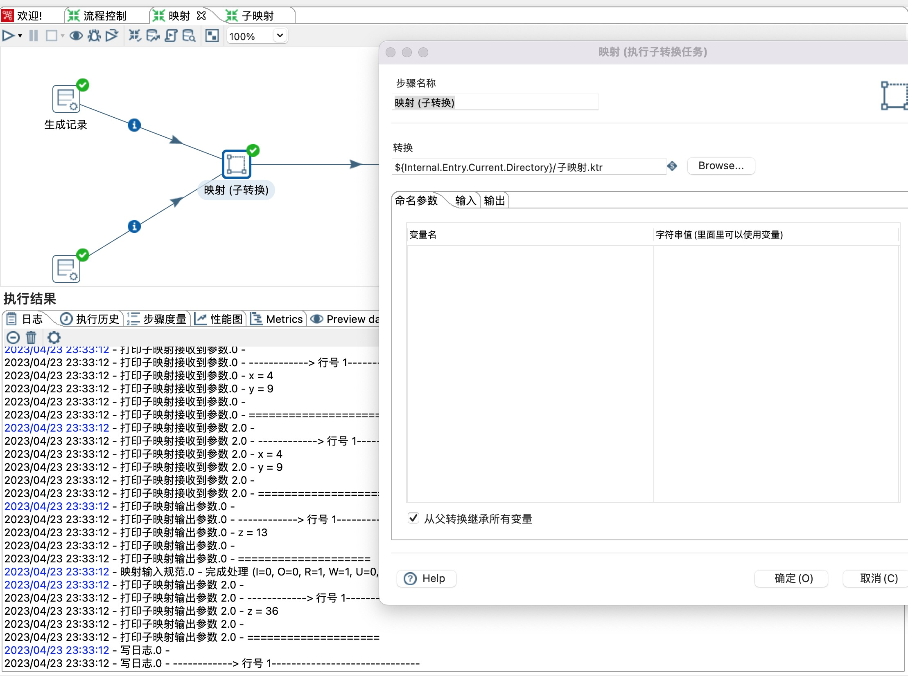
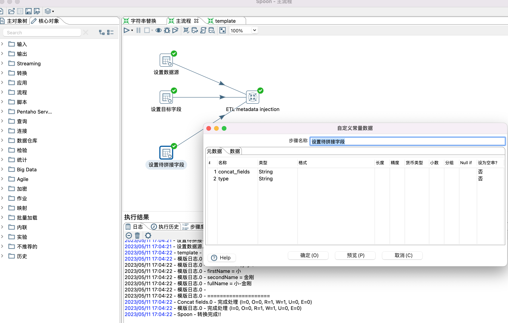

### 												Kettle详细教程

### 一、什么是kettle

#### 1.1 简介	

Kettle 是一款国外开源（免费：受欢迎）的 ETL 工具，纯 Java 编写（Java 开发很好的集成），可以在 windows、Linux、Unix 上运行（Linux 服务器流行时代下，Kettle 更加受欢迎），数据抽取高效稳定（更更加受欢迎）。Kettle 中文名俗称“水壶”，开发目的是将各种数据放到一个水壶中，然后经过各种处理加工，以特定的格式流出。学会使用此工具进行数据转换、同步**，能够解决实际工作中遇到的迁移和业务各种实际工作内容**。

Kettle是一款开源的ETL工具，纯java编写，可以在Window、Linux、Unix上运行，绿色无需安装，数据抽取高效稳定。

*ETL*，是英文Extract-Transform-Load的缩写，用来描述将数据从来源端经过抽取（extract）、转换（transform）、加载（load）至目的端的过程。

kettle 的中文含义是水壶，数据从一端输入，从另外一端输出


#### 1.2 kettle应用场景

##### 1.2.1 数据抽取分类

数据抽取分为**离线抽取**和**实时抽取**。

**离线抽取**，应用场景是对短时间内的更新不敏感，只关心一段时间后的最终状态，一般是固定周期定时抽取。抽取方法，可以采用快照的方式，对整个表做全表快照；或者是采用基于时间字段的增量抽取，但是需要对这个字段的更新场景非常了解，一般采用定时批量的方式。

 **实时抽取**，通常的应用场景是对数据的最新状态非常敏感，当有新数据插入或者旧数据更新时，需要及时抽取。抽取方法有很多，其中常用的一种是基于消费数据库binlog/logminer的方式，如阿里开源的canal、cdc-oracle 等。

##### 1.2.2 应用场景

应用A、应用B是两个生成环境跑的服务，应用C是一个新服务，依赖应用A和应用B的数据，但是应用A和应用B不提供接口对接，且应用C的表结构和应用A、应用B完全不一样。这里就涉及到异构数据的同步问题了，需要借助ETL工具解决，kettle便是ETL工具之一。

**离线抽取**


**实时抽取**


### 二、kettle下载和安装

#### 2.1 下载

官网：官网地址，可以根据kettle的官方文档进行学习

下载地址：[各版本下载链接](https://sourceforge.net/projects/pentaho/files/Data Integration/)


#### 2.2 安装

1. 安装 jdk，版本建议1.8及以上。

2. 下载kettle压缩包，因kettle为绿色软件，解压缩到任意本地路径即可。

3. 运行Spoon.bat/spoon.sh,启动图形化界面工具，就可以直接使用了。

4. 另外若要连接数据库mysql或者oracle，需要把相应的jar放到lib下面。


##### 2.2.1 Spoon.sh 启动命令：

```bash
#1.创建sh文件，
sudo touch Spoon.sh
#2.输入如下命令
sh softwore/kettle/data-integration/Spoon.sh
#3.给sh文件授权
sudo chmod -R 777 Spoon.sh
#4.使用命令查看 Spoon.sh 变绿色就可以使用命令启动类
```


##### 2.2.2 Spoon.bat 启动命令：

```bash
#1.使用 windows 的 dos 命令在桌面上创建一个 bat 文件
@echo off
echo now run the Spoon.bat
#2.Spoon 解压的路径
call D:\softwore\kettle\data-integration\Spoon.bat
echo over
```


### 三、kettle架构图

#### 3.1 kettle架构图


#### 3.2 架构说明

1. 最底层的是kettle的核心引擎层，相关的jar在lib目录下。

2. 中间是开发层，在开发阶段我们接触最多的就是通过spoon进行开发，通过Spoon.bat或者spoon.sh即可启动客户端，开发文件调试之前要先保存，开发阶段可以选择保存到本地，保存之后的文件后缀名有两种：转换文件后缀名是ktr，job文件后缀名是kjb。部署测试或者生产环境时可以将本地开发文件导入到数据库仓库，后续会单独讲解如何导入仓库。

3. 一般的同构或者异构数据同步通过默认的组件即可，若组件不能满足要求，可以自研kettle组件或者通过客户端里面的组件市场进行下载。

4. 通过spoon研发好的kettle文件，部署到测试环境之后，可以通过命令行工具（pan/kitchen）,或者通过Carte服务进行部署运行，后续会单独进行讲解。

5. kettle提供了丰富的rest接口，若有web端管理需求的话，可以进行对接，具体接口可以参考官方文档。https://help.hitachivantara.com/Documentation/Pentaho/9.3/Developer_center/REST_API_Reference


### 四、组件详解

#### 4.1 日志组件

1. 从核心对象里面找到写日志组件，直接拉到右侧工作区域，或者直接双击写日志控件，也会跑到右侧工作区域。

2. 我们在编辑转换文件或者作业文件需要调试时，就需要用到写日志组件。


3. 在右侧工作区域双击组件/步骤或者右键编辑步骤即可进行编辑属性，如下图


属性：

- **步骤名称**：可以自定义

- **日志级别**：和平时写代码一样，选择合适的日志级别。

- **打印头**：若勾选，打印日志结构为key=value形式，不勾选只有value。

- **Limit rows**：是否日志输出行数限制。需要结合Nr of rows to print 进行设置。

- **Nr of rows to print**：日志输出行数限制条数，设置为0时，输出一行，设置位1时，输出两行，以此类推。

- **写日志**：可以输入自定义日志文字。

- **字段**：选择打印到日志里面的字段。可以点击获取字段按钮。

4. 添加一个输入组件 生产记录 设置好连线，连线在kettle 里面术语叫做跳，点击连线可以启用/禁用。

#### 4.2 输入组件


5. 点击工作区域左上角的运行按钮，弹出窗口点击启动，即可运行当前转化文件，在运行之前需要先保存文件。


6. 运行日志截图


#### 4.3 表输入

1. 表输入属于输入类控件，其作用是从数据库中读取表数据。


属性：

- **步骤名称**：可自定义。

- **数据库连接**：可以点击右侧的新建按钮进行新建。

- **SQL**：编写查询sql语句，也可以点击获取SQL查询语句按钮选择相应表生成sql语句。

- **Store column info in step meta data**：选择这个选项可以使用存储在KTR中的缓存元数据，而无需建立数据库连接来查询表。注意：如果您使用Spark作为您的处理引擎，请必须选择此选项。

- **允许简易转换**：选择此选项以启用简易转换算法。如果选择简易转换，则尽可能避免不必要的数据类型转换，这可以显著提高性能。

- **替换SQL语句里的变量**：若勾选，SQL语句里面的变量如${ID} 会被替换。

- **从步骤插入数据**：选择流入步骤，然后SQL里面的占位符？会被替换。注意 前置步骤里面的输出字段数要和占位符的数量一致。

- **执行每一行**：和从步骤插入数据搭配使用，若前置步骤只有一条数据输出，则无需勾选，若前置步骤有多余一条数据输出，则需要勾选。

- **记录数量限制**：0表示不限制，可以填写大于0的数字，比如填写2作用和sql遇见里面的limit 2一样。

- **读取变量**：参数都可以在sql中用${var}或者%%var%%表示

2. 点击新建按钮建立数据库连接。


3. 填写连接名称，选择连接类型和连接方式，我这里使用的是mysql。注意 若出现找不到驱动类错误，需要把相应的驱动jar放到lib目录下，如mysql的驱动jar mysql-connector-java-8.0.20.jar


4. 点击测试按钮测试数据库是否正确连接。


5. 编辑写日志控件，设置要打印日志的字段，可以点击获取字段按钮获取所有字段，也可以删除不要打印的字段。


6. 运行截图


7. 设置字段值，替换表输入控件里面的占位符？




8. 设置变量，替换sql语句中的${ID}


#### 4.4 kettle可以通过javascript代码调用外部jar

1. 将外部jar放到lib目录下，重启spoon

2. 调用外部static方法

```js
var now = Packages.cn.hutool.core.date.DateUtil.now();
```




2. static方法也可以采用new 方式进行调用


3. 调用外部非static方法

```js
var dateUtil = new Packages.cn.hutool.core.date.DateUtil();
var now = dateUtil.now();
```


#### 4.5 kettle 字段选择

##### 4.5.1 字段选择步骤是一个比较常用的控件，它的作用有以下几点：

1. 选择字段，若输入有m个字段，可以从m个字段中选择n个字段，0=<n<=m。

2. 删除字段，若输入有m个字段，可以从m个字段中删除n个字段，0=<n<=m。

3. 重命名字段，比如某个字段名称为name，可以修改为newName，字段对应的值不变。

4. 修改字段元数据类型，比如某个字段类型是string，值是纯数字，可以修改数据类型为number等。

5. 配置字段长度和精度。

##### 4.5.2 选择和修改字段


##### 4.5.3 设置需要移除的字段


##### 4.5.4 修改元数据，如长度、精度、格式化等


###### 4.5.4.1 元数据

- 字段名称

  表示需要改变元数据的字段的名称。可以通过【获取改变的字段】或直接使用键盘设置。默认值为空

- 改名成

  表示字段改名后的目标名称，如果不希望改名，那么为空。默认值为空

- 类型

  表示字段的数据类型。类型选项有：BigNumber、Binary、Boolean、Date、Integer、Internet Address、Number、String、Timestamp。默认值为空

- 长度

  表示字段长度。默认值为空

- 精度

  表示数字类型字段的浮点数的精确位数。默认值为空

- Binary to Normal?

  表示是否将字符串转换为数字数据类型，选项有是、否。默认值为空

- 格式

  表示转换时，原始字段格式的可选掩码。有关公共有效日期和数字格式的信息，请参阅有关公共格式参考书。默认值为空

- Date Format Lenient?

  表示日期格式解析器是否是严格还是宽松的。选项有是、否。设置为“是”时，只接受严格有效的日期值；设置为“否”时，解析器会尝试把错误日期纠正为正确的日期。默认值为空

- Date Locale

  表示日期地区区域。为空时，以系统上默认日期区域编码设置。默认值为空

- Date Time Zone

  表示日期时区。为空时，以系统上默认日期日期编码设置。默认值为空

- Lenient number conversion?

  表示数字转换是否是宽松的。选项有是、否。设置为“是”时，将解析数字，直到找到一个非数字值，如破折号或斜杠，解析然后停止，不报告错误。当设置为“否”时，如果输入的数字无效，解析器将报告错误。默认值为空

- Encoding

  表示文本文件编码。为空时，以在系统上使用默认编码。从系统上提供的编码列表中选择。默认值为空

- 分组

  表示数值分组符号，一般使用“,”英文逗号。默认值为空

- 货币符号

  表示货币符号，例如“￥”“$”“€”等货币符号。默认值为空

#### 4.6 kettle json输入

1. JSON输入步骤从JSON结构、文件或传入字段中提取相关字段，并输出行。

2. 文件中解析json，具体操作如下图

3. 选择json文件


4. 设置输出字段


5. 在解析json数组时，选择的字段需要是同一层级的，不然json输入控件会出错，如下


6. 传入字段解析json，具体操作如下图

 1）用生成记录步骤设置json字段的值为json字符串


2）josn输入步骤文件选项勾选源定义在一个字段里和从字段获取源选择json字段



7. json结构数据解析

1）通过httpClient步骤获取天气预报信息，返回json数据放到result字段里面。


2）json输入步骤设置，如下图


#### 4.7 表输出

##### 4.7.1 kettle 表输出步骤的主要作用是将数据写入数据表

1. 本示例是通过json输入控件解析json数据并且将数据写入数据表weatherinfo。


2. json输入步骤，本次不做重点讲解。详情了解可以参考4.6。


3. 表输出步骤。

> 1）步骤名称：可自定义设置。
>
> 2）数据库连接，下拉选项里面没有可用连接时，点击新建按钮进行设置。
>
> 3）目标模式：填写数据库名称。
>
> 4）目标表：填写表名称。
>
> 5）提交记录数量：当需要同步的数据量非常大时，可以设置每次批量数据提交事物，提高写入数据库性能。提交记录数量大于1时，需要配合主选项里面的使用批量插入一起使用。
>
> 6）裁剪表：在执行insert into 第一行数据之前执行truncate table 语句清空表数据。
>
> 7）忽略插入错误：选择可忽略所有插入错误，例如违反的主键。最多将记录20个警告。此选项不适用于批量插入。
>
> 8）指定数据库字段：此选项和数据库字段设置联合使用，可以自定义哪些字段插入到表中。
>
> 9）表分区数据：选择此选项可根据“分区”字段中指定的日期字段的值将数据拆分到多个表中。选择此选项后，数据将插入到表中，这些表的名称遵循<target table>_<date format>模式。在运行转换之前，必须手动创建这些表，以便在这些表中插入数据。有关日期格式的详细信息，请参阅每月分区数据/每天分区数据。
>
> 10)分区字段：指定要用于确定如何在多个表中拆分值的日期字段。此值用于生成要插入数据的日期表名称。
>
> 11）每个月分区数据和每天分区数据是互斥的，只能二选一，分区表需要自行创建哦，参考如下截图


> 12）使用批量插入：和上面提交记录数量联合使用。
>
> 13）表名定义在一个字段里面：和包含表名字段联合使用，动态指定插入数据的表名。
>
> 14）返回一个自动产生的关键字：和自动产生关键字段的字段名称联合使用，用于记录自增id主键字段。
>
>  15）SQL 按钮：可以设置创建目标表的sql语句。



> 16）插入的字段：可以设置哪些字段插入到数据表中，需要和指定数据库字段联合使用。




#### 4.8 kettle switch/case、过滤记录、数值范围

1. java代码里面有if else 、switch-case等流程控制，kettle也有相应控件。下图便用到switch/case、过滤记录、数值范围控件。


2. switch/case步骤

> 1）步骤名称：可自定义
>
> 2）switch字段：需要判断的字段，从前置步骤中选择
>
> 3）使用字符串包含比较：如果勾选效果和java里面的contains一样，否则是完全匹配
>
> 4）case值数据类型：选择kettle基本数据类型，如String，Integer等
>
> 5）case指：设置映射关系，如值为sex值为女时数据流向我是女生步骤
>
> 6）默认目标步骤：同java语言中switch/case 的default 选项


3、过滤记录 相当于java中的if-else

> 1）发送true数据给步骤：下面条件表达式结果为true时流向的步骤
>
> 2）发送false数据给步骤：下面条件表达式结果为false时流向的步骤
>
> 3）条件：可以设置为比较两个字段，如field1=field2，也可以设置比较一个字段和一个常量，如major=计算机


4、数据范围，根据范围进行统计分组，如下是根据grade 统计优秀、良好、不及格的学生，根据输出字段range 可以进行路由步骤


### 五、Kettle JavaScript 解析JSON

1. json步骤虽然可以解析json数组，但是不够灵活。通过javascript步骤来解析json数组比较灵活，且可以按照需要组装数据流转到下个步骤。

- 步骤名称：可以自定义

- Transform Scripts：当前步骤编写的javascript脚本

- Transform Constants：重新定义的静态常量，用于控制数据行发生的情况。您必须为trans_Status变量指定一个常数值。要使用这些常量，必须首先在脚本开始时将trans_Status变量设置为CONTINUE_TRANSFORMATION，以便对正在处理的第一行进行变量赋值。否则，将忽略trans_Status变量的任何后续赋值。双击一个常量，将其添加到Java脚本窗格中。

  ```bash
  #1.CONTINUE_TRANSFORMATION
  CONTINUE_TRANSFORMATION: 将当前行包括在输出行集中。
  #2.SKIP_TRANSFORMATION
  SKIP_TRANSFORMATION:从输出行集中排除当前行，并继续处理下一行。
  #3.ERROR_TRANSFORMATION
  ERROR_TRANSFORMATION:从输出行集中排除当前行，生成错误，并且不处理任何剩余行。
  #4.ABORT_TRANSFORMATION
  ABORT_TRANSFORMATION:从输出行集中排除当前行，并且不会处理任何剩余行，但不会生成错误。（此常量不会显示在PDI客户端PDI客户端中，但可以在脚本中使用）
  ```

  

- Transform Functions:可以在脚本中使用的字符串、数字、日期、逻辑、特殊和文件函数。这些包含的函数是用Java实现的，执行速度比JavaScript函数快。每个函数都有一个演示其用途的示例脚本。双击该函数将其添加到Java脚本窗格中。右键单击并选择“示例”将示例添加到Java脚本窗格

- Input Fields：当前步骤输入字段

- Output Fields：当前步骤输出字段.

- 优化级别：1：JavaScript以解释模式运行。0：未执行任何优化。1-9:所有优化都已执行。9执行的优化最多，脚本执行速度更快，但编译速度较慢。默认值为9。

- 字段：设置输出元数据字段信息。

本事例用到的数据结构list为:[{"name":"a","age":"11"},{"name":"b","age":"22"}]],[{"name":"c","age":"33"},{"name":"d","age":"44"}]]


### 六、kettle java 代码过滤记录，利用Janino计算java表达式

1. 下图通过简单的示例讲解了根据java代码过滤记录和利用Janino计算Java表达式两个组件。


2. 根据java代码过滤记录

> 1）步骤名称：自定义
>
> 2）接收匹配的行的步骤(可选)：下面条件（java表达式）执行结果为true时流转的步骤
>
> 3）接收不匹配的行的步骤(可选)：下面条件（java表达式）执行结果为false时流转的步骤
>
> 4）条件（java表达式）：java表达式


3. 利用Janino计算Java表达式，主要作用是根据以后字段进行计算，然后返回新增字段或者覆盖原有字段。


### 七、kettle 字符串操作

7.1 字符串操作，有字段拼接，枚举值转换，计算器、字符串替换、字段拆分。

1、本次示例讲解一些常用的字符串操作，有字段拼接，枚举值转换，计算器、字符串替换、字段拆分。


 2、输入元数据有firstName、secondName、sex、salary、englishName、others。


 3、拼接字段步骤，其作用是把多个字段合并为一个新的字段

1）步骤名称：可自定义

2）Target Field Name：目标/新字段名称

3）Length of Target Field：目标/新字段数据长度

4）Separator：字段拼接在一起的分隔符，如逗号，分号等

5）Enclosure：一对可以包裹字段的字符串，如双引号，单引号等

 6）高级：更多配置参考 https://pentaho-public.atlassian.net/wiki/spaces/EAI/pages/386803438/Concat+Fields


 4、值映射步骤，其作用是处理枚举值转换

1）步骤名称：可自定义

2）使用的字段：从前一个步骤输入的字段中选取

3）目标字段名（空=覆盖）：可以自定义哥目标字段，若为空，则替换原始字段的值

4）不匹配时的默认值：当输入的数据不匹配枚举列表时给出默认值设置

5）字段值：枚举转换列表设置


 5、计算器步骤，其作用根据预设的一些规则对多个字段进行运算，本示例是将englishName字段值转成大写字母。


 5、字符串替换步骤，其作用是和java里面的replace一样，本示例是通过正则表达式将数字替换为***



 6、拆分字段步骤，其作用是将一个字段拆分为多个字段，本示例将others字段拆分为tel和address，类似java里面的split

1)步骤名称：可自定义

2）需拆分的字段：从输入步骤字段中选择

3）分隔符：比如常见的逗号，分号，空格等

4）用一对指定的字符串将字段括起来。如果要在字段中使用分隔符，请使用此选项。

 5）更多配置参考https://help.hitachivantara.com/Documentation/Pentaho/9.3/Products/Split_Fields


### 八、kettle kafka生产者消费者

1、本节课讲解kafka生产者和消费者两个步骤。这两个组件可以实现数据实时同步（后续课程会讲解）。


 2、kafka producer 步骤

1）step name：自定义名称

2）connection：选择Direct，然后Bootstrap servers：填写kafka地址ip+port格式，kafka集群中间逗号分隔

3）Client ID：自定义，标记客户端

4）Topic：从下拉列表中选择一个topic

5）Key field：在Kafka中，所有消息都可以进行键控，允许在默认路由方案中根据消息的键将消息分发到分区。如果不存在密钥，则消息将随机分布到分区。

6）Message field：发送的消息内容字段

 7）Options：更多配置参考https://help.hitachivantara.com/Documentation/Pentaho/9.3/Products/Kafka_Producer


 3、kafka 已经收到消息，如下图。


 4、kafka consumer 步骤，可以从kafka中读取消息。


 相关配置如下:

1）step name：自定义名称

2）Transformation：所选的子转换必须从“Get Records from Stream”步骤开始。

3）connection：选择Direct，然后Bootstrap servers：填写kafka地址ip+port格式，kafka集群中间逗号分隔

4）Topics：设置消费一个或多个topic

5）Consumer Group：输入您希望此使用者成为其成员的组的名称。每个Kafka Consumer步骤都将启动一个单独的线程进行消费。

 


 6）子转换


###  九、kettle 映射（子转换1）

1、kettle 里面的映射和java代码里面的封装是一个概念，就是将一个可复用的模块单独抽离为公共模块供其他模块引用，用到的步骤或者组件如下


 2、构建子映射，子映射需要用到映射输入规范和映射输出规范两个组件，相当于输入和输出参数，如下图所示


 


 3、本示例是计算两个数字的加和，用到了计算器步骤，如下图所示


 

 4、主流程，主流程中Simple mapping 步骤需要引用子映射步骤。


 1）步骤名称：可自定义

2）转换：点击browse 按钮选择子转换

3）输入：输入参数设置，可以点击字段映射按钮就行详细设置

4）输出：输出参数设置

5）更多细节参考官网https://help.hitachivantara.com/Documentation/Pentaho/9.2/Products/Simple_Mapping_(sub-transformation)



 


 


###  十、kettle 映射（子转换2）

1、上节讲的子映射里面只有一个转换（类似一个java类里面只有一个公共方法），本次讲解的有两个，实际上可以有任意多个（一个java类里面有多个公共方法）。两个转换分别计算x+y和x*y。


 2、命名参数：定义一些变量传递到子转换里面。



 3、输入

1）Available inputs 可以点击加号增加多个输入，本示例有两个输入，分别是生成记录和生成记录2。

2）是否为主数据路径：当只有一个输入时，勾选此选项。

3）输入原步骤名（如果只有一个前驱步骤，该项可以为空）：选择一个前驱步骤。

4）子转换里的“映射输入接口”步骤名：选择一个映射输入规范。

5）设置前驱原字段名和子映射字段名映射关系。


 4）输出：

1）Available outputs 可以点击加号增加多个输入，本示例有两个输出，分别是映射输出规范和映射输出规范2。

2）是否为主数据路径：当只有一个输出时，勾选此选项。

3）子转换里的“映射输出接口”步骤名：选择一个映射输出规范。

4）输出目标步骤名（如果只有一个后继步骤，该项可以为空）：选择一个后继步骤。

5）设置子映射字段名和后继步骤字段映射关系。


 


###  十一、ransformation executor

Transformation executor步骤是一个流程控件，和映射控件类似却又不一样。

1、子转换需要配合使用从结果获取记录和复制记录到结果两个步骤，而子映射需要配合映射输入规范和映射输出规范使用。

如下子转换实现的功能是计算x+y的值


 2、从结果获取记录

1）步骤名称：自定义

2）字段：设置从主流程获取的字段，字段名称需要和主流程传递的字段名称一致，这点和映射步骤是不一样的，映射步骤不要求传递字段一致。


 3、复制记录到结果步骤，无需进行任何设置。


 4、Transformation executor 步骤

1）step name：自定义名称

2）transformation：点击browse...按钮选择自转换

3）${Internal.Entry.Current.Directory} 表示当前转换的文件目录

4）更多设置参考官网 https://help.hitachivantara.com/Documentation/Pentaho/9.2/Products/Transformation_Executor


 


 


 

### 十二、kettle Metadata Injection

1、Metadata Injection 类似于java里面的模版，设置通用的模版，通过输入不同的数据，得到不同的结果。本示例演示两个字段拼接成一个新字段。

2、设置模版，设置模版时，只需要根据自己的需要拉取一些控件，以及设置控件之间的关系，无需设置控制的具体属性，有个前提用到的控件需要支持元数据注入。 

3、控件是否支持元数据注入，可以通过点击控件查看是否有针头标记，如下图


 4、设置模版，模版里面有些默认值是可以设置的，如Concat fields控件中的Separator属性。


 


 

5、设置模版参数，也就是给模版控件（Concat fields控件）设置数据源，目标字段，待拼接字段等属性。设置哪些属性，根据个人需要。


 


 


 

 


 


 



 


 

 

 6、ETL metadata injection 控件设置


 

 Inject Metadata 选项卡中双击行设置相应属性。


 Options 选项卡，设置数据源和目标接收控件。


