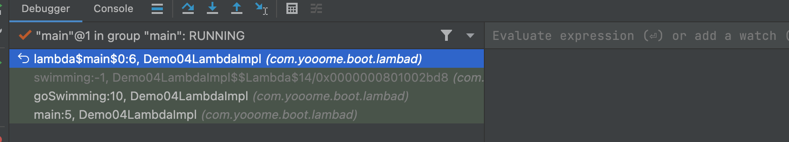
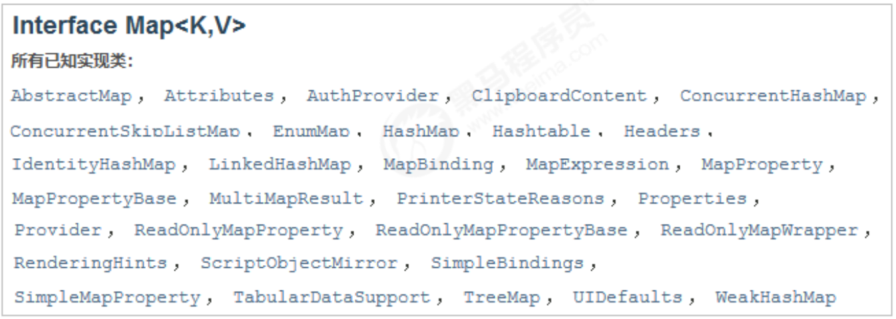

### 						JDK8~21新特性

### 前言

最近看到JDK21出来了，身为打工人，还是有点好奇JDK21的新特性，因此总结一下JDK8~21的所有的新特性，看看JDK筚路蓝缕的历程。

### 一、JDK8新特性

#### 1.1 Lambda表达式

##### 1.1.1 目标

了解使用匿名内部类型存在的问题，体验Lambda

##### 1.1.2 使用匿名内部类存在的问题

当需要启动一个县城去完成任务时，通常会通过Runnable接口来定义任务内容，并使用 Thread 类来启动该线程。

**传统写法，代码如下**：

```java
@Test
public void Demo01LambdaIntro(){
  new Thread(new Runnable() {
    @Override
    public void run() {
      System.out.println("线程执行任务");
    }
  }).run();
}
```

由于面向对象的语法要求，首先创建一个Runnable接口的匿名内部类对象来制定线程要执行的任务内容，再将其交给一个线程来启动。

**代码分析**：

对于 `Runnable` 的匿名内部类用法， 可以分析出几点内容：

- Thread 类需要 Runnable 接口作为参数，其中的抽象 run 方法是用来制定线程任务内容的核心。
- 为了指定 run 的方法体，不得不需要 Runnable 接口的实现类。
- 为了省去定义一个 Runnable 实现类的麻烦，不得不使用匿名内部类。
- 必须覆盖重写抽象 run 方法，所以方法名称，方法参数，方法返回值不得不再写一遍，且不能写错。
- 而实际上，**似乎只有方法体才是关键所在**。

##### 1.1.3 Lambda 体验

Lambda 是一个**匿名函数**，可以理解为一段可以传递的代码。

Lambda 表达式写法，代码如下：

借助 Java8 的全新语法，上述 Runnable 接口的匿名内部类写法可以通过更简单的Lambda 表达式达到相同的效果

```java
  @Test
    public void Demo01LambdaIntro1(){
        new Thread(()->{
            System.out.println("线程执行任务");
        }).run();
    }
```

这段代码和刚才的执行效果完全一样的，可以在JDK8 或更高的编译级别下通过。从代码的语义中欧可以看出：我们启动类一个线程，而线程任务的内容以一种更加简洁的形式被指定。

我们只需要将要执行的代码放到一个Lambda表达式中，不需要定义类，不需要创建对象。

##### 1.1.4 Lambda的优点

简化匿名内部类的使用，语法更加简单。

##### 1.1.5 小结

了解匿名内部类语法冗余，体验了Lambda表达式的使用，发现 Lambda 是简化匿名内部类的简写。

#### 1.2 Lambda的标准格式

- 掌握Lambda的标准格式
- 练习五参数无返回值的Lambda
- 练习有参数有返回值的Lambda

##### 1.2.1 Lambda的标准格式

Lambda 省去面向对象的条条框框，Lambda的标准格式格式由 3 个部分组成：

```bash
(参数类型 参数名称) -> {
	代码体;
}
```

**格式说明**：

- (参数类型 参数名称)：参数列表
- {代码体;}：方法体
- `->`：箭头，分隔参数列表和方法体。

**Lambda与方法的对比**

匿名内部类

```java
public void run(){
  System.out.printle("aa");
}
```

Lambda

```java
() -> System.out.printle("bb!")
```

##### 1.2.2 练习无参数无返回值的Lambda

掌握了 Lambda 的语法，我们来通过一个案例熟悉 Lambda 的使用。

```java
interface Swimmable {
  public abstract void swimming();
}
```

##### 1.2.3 练习有参数有返回值的Lambda

下面举例演示 `java.util.Comparator<T>` 接口的使用场景代码，其中的抽象方法定义为：

- `public abstract int compare(T o1,T o2);`

当需要对一个对象集合进行排序时，`Collections.sort` 方法需要一个 `Comparator` 接口实例来制定排序的规则。

**传统写法**

如果使用传统的代码对 ArrayList 集合进行排序，写法如下：

```java
package com.yooome.boot.lambad;

import lombok.AllArgsConstructor;
import lombok.Data;

@Data
@AllArgsConstructor
public class Person {
    private String name;
    private int age;
    private int height;
}
```

```java
package com.yooome.boot.lambad;

import java.util.ArrayList;
import java.util.Collections;
import java.util.Comparator;

public class Demo03LambdaUse {
    public static void main(String[] args) {
        ArrayList<Person> personArrayList = new ArrayList<>();
        personArrayList.add(new Person("1",21,21));
        personArrayList.add(new Person("2",12,12));
        personArrayList.add(new Person("3",13,13));

        Collections.sort(personArrayList, new Comparator<Person>() {
            @Override
            public int compare(Person o1, Person o2) {
                return o1.getAge() - o2.getAge();
            }
        });
        for (Person person : personArrayList) {
            System.out.println(person);
        }

    }
}
```

这种做法在面向对象的思想中，似乎也是 “理所当然” 的。其中 `Comparator` 接口的实例（使用了匿名内部类）代表了 `按照年龄从小到大`的排序规则。

**Lambda写法**

```java
package com.yooome.boot.lambad;

import java.util.*;
import java.util.function.Consumer;

public class Demo03LambdaUse {
    public static void main(String[] args) {
        ArrayList<Person> personArrayList = new ArrayList<>();
        personArrayList.add(new Person("1", 21, 21));
        personArrayList.add(new Person("2", 12, 12));
        personArrayList.add(new Person("3", 13, 13));

        Collections.sort(personArrayList, (o1, o2) -> {
            return o1.getAge() - o2.getAge();
        });
        for (Person person : personArrayList) {
            System.out.println(person);
        }
        System.out.println("------------");
        List<Integer> list = Arrays.asList(11, 22, 33, 44);
        list.forEach(new Consumer<Integer>() {
            @Override
            public void accept(Integer integer) {
                System.out.println(integer);
            }
        });
        System.out.println("-----------------");
        list.forEach((s) -> {
            System.out.println(s);
        });

    }
}
```

首先学习了Lambda表达式的标准格式

```bash
(参数列表) -> {
	方法体;
}
```

以后我们调用方法时，看到参数是接口就可以考虑使用 Lambda 表达式，Lambda 表达式相当于是对接口中抽象方法的重写。

#### 1.3 了解Lambda的实现原理

##### 1.3.1 目标

了解 Lambda 的实现原理

我们现在已经回使用 Lambda 表达式了。现在同学们可定很好奇 Lambda 是如何实现的，现在我们就来探究 Lambda 表达式的底层实现原理。

```java
@FunctionalInterface
interface Swimmable {
  public abstract void swimming();
}
```

我们可以看到匿名内部类会在编译后产生一个类：`Demo04LambdaImpl$1.class`


使用XJad 反编译这个类，得到如下代码：

```java
package com.itheima.demo01lambda;
import java.io.PrintStream;
// Referenced classes of package com.itheima.demo01lambda: 
// Swimmable, Demo04LambdaImpl
static class Demo04LambdaImpl$1 implements Swimmable {
  public void swimming(){ 
    System.out.println("使用匿名内部类实现游泳"); 
  }
  Demo04LambdaImpl$1() { 
  } 
}
```

我们再来看看Lambda 的效果，修改代码如下：

```java
public class Demo04LambdaImpl {
    public static void main(String[] args) {
        goSwimming(new Swimmable() {
            @Override
            public void swimming() {
                System.out.println("使用匿名内部类实现游泳");
            }
        });
    }
    public static void goSwimming(Swimmable swimmable){
        swimmable.swimming();
    }
}
```

运行程序，控制台可以得到预期的结果，但是并没有出现一个新的类，也就是说Lambda 并没有在编译的时候产生一个新的类。使用XJad对这个类进行反编译，发现XJad报错。使用了 Lambda 后 XJad 反编译工具无法反编译。我们使用JDK自带的一个工具： `javap` ,对字节码进行反编译，查看字节码指令。

在DOS命令行输入：

```bash
javap -c -p 文件名.class
-c: 表示对代码进行反汇编
-p: 显示所有类和成员
```

反汇编效果如下：

```java
yooome@192 lambad % javap -c -p Demo04LambdaImpl.class
Compiled from "Demo04LambdaImpl.java"
public class com.yooome.boot.lambad.Demo04LambdaImpl {
  public com.yooome.boot.lambad.Demo04LambdaImpl();
    Code:
       0: aload_0
       1: invokespecial #1                  // Method java/lang/Object."<init>":()V
       4: return

  public static void main(java.lang.String[]);
    Code:
       0: invokedynamic #7,  0              // InvokeDynamic #0:swimming:()Lcom/yooome/boot/lambad/Swimmable;
       5: invokestatic  #11                 // Method goSwimming:(Lcom/yooome/boot/lambad/Swimmable;)V
       8: return

  public static void goSwimming(com.yooome.boot.lambad.Swimmable);
    Code:
       0: aload_0
       1: invokeinterface #17,  1           // InterfaceMethod com/yooome/boot/lambad/Swimmable.swimming:()V
       6: return

  private static void lambda$main$0();
    Code:
       0: getstatic     #21                 // Field java/lang/System.out:Ljava/io/PrintStream;
       3: ldc           #27                 // String lambad 学会游泳了
       5: invokevirtual #29                 // Method java/io/PrintStream.println:(Ljava/lang/String;)V
       8: return
}
```

可以看到在类中多出来一个私有的静态方法 `lambda$main$0` 。这个方法里面放的是什么内容呢？我们通过断点调试来看看：



可以确认 lambda$main$0 里面放的就是Lambda中的内容，我们可以这么理解 lambda$main$0 方法：

```
public class Demo04LambdaImpl {
    public static void main(String[] args) {
        ...
    }
    public static void lambda$main$0(){
        System.out.println("Lambda游泳");
    }
}
```

关于这个方法 lambda$main$0 的命名：以lambda开头，因为是在main()函数里使用lambda表达式，所以带有 $main 表示，因为是第一个，所以$0。

如何调用这个方法呢？其实lambda在运行的时候会生成一个内部类，为了验证是否生成内部类，可以在运行是加上  

`-Djdk.internal.lambda.dumpProxyClasses` ，加上这个参数后，运行是会将生成的内部类class码输出到一个文件中。使用java命令如下：

```
java -Djdk.internal.lambda.dumProxyClasses y要运行的包名.类名
```

根据上面的格式，在命令行输入一下命令：

```java
// Referenced classes of package com.itheima.demo01lambda: 
// Swimmable, Demo04LambdaImpl
final class Demo04LambdaImpl$$Lambda$1 implements Swimmable {
  public void swimming() { 
    Demo04LambdaImpl.lambda$main$0(); 
  }
  private Demo04LambdaImpl$$Lambda$1() {} 
}
```

可以看到这个匿名内部类实现了 Swimmable 接口，并且重写了 swimming 方法，swimming 方法调用 `Demo04LambdaImpl.lambda$main$0()` ,也就是调用 Lambda 中的内容。最后可以将 Lambda 理解为：

```java
public class Demo04LambdaImpl { 
  public static void main(String[] args) { 
    goSwimming(new Swimmable() { 
      public void swimming() { 
        Demo04LambdaImpl.lambda$main$0(); 
      } 
    }); 
  }
  private static void lambda$main$0() { 
    System.out.println("Lambda表达式游泳"); 
  }
  public static void goSwimming(Swimmable swimmable) { 
    swimmable.swimming(); 
  } 
}
```

##### 1.3.2 小结

匿名内部类在编译的时候会生成一个class文件

Lamdba 在程序运行的时候形成一个类

1. 在类中新增一个方法，这个方法的方法体就是 Lambda 表达式中的代码
2. 还会形成一个匿名内部类，实现接口，重写抽象方法
3. 在接口的重写方法中会调用新生成的方法。

#### 1.4 Lambda 省略格式

**目标**：

掌握 Lambda 省略格式

在 Lambda 标准格式的基础上，使用省略写法的规则为：

1. 小括号内参数的类型可以省略。
2. 如果小括号内有且仅有一个参数，则小括号可以省略。
3. 如果大括号内有且仅有一个语句，可以同事省略大括号，return 关键字及语句分号。

```java
(int a) -> {
  return new Person();
}
```

省略后

```java
a -> new Person()
```

#### 1.5 Lambda 的前提条件

掌握Lambda的前提条件

Lambda 的语法非常简洁，但是 Lambda 表示式不是随便使用的，使用时有几个条件要特别注意：

1. 方法的参数或局部变量类型必须为接口才能使用 Lambda 。
2. 接口中有且仅有一个抽象方法。

```java
public interface Flyable {
  public abstract void flying();
}
```

#### 1.6 小结

Lambad表达式的前提条件：

1. 方法的参数或变量的类型是接口。
2. 这个接口中只能有一个抽象方法。

#### 1.7 函数式接口

函数式接口在Java中是指：有且仅有一个抽象方法的接口。

函数式接口，即适用于函数式编程场景的忌口。而且 Java 中的函数式编程体现就是 Lambda，所以函数式接口就是可以适用于 Lambda 会用的接口。只有确保接口中有且仅有一个抽象方法，Java  中的 ：Lambda 才能顺利地进行推导。

FuncationlInterface 注解

与 @Override 注解的作用类似，Java8 中专门的函数式接口引入了一个新的注解：`@FunctionalInterface`。该注解可用于一个接口的定义上：

```java
@FuncationlInterface
public interface Operator{
  void myMethod();
}
```

一旦使用该注解来定义接口，编译器将会强制检查该接口是否确定有且仅有一个抽象方法，否则将会报错。不过。，即时不适用该注解，只要满足函数式接口的定义，这仍然是一个函数式接口，使用起来都一样。

#### 1.8 Lambda 和 匿名内部类对比

了解 Lambda 和匿名内部类在使用上的区别

1. 所需的类型不一样

   匿名内部类，需要的类型可以是类，抽象类，接口。

   Lambda 表达式，需要的类型必须接口。

2. 抽象方法的数量不一样

   匿名内部类所需的接口中抽象的方法的数量随意。

   Lambda 表达式所需的接口只能有一个抽象方法。

3. 实现原理不同

   匿名内部类是在编译后会形成class

   Lambda 表达式是在程序运行的时候动态生成class

#### 1.9 小结：

当接口中只有一个抽象方法时，建议使用Lambda表达式，其他其他情况还是需要使用匿名内部类。

### 二、JDK 8接口新增的两个方法

#### 2.1 目标

了解 JDK8 接口新增的两个方法。

掌握接口默认方法的使用。

掌握接口静态方法的使用。

#### 2.2 JDK8接口增强介绍

JDK 8 以前的接口：

```java
interface 接口名{
    静态常量；
    抽象方法；
}
```

JDK8 对接口的增强，接口还可以有默认的方法和静态方法

JDK8 的接口:

```java
interface 接口名 {
  静态常量;
  抽象方法;
  默认方法;
  静态方法;
}
```

接口引入默认方法的背景

在JDK8以前的接口中只能有抽象方法。存在以下问题：

如果给接口新增抽象方法，所有实现类都必须重写这个抽象方法。不利于接口的扩展。

```java
interface A {
  public abstrict void test1();
  //接口新增抽象方法，所有实现类都需要去重写这个方法，非常不利于接口的扩展。
  public abstrict void test2();
}
class B implements A {
  @Voerride
  public void test1(){
    System.out.println("BB test1");
  }
  // 接口新增抽象方法，所有实现类都需要去重写这个方法
  @Override
  public void test2(){
    System.out.println("BB test2");
  }
}

class C implement A {
  @Override
  public void test1(){
    System.out.println("cc test1");
  }
   // 接口新增抽象方法，所有实现类都需要去重写这个方法
  @Override
  public void test2(){
    System.out.println("BB test2");
  }
}
```

例如，JDK 8 时在Map接口中增加了 forEach 方法：

```java
public interface Map<K,V> {
  abstrict void forEach(BiConsumer<? super K,? super V> action);
}
```

通过API可以查询到Map接口的实现类如：



如果在Map接口中增加一个抽象方法，所有的实现类都需要去实现这个方法，那么工程量时巨大的。

因此，在JDK8时为接口新增了默认方法，效果如下：

```java
public interface Map<K,V> {
  default void forEach(BiConsumer<? super K,? super V> action){
    ...
  }
}
```

接口中的默认方法实现类不必重写，可以直接使用，实现类也可以分局需要重写。这样就方便接口的扩展。

#### 2.3 接口默认方法的定义格式

```java
interface 接口名{
  修饰符 default 返回值类型 方法名(){
    代码;
  }
}
```

#### 2.4 接口默认方法的使用

方式一：实现类直接调用接口默认方法

方式二：实现类重写接口默认方法。

```java
package com.yooome.boot.lambad;

public class Demo02UserDefaultFunction {
    public static void main(String[] args) {
        AA aa = new AA();
        aa.test02();

        CC cc = new CC();
        cc.test02();
    }
}

public interface BB {
    void test1();

    default void test02(){
        System.out.println("AA test02 ");
    }
}

public class AA implements BB{
    @Override
    public void test1() {

    }
}

public class CC implements BB{
    @Override
    public void test1() {

    }

    @Override
    public void test02() {
        BB.super.test02();
    }
}
```

#### 2.5 接口静态方法

为了方便接口扩展，JDK8位接口新增了静态方法

##### 2.5.1 接口静态方法的定义格式

```java
interface 接口名 {
  修饰符 static 返回值类型 方法名(){
    代码;
  }
}
```

##### 2.5.2 接口静态方法的使用

直接使用接口名调用即可：接口名.静态方法名();

```java
package com.yooome.boot.lambad;

public class Demo04UseStaticFunction {
    public static void main(String[] args) {
        // 直接使用接口名调用即可：接口名.静态方法名();
        AAA.test01();
    }
}

public interface AAA {
    public static void  test01(){
        System.out.println("AAA 接口的静态方法");
    }
}

public class BBB implements AAA{
    // 静态方法不能重写
    /*public static void test01(){
        System.out.println("静态方法不能被重写");
    }*/
}
```

#### 2.6 接口默认方法和静态方法的区别

1. 默认方法通过实例调用，静态方法通过接口名调用。
2. 默认方法可以被继承，实现类可以直接使用接口默认方法，也可以重写接口默认的方法。
3. 静态方法不能被继承，实现类不能重写接口静态方法，只能使用接口名调用。

#### 2.7 小结

接口中新增的两种方法：

默认方法和静态方法

如何选择呢？如果这个方法需要被实现类继承或重写，使用默认方法，如果接口中的方法不需要被继承就使用静态方法。

### 三、常用内置函数式接口

#### 3.1 目标

了解内置函数式接口由来

了解常用内置函数式接口

#### 3.2 内置函数式接口来由来

我们知道使用Lambda表达式的提前是需要有函数式接口。而Lambda使用时不关系接口名，抽象方法名，只关心抽象方法的参数列表和返回值类型。因此为了让我们使用 Lambda 方便，JDK 提供了大量常用的函数式接口。

```java
public class Demo01UserFunctionalInterface {
    public static void main(String[] args) {
        method((arr) -> {
            int sum = 0;
            for (int n : arr) {
                sum += n;
            }
            return sum;
        });
    }

    private static void method(Operator op) {
        int[] arr = {1, 2, 3, 4};
        int sum = op.getSum(arr); 
        System.out.println("sum = " + sum);
    }

}
@FunctionalInterface
interface Operator{
    int getSum(int[] arr);
}
```

#### 3.3 常用内置函数式接口介绍

它们主要在 `java.util.funcation` 包中。下面是最常用的几个接口

1. Supplier 接口

```java
@FunctionalInterface
public interface Supplier<T>{
  public abstract T get();
}
```

2. Consumer 接口

```java
@FunctionalInterface
public interface Consumer<T> {
  public abstract void accept(T t);
}
```

3. Function 接口

```java
@FunctionalInterface
public interface Funcation<T,R> {
  public abstract R apply(T t);
}
```

4. Predicate接口

```java
@FunctionalInterface
public interface Predicate<T> {
  public abstract boolean test(T t);
}
predicate 接口用于做判断，返回 boolean 类型的值
```

#### 3.4 Suppplier接口

`java.util.function.Supplier<T> `接口，它意味着"供给" , 对应的Lambda表达式需要“**对外提供**”一个符合泛型类型的对象数据。

```java
@FunctionalInterface
public interface Supplier<T> {
  public abstract T get();
}
```

供给型接口，通过Supplier接口中的get方法可以得到一个值，无参有返回的接口。

**使用Lambda表达式返回数组元素最大值**

使用Supplier接口作为方法参数类型，通过Lamdba 表达式求出 int 数组中的最大值。提示：接口的泛型请使用 `java.lang.Interget` 类。

**代码示例:**

```java
public class Demo05Supplier {
    public static void main(String[] args) {
        printMax(()->{
            int[] arr = {10,30,20,300,200,100};
            Arrays.sort(arr);
            return arr[arr.length - 1];
        });
    }

    private static void printMax(Supplier<Integer> supplier) {
        int  max = supplier.get();
        System.out.println(max);
    }
}
```

#### 3.5  Consumer接口

`java.util.function.Consumer<T>` 接口则正好相反，它不是生产一个数据，而是**消费**一个数据，其数据类型由泛型参数决定。

```java
@FunctionalInterface public interface Consumer<T> { 
  public abstract void accept(T t); 
}
```

**使用Lambda表达式将一个字符串转成大写和小写的字符串**

Consumer消费型接口，可以拿到accept方法参数传递过来的数据进行处理, 有参无返回的接口。基本使用如：

```java
public class Demo05Supplier {
    public static void main(String[] args) {
        printMax((String s)->{
            System.out.println(s.toLowerCase());
        });
    }

    private static void printMax(Consumer<String> consumer) {
        consumer.accept("HelloWorld");
    }
}
```


