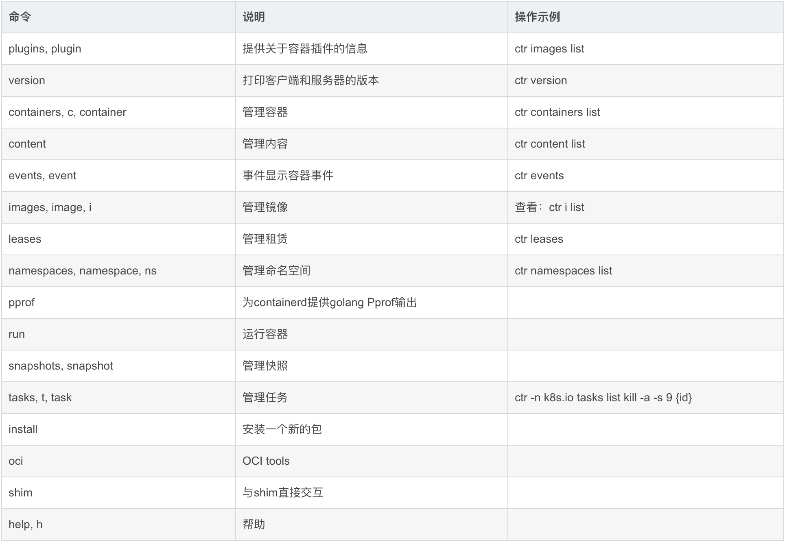
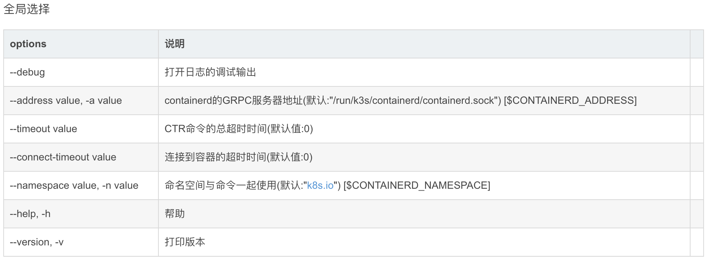

### 一、k8s 安装步骤

#### 1.1 安装docker及containerd容器

```bash
# 1.移除docker
sudo yum remove docker \
                  docker-client \
                  docker-client-latest \
                  docker-common \
                  docker-latest \
                  docker-latest-logrotate \
                  docker-logrotate \
                  docker-engine
# 2.安装yum-utils包（它提供了yum-config-manager实用程序）并设置存储库。                
sudo yum install -y yum-utils
sudo yum-config-manager \
    --add-repo \
    https://download.docker.com/linux/centos/docker-ce.repo  
      
# 3.安装 Docker 引擎、容器和 Docker 组合:
sudo yum install docker-ce docker-ce-cli containerd.io docker-buildx-plugin docker-compose-plugin

#	4.启动&开机启动docker
systemctl enable docker --now

# 5.docker加速配置
sudo mkdir -p /etc/docker
sudo tee /etc/docker/daemon.json <<-'EOF'
{
  "registry-mirrors": ["https://wkxfupsi.mirror.aliyuncs.com"],
  "exec-opts": ["native.cgroupdriver=systemd"],
  "log-driver": "json-file",
  "log-opts": {
    "max-size": "100m"
  },
  "storage-driver": "overlay2"
}
EOF
# 6.后台程序重新加载
sudo systemctl daemon-reload

# 7.启动Docker
sudo systemctl restart docker

# 8.通过运行hello-world镜像来验证Docker引擎安装是否成功。
sudo docker run hello-world
```

#### 1.2、设置每台服务器的参数

```bash
#1.设置每个机器自己的hostname
hostnamectl set-hostname xxx

#2.将 SELinux 设置为 permissive 模式（相当于将其禁用）
sudo setenforce 0
sudo sed -i 's/^SELINUX=enforcing$/SELINUX=permissive/' /etc/selinux/config

#3.关闭swap
swapoff -a  
sed -ri 's/.*swap.*/#&/' /etc/fstab

#4.转发 IPv4 并让 iptables 看到桥接流量
cat <<EOF | sudo tee /etc/modules-load.d/k8s.conf
overlay
br_netfilter
EOF

sudo modprobe overlay
sudo modprobe br_netfilter

#5.设置所需的 sysctl 参数，参数在重新启动后保持不变
cat <<EOF | sudo tee /etc/sysctl.d/k8s.conf
net.bridge.bridge-nf-call-iptables  = 1
net.bridge.bridge-nf-call-ip6tables = 1
net.ipv4.ip_forward                 = 1
EOF
#6.应用 sysctl 参数而不重新启动
sudo sysctl --system
```

#### 1.3、安装kubelet、kubeadm、kubectl

```bash
#1.配置k8s的yum源地址
cat <<EOF | sudo tee /etc/yum.repos.d/kubernetes.repo
[kubernetes]
name=Kubernetes
baseurl=http://mirrors.aliyun.com/kubernetes/yum/repos/kubernetes-el7-x86_64
enabled=1
gpgcheck=1
gpgkey=http://mirrors.aliyun.com/kubernetes/yum/doc/yum-key.gpg
   http://mirrors.aliyun.com/kubernetes/yum/doc/rpm-package-key.gpg
EOF

#2.安装 kubelet，kubeadm，kubectl
sudo yum install -y kubelet-1.27.1 kubeadm-1.27.1 kubectl-1.27.1

#3.启动kubelet
sudo systemctl enable --now kubelet
#4.所有机器配置master域名
echo "172.31.0.2  master" >> /etc/hosts
```

#### 1.4、修改 kubelet 的 cgroup 和 docker 的 cgroup-driver 保持一致

```bash
为了实现docker使用的cgroupdriver与kubelet使用的cgroup的一致性，建议修改如下文件内容。

# vim /etc/sysconfig/kubelet
KUBELET_EXTRA_ARGS="--cgroup-driver=systemd"

设置kubelet为开机自启动即可，由于没有生成配置文件，集群初始化后自动启动
# systemctl enable kubelet

```

#### 1.5、使用containerd 默认容器的配置

说明：
如果你从软件包（例如，RPM 或者 .deb）中安装 containerd，你可能会发现其中默认禁止了 CRI 集成插件。

你需要启用 CRI 支持才能在 Kubernetes 集群中使用 containerd。 要确保 cri 没有出现在 /etc/containerd/config.toml 文件中 disabled_plugins 列表内。如果你更改了这个文件，也请记得要重启 containerd。

如果你在初次安装集群后或安装 CNI 后遇到容器崩溃循环，则随软件包提供的 containerd 配置可能包含不兼容的配置参数。考虑按照 getting-started.md 中指定的 containerd config default > /etc/containerd/config.toml 重置 containerd 配置，然后相应地设置上述配置参数。

```bash
#1.使用如下命令重置config.toml文件
containerd config default > /etc/containerd/config.toml
#2.编辑配置文件
vim /etc/containerd/config.toml
SystemdCgroup = false 改为 SystemdCgroup = true

# 3.修改 sandbox_image = "k8s.gcr.io/pause:3.6"
sandbox_image = "registry.cn-hangzhou.aliyuncs.com/google_containers/pause:3.6"

# 4.设置开机自启动
systemctl enable containerd

# 5.重新启动containerd
systemctl restart containerd
# 6. 列出containerd所有镜像命令
ctr images ls

```

#### 1.6、使用kubeadm进行初始化

```bash
kubeadm init \
--apiserver-advertise-address=172.31.0.2 \
--control-plane-endpoint=master \ # 此处的 master 和修改主节点的 hostname 一致
--image-repository registry.cn-hangzhou.aliyuncs.com/google_containers \
--kubernetes-version v1.27.1 \
--service-cidr=10.96.0.0/16 \
--pod-network-cidr=192.168.0.0/16

# 上面参数说明
--apiserver-advertise-address 集群通告地址
--image-repository 由于默认拉取镜像地址k8s.gcr.io国内无法访问，这里指定阿里云镜像仓库地址
--kubernetes-version K8s版本，与上面安装的一致
--service-cidr 集群内部虚拟网络，Pod统一访问入口
--pod-network-cidr Pod网络，，与下面部署的CNI网络组件yaml中保持一致
```

#### 1.7、初始化成功

```bash
Your Kubernetes control-plane has initialized successfully!

To start using your cluster, you need to run the following as a regular user:

  mkdir -p $HOME/.kube
  sudo cp -i /etc/kubernetes/admin.conf $HOME/.kube/config
  sudo chown $(id -u):$(id -g) $HOME/.kube/config

Alternatively, if you are the root user, you can run:

  export KUBECONFIG=/etc/kubernetes/admin.conf

You should now deploy a pod network to the cluster.
Run "kubectl apply -f [podnetwork].yaml" with one of the options listed at:
  https://kubernetes.io/docs/concepts/cluster-administration/addons/

You can now join any number of control-plane nodes by copying certificate authorities
and service account keys on each node and then running the following as root:

  kubeadm join master:6443 --token vpaktg.s51c1071536ufw2f \
        --discovery-token-ca-cert-hash sha256:007086af6e8e68cf02ba69643e00bb1318e1e0fadf834dd332fb2ad80010966c \
        --control-plane 

Then you can join any number of worker nodes by running the following on each as root:

kubeadm join master:6443 --token vpaktg.s51c1071536ufw2f \
        --discovery-token-ca-cert-hash sha256:007086af6e8e68cf02ba69643e00bb1318e1e0fadf834dd332fb2ad80010966c 
[root@master containerd]# 
```

#### 1.8、集群部署网络插件

```bash
网络组件有很多种，只需要部署其中一个即可，推荐Calico。
Calico是一个纯三层的数据中心网络方案，Calico支持广泛的平台，包括Kubernetes、OpenStack等。
Calico 在每一个计算节点利用 Linux Kernel 实现了一个高效的虚拟路由器（ vRouter） 来负责数据转发，而每个 vRouter 通过 BGP 协议负责把自己上运行的 workload 的路由信息向整个 Calico 网络内传播。
此外，Calico 项目还实现了 Kubernetes 网络策略，提供ACL功能。
#1.下载Calico

wget https://docs.tigera.io/archive/v3.24/manifests/calico.yaml

vim calico.yaml
# 2.注意此处 CALICO_IPV4POOL_CIDR 的 value 要和 --pod-network-cidr 后面的值一致
- name: CALICO_IPV4POOL_CIDR
  value: "10.244.0.0/16"
...
#3.使用命令执行网络插件
kubectl apply -f calico.yaml
```

### 二、containerd镜像加速

#### 2.1 containerd 镜像加速配置

- 修改Config.toml文件

```toml
[plugins."io.containerd.grpc.v1.cri".registry]
      config_path = "/etc/containerd/certs.d"  # 镜像地址配置文件

      [plugins."io.containerd.grpc.v1.cri".registry.auths]

      [plugins."io.containerd.grpc.v1.cri".registry.configs]

      [plugins."io.containerd.grpc.v1.cri".registry.headers]

      [plugins."io.containerd.grpc.v1.cri".registry.mirrors]
```

- 创建相应目录

```bash
mkdir /etc/containerd/certs.d/docker.io -pv
```

- 配置加速

```toml
cat > /etc/containerd/certs.d/docker.io/hosts.toml << EOF
server = "https://docker.io"
[host."https://wkxfupsi.mirror.aliyuncs.com"]
  capabilities = ["pull", "resolve"]
EOF
```

- 重启containerd容器

```bash
systemctl restart containerd
```

- 拉去mysql 镜像

```bash
ctr i pull docker.io/library/mysql:latest
```

#### 2.2 containerd 常用镜像命令

1. containerd的概述

> 名字：ctr （containerd CLI）
>
> 用法：CTR [global options] command [command options] [arguments…]
>
> 描述：CTR是一个不受支持的用于交互的调试和管理客户机使用容器守护进程。因为它不受支持，选项和操作不能保证向后兼容或容器项目从一个版本到另一个版本都是稳定的

注：如果没有指定默认名称空间的话，则要 （-n 名称空间）

> 命令										说明												操作示例
>
> plugins, plugin			 		 提供关于容器插件的信息			 ctr images list
>
> version						   		打印客户端和服务器的版本		 ctr version
>
> containers, c, container	   管理容器									   ctr containers list
>
> content								   管理内容									   ctr content list
>
> events, event						 事件显示容器事件						ctr events
>
> images, image, i	         	   管理镜像	查看：						ctr i list
>
> leases									  管理租赁									   ctr leases
>
> namespaces, namespace, ns	管理命名空间						  ctr namespaces list
>
> pprof	                 					为containerd提供golang Pprof输出	
>
> run										   运行容器	
>
> snapshots, snapshot		    管理快照	
>
> tasks, t, task						   管理任务										 ctr -n k8s.io tasks list kill -a -s 9 {id}
>
> install									   安装一个新的包	
>
> oci											OCI tools	
>
> shim									    与shim直接交互	
>
> help, h									 帮助														打印版本






#### 2.3 ctr日常操作示例

操作示例

```bash
# 查看镜像
~]# ctr images list 或  ctr i ls
# 如没有指定名称空间则需指定
~]# ctr namespaces list  或 ctr ns list
NAME   LABELS 
k8s.io
~]# ctr -n k8s.io images list
​
# 镜像标记
~]# ctr -n k8s.io images tag registry.cn-hangzhou.aliyuncs.com/google_containers/pause:3.2 k8s.gcr.io/pause:3.2

# 删除镜像
~]# ctr -n k8s.io images rm k8s.gcr.io/pause:3.2

# 拉取镜像
~]# ctr -n k8s.io images pull -k k8s.gcr.io/pause:3.2

# 导出镜像
~]# ctr -n k8s.io images export pause.tar k8s.gcr.io/pause:3.2

# 导入镜像;不支持 build,commit 镜像
~]# ctr -n k8s.io i import pause.tar

# 运行容器
~]# ctr -n k8s.io run --null-io --net-host -d –env PASSWORD=$drone_password –mount type=bind,src=/etc,dst=/host-etc,options=rbind:rw –mount type=bind,src=/root/.kube,dst=/root/.kube,options=rbind:rw $image sysreport bash /sysreport/run.sh

–null-io: 将容器内标准输出重定向到/dev/null
–net-host: 主机网络
-d: 当task执行后就进行下一步shell命令,如没有选项,则会等待用户输入,并定向到容器内

# 查看容器
~]# ctr containers list 或 ctr c ls
# 如没有指定名称空间则需指定
~]# ctr -n k8s.io c ls

# 先找出容器然后搜索容器名
~]# ctr -n k8s.io c ls 
CONTAINER      IMAGE                     RUNTIME 
06.....86      pause:3.2              io.containerd.runc.v2
# 找出容器名
~]# ctr -n k8s.io tasks list 
# 停止容器 
~]# kill -a -s 9 {id}
```


