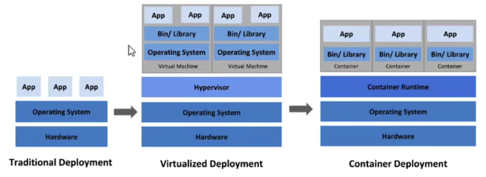
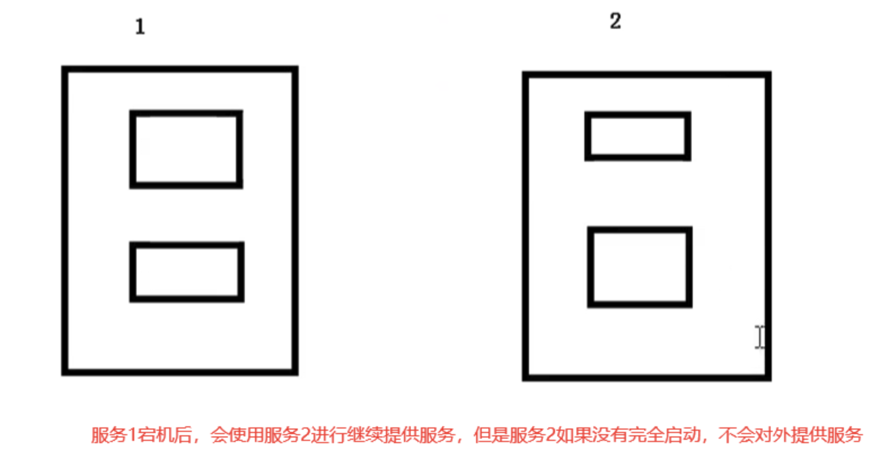
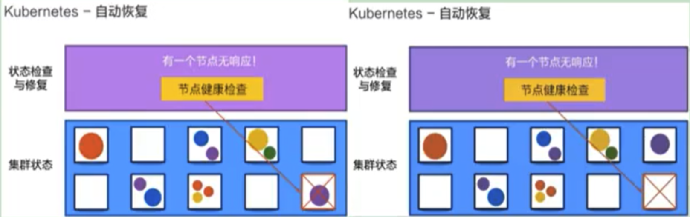
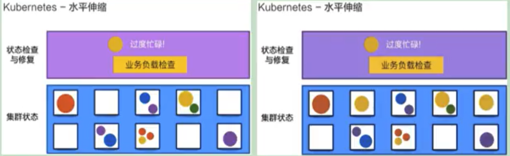
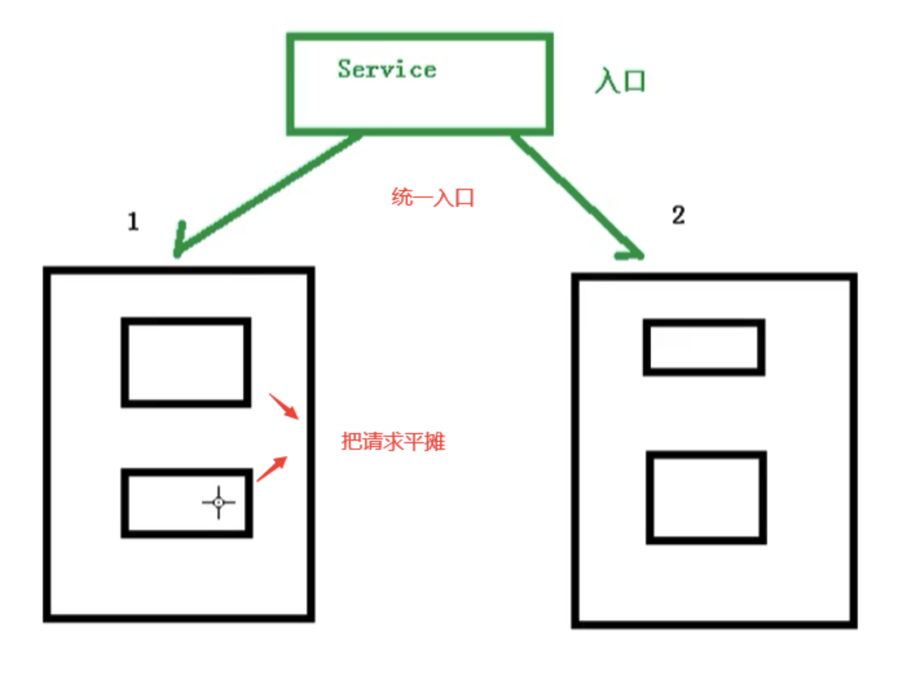
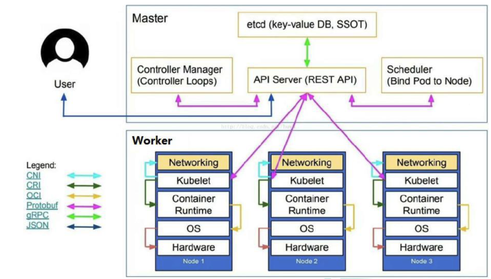
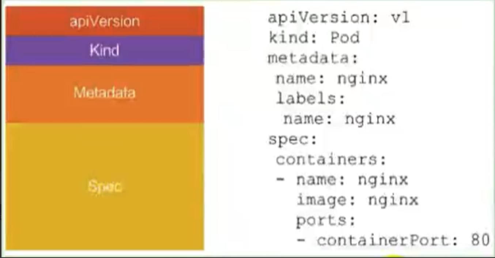

##                              Kubernetes  学习笔记

#### 一、来源

中文官网：https://kubernetes.io/zh

中文社区：https://www.kubernetes.org.cn/

#### 二、介绍

k8s主要将的就是Kubernetes，首先Kubernetes首字母为k，末尾为s，中间移动有8个字母，所以简称k8s

#### 三、课程简介

##### 3.1 k8s概念和架构

##### 3.2 从零搭建k8s集群

- 基于客户端工具 kubeadm 搭建 (简单,最多半个小时)
- 基于二进制包的方式（能看到内部的架构

##### 3.3 k8s核心概念

- Pod：k8s管理的最小单位级，是所有业务类型的基础。
- Controller: 控制器，有状态，无状态，一次任务，定时任务，守护进程。
- Service Ingerss：对外暴露端口。
- RBAC：安全机制，权限模型。
- Helm：下载机制
- 持久化存储

##### 3.4 搭建集群监控平台系统

##### 3.5 从零搭建高可用k8s集群

##### 3.6 在集群环境部署项目

#### 四、k8s 概念和特定

##### 4.1 部署发展历程

我们的项目部署也在经历下面的这样一个历程

> 传统部署 -> 虚拟化部署时代 ->容器部署时代

##### 4.2 传统部署时代：

早期，组织在物理服务器上运行应用程序。无法为物理服务器中的应用程序定义资源，这样会导致资源分配问题。例如，如果在物理服务器上运行多个应用程序，则可能会出现一个应用程序占用大部分资源的情况，结果可能导致其他应用程序的性能下降。 ---解决方案是在不同的物理服务器运行每个应用程序，但是由于资源利用不足而无法扩展，并且组织维护许多物理服务器的成本很高。

##### 4.3 虚拟化部署时代：

作为解决方案，引入了虚拟化功能，它允许您在单个物理服务器的CPU 上运行多个虚拟机（VM）。虚拟化功能允许应用程序在VM之间隔离，并提供安全级别，因为一个应用程序的信息不能被另外一个应用程序自由的访问。文艺虚拟化可以轻松添加或更新应用程序，降低硬件成本等等，所以虚拟化可以更好的利用物理服务器中的资源，并可以实现更好的可伸缩性。每个VM是一台完整的计算机，在虚拟化硬件上运行所有组件，包括自己的操作系统。

##### 4.4 容器化部署时代：

容器类似于VM，但是他们具有轻量级的隔离属性，可以在应用程序之间共享操作系统（OS），因此，容器被认为是轻量级的。容器与VM类似，具有自己的文件系统，CPU，内存，进程空间等。由于他们与基础架构分离，因此可以跨云和OS分发进行移植。

##### 4.5 容器的优势：

- 敏捷应用程序的创建和部署：与使用VM镜像相比，提高了容器镜像创建的简便形和效率。
- 持续开发，集成和部署：通过简单的回滚（由于镜像不可变性），提供可靠且频繁的容器镜像构建和部署。
- 关注开发与运维的分离，在构建时，而不是在不是时创建应用程序容器镜像，将应用程序与基础架构分离。
- 可观察性：不仅可以显示操作系统级别的信息和指标，还可以显示应用程序的运行状况和其他指标信息。
- 跨开发，测试和生产的环境移植：在便携式计算机上与在云中形同地运行。
- 云和操作系统分发的可移植性： 可在Ubuntu、RHEL、RHEL、CoreOS、本地、Google Kubernetes Engine和其它任何其它地方运行。
- 以应用程序为中心的管理：提高抽象级别，从在虚拟硬件上运行OS到使用逻辑资源在OS上运行应用程序。
- 松散耦合、分布式、弹性、解放的微服务：应用程序被分解成较小的独立部分，并且可以动态部署和管理-而不是在一台大型单机上器体运行。
- 资源隔离：可预测的应用程序性能。

##### 4.6 k8s 概述

kubernetes，简称K8s，是用8 代替8 个字符“ubernete”而成的缩写。是一个开源的，用于管理云平台中多个主机上的容器化的应用，Kubernetes 的目标是让部署容器化的应用简单并且高效（powerful）,Kubernetes 提供了应用部署，规划，更新，维护的一种机制。

传统的应用部署方式是通过插件或脚本来安装应用。这样做的缺点是应用的运行、配置、管理、所有生存周期将与当前操作系统绑定，这样做并不利于应用的升级更新/回滚等操作，当然也可以通过创建虚拟机的方式来实现某些功能，但是虚拟机非常重，并不利于可移植性。

新的方式是通过部署容器方式实现，每个容器之间互相隔离，每个容器有自己的文件系统，容器之间进程不会相互影响，能区分计算资源。相对于虚拟机，容器能快速部署，由于容器与底层设施、机器文件系统解耦的。

>总结：
>
>- K8s是谷歌在2014年发布的容器化集群管理系统
>- 使用k8s进行容器化应用部署
>- 使用k8s利于应用扩展
>- k8s目标实施让部署容器化应用更加简洁和高效

Kubernetes 是一个轻便的和可扩展的开源平台，用于管理容器化应用和服务。通过Kubernetes 能够进行应用的自动化部署和扩缩容器。在Kubernetes中 ，会将组成应用的容器组合成一个逻辑单元以更易管理和发现。

Kuberbetes 积累了作为Google 生产环境运行工作负载15年的经验，并吸收了源自于社区的最佳想法和实践。

#### 五、k8s功能

##### 5.1 自动装箱：

基于容器对应运行环境的资源配置要求自动部署应用容器

##### 5.2 自我修复（自愈能力）：

- 当容器失败时，会对容器进行重启
- 当部署的Node节点有问题时。会对容器进行重新部署和重新调度
- 当容器为通过监控检查时，会关闭此容器知道容器能正常运行时，才会对外提供服务。

如果某个服务器上的应用不响应了，Kubernetes会自动在其它的地方创建一个

##### 5.3 水平扩展：

通过简单的命令，用户UI界面或基于CPU 等资源使用的情况，对应用容器进行规模扩大或规模裁剪

>当我们有大量的请求来临是，我们可以增加副本数量，从而达到水平扩展的效果

当黄色应用过度忙碌，会扩展一个应用

##### 5.4 服务发现

用户不需要使用额外的服务发现机制，就能够基于Kubernetes自身能力实现服务发现和负载均衡

> 对外提供同意的入口，让它来做节点的调度和负载均衡，相当于微服务里面的网关？

##### 5.5 滚动更新：

可以根据应用的变化，对应用容器运行的应用，进行一次性或批量式更新。

> 添加应用的时候，不是加进去就马上可以进行使用，而是需要判断这个添加进去的应用是否能够正常使用。

##### 5.6 版本回退：

可以根据应用部署情况，对应用容器运行的应用，进行历史版本即时回退。

> 类似于Git中的回滚

##### 5.7 秘钥和配置管理：

在不需要重新构建镜像的情况下，可以部署和更新秘钥和应用配置，类似于热部署。

##### 5.8 存储编排：

自动实现存储系统挂载及应用，特别对有状态应用实现数据持久化非常重要。

存储系统可以来自于本地目录，网络存储（NFS、Gluster、Ceph等），公共云存储服务

##### 5.9 批处理：

提供一次性任务，定时任务；满足批量数据处理和分析的场景。

##### 5.10 总结：

> 总结主要提供了如下的功能
>
> - **自我修复**：一旦某一个容器崩溃，能够在1秒中左右迅速启动新的容器
> - **弹性伸缩**：可以根据需要，自动对集群中正在运行的容器数量进行调整
> - **服务发现**：服务可以通过自动发现的形式找到它所依赖的服务
> - **负载均衡**：如果一个服务起动了多个容器，能够自动实现请求的负载均衡
> - **版本回退**：如果发现新发布的程序版本有问题，可以立即回退到原来的版本
> - **存储编排**：可以根据容器自身的需求自动创建存储卷

#### 六、Kubernetes 组件

一个Kubernetes集群主要是由**控制节点(master)、工作节点(node)** 构成，每个节点上都会安装不同的组件。

##### 6.1 master：集群的控制平面，负责集群的决策(管理)

> **ApiServer**：资源操作的唯一入口，以restful风格进行操作，接受用户输入的命令，提供认证，授权，API注册和发现等机制。
>
> **Schedule**：负责集群资源调度，按照预定的调度策略将Pod调度到相应的node节点上。
>
> **ControllerManager**：负责维护集群的状态，比如程序部署安排，故障检测，自动扩展，滚动更新等。
>
> **Etcd**：负责存储集群中各种资源对象的信息。【存储系统，用于保存集群中的相关数据】。

##### 6.2 node节点：集群的数据平面，负责为容器提供运行环境（干活）：

> **Kubelet**：负责维护容器的生命周期，即通过控制docker，来创建，更新，销毁容器。
>
> **KubeProxy**：负责提供集群背部的服务发现和负载均衡。
>
> **Docker**：负责节点上容器的各种操作

下面，以部署一个nginx服务来说明Kubernetes系统各个组件调用关系：

##### 6.3 容器运行环境(Container Runtime)：

> - 容器运行环境是负责运行容器的软件
>
> - Kubernetes支持多个容器运行环境：Docker、containerd、cri-o，rktlet以及任何实现Kubernetes CRI(容器运行环境接口)的软件。

##### 6.4 fluentd：

是一个守护进程，它有助于提升 集群层面日志

#### 七、k8s核心概念

##### 7.1 Pod

- Pod 是k8s中最小的单元
- 一组容器的集合
- 共享网络【一个Pod中的所有容器共享一个网络】
- 生命周期是短暂的(服务器重启后，就找不到了)

##### 7.2 Volume

- 生命在Pod容器中可访问的文件目录
- 可以被挂载到Pod中一个或多个容器制定路径下
- 支持多种后端存储抽象【本地存储,分布式存储，云存储】

##### 7.3 Controller

- 确保预期的pod副本数量【ReplicaSet】
- 无状态应用部署【StatefulSet】
- 有状态需要特定的条件
- 确保所有的node运行同一个pod【DaemonSet】
- 一次性任务和定时任务【Job和CronJob】

##### 7.4 Deployment

- 定义一组Pod副本数目，版本等。
- 通过控制器【Controller】维持Pod数目【自动回复失败的Pod】
- 通过控制器以制定的策略控制版本【滚动升级，回滚等】

##### 7.5 Service

- 定义一组pod的访问规则。
- Pod的负载均衡，提供一个或多个Pod的稳定访问地址。

- 支持多种方式【ClusterIP，NodePort，LoadBalancer】

可以用来组合pod，同时对外提供服务

##### 7.6 Label：

label：标签，用于对象资源查询，筛选

##### 7.7 Namespace

命名空间，逻辑隔离

- 一个集群内部的逻辑隔离机制【权健，资源】
- 每一个资源都属于一个namespace
- 同一个namespace所有资源不能重复
- 不同namespace可以资源名重复

##### 7.8 API

我们通过Kubernetes的API来操作整个集群

同时我们通过kubectl、ui、curl最终发送http + json/ymal 方式的请求给API Server，然后控制整个 k8s 集群，k8s中所有的资源对象都可以采用ymal 或json格式的文件定义或描述

如下：使用 ymal 部署一个nginx的pod

##### 7.9 完整流程

> - 通过Kubectl提交一个创建 RC (Replication Controller) 的请求，该请求通过 ApiServer 写入 etcd
>
> - 此时 Controller-Manager 通过ApiServer的监听资源变化的接口监听到此RC事件
>
> - 分析之后，发现当前集群中还没有它所对应的 Pod 实例
>
> - 于是将根据 RC 里的Pod模板定义一个生成Pod对象，通过APIServer写入etcd
>
> - 此事件被Scheduler发现，它立即执行一个复杂的调度流程，为这个信的Pod选定一个落户的Node，然后通过ApiServer将这一结果写入etcd中。
>
> - 目标Node上运行的Kubelet进程通过ApiServer检测到这个"新生的Pod.并按照它的定义，启动该Pod并任劳任怨的负责它的下半生，直到Pod的生命结束"
>
> - 随后，我们通过Kubectl提交一个新的映射到该Pod的Service的创建请求
>
> - ControllerManager通过Label标签查询到关联的Pod实例，然后生成Servie的Endpoints信息，并通过ApiServer写入到etcd中
>
> - 接下来，所有Node上运行的Proxy进程通过ApiServer查询并监听Service对象与其对应的Endponts信息，建立一个软件方式的负载均衡来时出现Service访问到后端Pod的流量转发功能
>
>   

下面，以部署一个nginx服务来说明Kubernetes系统各个组件调用关系：

1. 首先要明确，一旦Kubernetes环境启动之后，master和node都会将自身的信息存储到etcd数据库中

2. 一个nginx服务的安装请求会首相被发送到master节点的apiServer组件

3. apiServer组件会调用scheduler组件来决定到底应该把这个服务安装到哪个node节点上

   在此时，它会从etcd中中读取各个node节点的信息，然后按照一定的算法进行选择，并将结果告知apiServer

4. apiServer调用controller-manager 去调用 node 节点安装nginx 服务
5. kubelet接受到指令后，会通知docker，然后由 docker 来启动一个nginx 的pod，pod 是Kubernetes的最小操作单元，容器必须跑在pod中。

6. 一个nginx服务就运行了，如果需要访问nginx，就需要通过kube-proxy来对pod产生访问的代理这样，外界用户就可以访问集群中的nginx服务了。