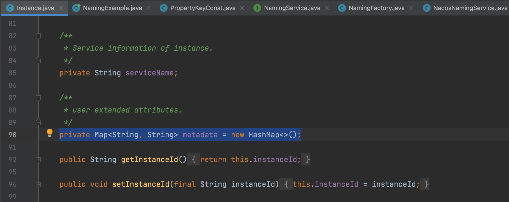

### 深度解析nacos源码之注册中心（服务注册）

### 一、Nacos核心功能点有哪些

#### 1.1 服务注册

Nacos Client 端会通过发送 Rest 请求的方式，向 Nacos Server 端注册自己的服务，提供自身的元数据，比如 ip 地址，端口等信息，Nacos Server 收到注册信息后，就会把这些元数据信息存储到一个双层的内存Map中。

#### 1.2 服务心跳

在服务注册后，Nacos Client 会维护一个定时心跳来持续通知 Nacos Server，说明服务一直处于可用状态，防止被剔除，默认5s发送一次心跳。

#### 1.3 服务健康检查

Nacos Server 会开启一个定时任务，用来检查注册服务实例的健康情况，对与超过15s没有收到客户端心跳的实力，会将它的healthy属性位置false（客户端服务发现的时候不会发现），如果某个势力超过30s没有收到心跳，直接剔除该实例，被踢出的实例如果恢复的话发送心跳重新注册。

#### 1.4 服务发现

Nacos Client 端在调用服务提供者提供的服务时，会发送一个 Rest 请求给 Nacos Server，获取上面注册服务清单，并且缓存Nacos Client本地，同时会在 Nacos Client 本地开启一个定时任务，定时拉去服务端最新的注册表信息，更新到本地缓存。

#### 1.5 服务同步

Nacos Server 集群之间会互相同步实例，用来保证服务信息的唯一性。

#### 1.6 Nacos服务端原理


#### 1.7 Nacos客户端原理


### 二、acos源码之注册中心

#### 2.1 前言

我们这里就是直接使用 nacos 源码中的 example 子项目里面的一个 NamingExample 例子来剖析下服务注册的源码，在解析服务注册源码的时候我们会将整个注册流程从客户端发送注册请求，到Nacos服务端接受注册请求串起来介绍。

##### 2.1.1 client端发送服务注册请求

我们这里就直接以NamingExample里面的这个例子出发

```java
Properties properties = new Properties();
properties.setProperty("serverAddr", System.getProperty("serverAddr", "localhost"));
properties.setProperty("namespace", System.getProperty("namespace", "public"));
// 根据NamingFactory创建一个Service服务类
NamingService naming = NamingFactory.createNamingService(properties);
// 通过服务类去注向注册中心注册自己的服务
naming.registerInstance("nacos.test.3", "11.11.11.11", 8888, "TEST1");
```

这里先是创建一个Properties，塞入两个kv，一个是 serverAddr，一个是 namespace ，这个serverAddr是nacos服务端的地址，可以设置多个，用都好隔开就行，这个 namespace 是命名空间的意思，可以用来区分不同的环境，比如说测试环境，预发布环境，我们看下官方的推荐。

##### 2.1.2 命名空间

用于进行租户力度的配置隔离。不同的命名空间下，可以存在相同的 Group 或 Data ID 的配置。Namespace 的常用场景之一是不同环境的配置的区分隔离，例如开发测试环境和生产环境的资源（如配置，服务）隔离等。

这里我们就不做过多的介绍，接着就是使用NamingFactory这个工厂创建出来的一个NamingService（NacosNamingService），这里不做过多的介绍，我们只介绍NamingService创建的时候，里面都初始化了哪些组件。

1. 示例代码：

   

2. NacosNamingService 实现NamingService，NacosNamingService构建对象初始化的init()方法

```java
// 创建NacosNamingService
public NacosNamingService(Properties properties) throws NacosException {
        init(properties);
    }
// 创建NacosNamingService初始化的条件
private void init(Properties properties) throws NacosException {
  // 配置客户端属性
  final NacosClientProperties nacosClientProperties = NacosClientProperties.PROTOTYPE.derive(properties);

  ValidatorUtils.checkInitParam(nacosClientProperties);
  this.namespace = InitUtils.initNamespaceForNaming(nacosClientProperties);
  // 初始序列化
  InitUtils.initSerialization();
  // 初始化 web root context
  InitUtils.initWebRootContext(nacosClientProperties);
  // 初始化Log日志
  initLogName(nacosClientProperties);
  // 声明事件范围
  this.notifierEventScope = UUID.randomUUID().toString();
  // 实例更改通知
  this.changeNotifier = new (this.notifierEventScope);
  //注册实例到发布者
  NotifyCenter.registerToPublisher(InstancesChangeEvent.class, 16384);
  // 注册订阅通知
  NotifyCenter.registerSubscriber(changeNotifier);
  //服务信息的持有者
  this.serviceInfoHolder = new ServiceInfoHolder(namespace, this.notifierEventScope, nacosClientProperties);
  //命名客户端代理
  this.clientProxy = new NamingClientProxyDelegate(this.namespace, serviceInfoHolder, nacosClientProperties, changeNotifier);
}
```

这是一个客户端注册的一个测试类，它模仿了一个真实的服务注册进Nacos的过程，包括NacosServer链接、实例的创建爱你，实例属性的复制，注册实例，所以在这个其中包含了服务注册的核心代码，仅从此处的代码分析，可以看出，Nacos注册服务实例时，包含了两大类信息：Nacos Server 连接信息和实例信息。

##### 2.1.3  Nacos Server连接信息

Nacos Server连接信息，存储在Properties当中，包含以下信息：

- Server地址：Nacos服务器地址，属性的key为serverAddr；
- 用户名：连接Nacos服务的用户名，属性key为username，默认值为nacos；
- 密码：连接Nacos服务的密码，属性key为password，默认值为nacos；

##### 2.1.4 实例信息

注册实例信息用Instance对象承载，注册的实例信息又分两部分：实例基础信息和元数据。

**实例基础信息包括**：

- instanceId：实例的唯一ID；
- ip：实例IP，提供给消费者进行通信的地址；
- port： 端口，提供给消费者访问的端口；
- weight：权重，当前实例的权限，浮点类型（默认1.0D）；
- healthy：健康状况，默认true；
- enabled：实例是否准备好接收请求，默认true；
- ephemeral：实例是否为瞬时的，默认为true；
- clusterName：实例所属的集群名称；
- serviceName：实例的服务信息；

Instance类包含了实例的基础信息之外，还包含了用于存储元数据metadata（描述数据的数据），类型为HfashMap。



在Instance类中还定义了一些默认信息，这些信息通过get方法提供：

```java
    public long getInstanceHeartBeatInterval() {
        return getMetaDataByKeyWithDefault(PreservedMetadataKeys.HEART_BEAT_INTERVAL,
                Constants.DEFAULT_HEART_BEAT_INTERVAL);
    }
    
    public long getInstanceHeartBeatTimeOut() {
        return getMetaDataByKeyWithDefault(PreservedMetadataKeys.HEART_BEAT_TIMEOUT,
                Constants.DEFAULT_HEART_BEAT_TIMEOUT);
    }
    
    public long getIpDeleteTimeout() {
        return getMetaDataByKeyWithDefault(PreservedMetadataKeys.IP_DELETE_TIMEOUT,
                Constants.DEFAULT_IP_DELETE_TIMEOUT);
    }
    
    public String getInstanceIdGenerator() {
        return getMetaDataByKeyWithDefault(PreservedMetadataKeys.INSTANCE_ID_GENERATOR,
                Constants.DEFAULT_INSTANCE_ID_GENERATOR);
    }
```

```java
public static final String HEART_BEAT_INTERVAL = "preserved.heart.beat.interval";   
public static final String HEART_BEAT_TIMEOUT = "preserved.heart.beat.timeout";
public static final String IP_DELETE_TIMEOUT = "preserved.ip.delete.timeout";
public static final String INSTANCE_ID_GENERATOR = "preserved.instance.id.generator";
```

上面的get方法在需要元数据默认值时会被用到：

- preserved.heart.beat.interval：心跳间隙的key，默认为5s，也就是默认5秒进行一次心跳；
- preserved.heart.beat.timeout：心跳超时的key，默认为15s，也就是默认15秒收不到心跳，实例将会标记为不健康；
- preserved.ip.delete.timeout：实例IP被删除的key，默认为30s，也就是30秒收不到心跳，实例将会被移除；
- preserved.instance.id.generator：实例ID生成器key，默认为simple；

这些都是Nacos默认提供的值，也就是当前实例注册时会告诉Nacos Server说：我的心跳间隙、心跳超时等对应的值是多少，你按照这个值来判断我这个实例是否健康。

有了这些信息，我们基本是已经知道注册实例时需要传递什么参数，需要配置什么参数了。

#### 2.2 核心NamingService接口

NamingService 接口是Nacos命名服务对外提供的一个统一接口，看对应的源码就可以发现，它提供了大量实例相关的接口方法：

1. 服务实例注册：

   ```java
   void registerInstance(...) throws NacosException;
   ```

2. 服务实例注销：

   ```java
   void deregisterInstance(...) throws NacosException;
   ```

3. 查询健康服务实例:

   ```java
   List<Instance> selectInstances(...) throws NacosException;
   ```

4. 查询集群中健康的服务实例

   ```java
   List<Instance> selectInstances(....List<String> clusters....)throws NacosException;
   ```

5. 使用负载均衡策略选择一个健康的服务实例

   ```java
   Instance selectOneHealthyInstance(...) throws NacosException;
   ```

6. 订阅服务事件:

   ```java
   void subscribe(...) throws NacosException;
   ```

7. 取消订阅服务事件:

   ```java
   void unsubscribe(...) throws NacosException;
   ```

8. 获取所有（或指定）服务名称:

   ```java
   ListView<String> getServicesOfServer(...) throws NacosException;
   ```

9. 获取所有订阅的服务:

   ```java
    List<ServiceInfo> getSubscribeServices() throws NacosException;
   ```

10. 获取Nacos服务的状态：

    ```java
    String getServerStatus();
    ```

11. 主动关闭服务:

    ```java
    void shutDown() throws NacosException
    ```

在这些方法中提供了大量的重载方法，应用于不同场景和不同类型实例或服务的筛选，所以我们只需要在不同的情况下使用不同的方法即可。

NamingService 的实例化是通过NamingFactory类和上面的Nacos服务信息，从代码中可以看出这里采用了反射机制来实例化 NamingService，具体的实现类为 NacosNamingService：

```java
public static NamingService createNamingService(Properties properties) throws NacosException {
    try {
        Class<?> driverImplClass = Class.forName("com.alibaba.nacos.client.naming.NacosNamingService");
        Constructor constructor = driverImplClass.getConstructor(Properties.class);
        return (NamingService) constructor.newInstance(properties);
    } catch (Throwable e) {
        throw new NacosException(NacosException.CLIENT_INVALID_PARAM, e);
    }
}
```

#### 2.3 NacosNamingService的实现

在示例代码中使用了NamingService的registerInstance方法来进行服务实例的注册，该方法接受两个参数，服务名称和实例对象。这个方法的最大作用是设置了当前实力的分组信息。我们知道，在Nacos中，通过Namespace，group，Service，Cluster等一层层的将实力进行环境的隔离。这里设置了默认的分组为 "DEFAULT_GROUP"

紧接着调用的 **registerInstance** 方法如下，这个方法实现了两个功能：


 第一，检查心跳时间设置的对不对（心跳默认为5秒）

 第二，通过NamingClientProxy这个代理来执行服务注册操作

```java
@Override
public void registerInstance(String serviceName, String groupName, Instance instance) throws NacosException {
    NamingUtils.checkInstanceIsLegal(instance);//检查心跳
    clientProxy.registerService(serviceName, groupName, instance);//通过代理执行服务注册操作
}
```

通过clientProxy我们发现NamingClientProxy这个代理接口的具体实现是有NamingClientProxyDelegate来完成的，这个可以从NacosNamingService构造方法中来看出。

```java
public NacosNamingService(Properties properties) throws NacosException {
    init(properties);
}
```

初始化在init方法中


#### 2.4 NamingClientProxyDelegate中实现

根据上方的分析和源码的阅读，我们可以发现NamingClientProxy调用registerService实际上调用的就是NamingClientProxyDelegate的对应方法：

```java
 @Override
    public void registerService(String serviceName, String groupName, Instance instance) throws NacosException {
        getExecuteClientProxy(instance).registerService(serviceName, groupName, instance);
    }
```

真正调用注册服务的并不是代理实现类，而是根据当前实例是否为瞬时对象，来选择对应的客户端代理来进行请求的：

如果当前实例为瞬时对象，则采用gRPC协议（NamingGrpcClientProxy）进行请求，否则采用http协议（NamingHttpClientProxy）进行请求。默认为瞬时对象，也就是说，2.0版本中默认采用了gRPC协议进行与Nacos服务进行交互。


```java
@Override
    public void registerService(String serviceName, String groupName, Instance instance) throws NacosException {
        getExecuteClientProxy(instance).registerService(serviceName, groupName, instance);
    }
```

##### 2.4.1 NamingGrpcClientProxy中实现

从Nacos2.0开始，Nacos增加了关于gRPC协议（NamingGrpcClientProxy）的支持，我们主要关注一下registerService方法实现，这里其实做了两件事情：

1. 缓存当前注册的实例信息用于恢复，缓存的数据结构为ConcurrentMap<String, Instance>，key为“serviceName@@groupName”，value就是前面封装的实例信息。
2. 另外一件事就是封装了参数，基于gRPC进行服务的调用和结果的处理。

```java
    @Override
    public void registerService(String serviceName, String groupName, Instance instance) throws NacosException {
        NAMING_LOGGER.info("[REGISTER-SERVICE] {} registering service {} with instance {}", namespaceId, serviceName,
                instance);
      //缓存数据
        redoService.cacheInstanceForRedo(serviceName, groupName, instance);
      //基于gRPC进行服务的调用
        doRegisterService(serviceName, groupName, instance);
    }
```

在注册之前可以看到调用redoService将我们的注册信息在内存中进行缓存。redoService缓存数据后，默认情况下回每隔3s去执行RediScheduleTask任务，如果发现当前连接处于断开状态，则根据缓存中的数据执行实例重新注册和实例订阅的处理。

调用 doRegisterService()之心真正的注册逻辑，通过GRPC请求注册接口，同时调用redoService类，标记缓存中的数据为当前信息已经注册过。

```java
    public void doBatchRegisterService(String serviceName, String groupName, List<Instance> instances)
            throws NacosException {
        BatchInstanceRequest request = new BatchInstanceRequest(namespaceId, serviceName, groupName,
                NamingRemoteConstants.BATCH_REGISTER_INSTANCE, instances);
        requestToServer(request, BatchInstanceResponse.class);
        redoService.instanceRegistered(serviceName, groupName);
    }
```

#####  2.4.2 NamingHttpClientProxy中实现

在Nacos2.0以前，是通过HTTP的方式完成服务的注册，注册代码如下：


对于HTTP方式来说，核心的reqApi是我们需要关注的内容，并且知道了，他向服务端发起了心跳检测任务请求和注册请求2中逻辑。HTTP方式的注册请求代码如下，核心关注的就是他进行了Nacos的域名解析与随机负载请求代码处理：

如果当前支持域名方式的处理，则根据重试的次数请求，直到成功，且达到重试次数。

如果当前不是服务域名方式的处理，则根据服务的数量进行随机轮训请求，直到请求成功，且服务器轮训结束。

```java
    public String reqApi(String api, Map<String, String> params, Map<String, String> body, List<String> servers,
            String method) throws NacosException {
        
        params.put(CommonParams.NAMESPACE_ID, getNamespaceId());
        
        if (CollectionUtils.isEmpty(servers) && !serverListManager.isDomain()) {
            throw new NacosException(NacosException.INVALID_PARAM, "no server available");
        }
        
        NacosException exception = new NacosException();
        
        if (serverListManager.isDomain()) {
            String nacosDomain = serverListManager.getNacosDomain();
            for (int i = 0; i < maxRetry; i++) {
                try {
                    return callServer(api, params, body, nacosDomain, method);
                } catch (NacosException e) {
                    exception = e;
                    if (NAMING_LOGGER.isDebugEnabled()) {
                        NAMING_LOGGER.debug("request {} failed.", nacosDomain, e);
                    }
                }
            }
        } else {
            Random random = new Random();
            int index = random.nextInt(servers.size());
            
            for (int i = 0; i < servers.size(); i++) {
                String server = servers.get(index);
                try {
                    return callServer(api, params, body, server, method);
                } catch (NacosException e) {
                    exception = e;
                    if (NAMING_LOGGER.isDebugEnabled()) {
                        NAMING_LOGGER.debug("request {} failed.", server, e);
                    }
                }
                index = (index + 1) % servers.size();
            }
        }
        
        NAMING_LOGGER.error("request: {} failed, servers: {}, code: {}, msg: {}", api, servers, exception.getErrCode(),
                exception.getErrMsg());
        
        throw new NacosException(exception.getErrCode(),
                "failed to req API:" + api + " after all servers(" + servers + ") tried: " + exception.getMessage());
        
    }
```

##### 2.4.3 总结流程

通过本文分析，可以清楚的知道，对于Nacos客户端注册来说，涉及到的核心关键点如下：

1. Nacos多种通信方式的处理（GRPC or HTTP）
2. GRPC 通信室的 RedoService 缓存数据，任务重做业务处理。
3. HTTP 通信是的向服务端发现心跳任务请求的处理。
4. 通信是采用的委派设计模式的应用等。


### 三、Nacos服务端服务注册制基本处理流程

在Nacos中2.x以前默认情况下客户端采用HTTP的方式进行服务与实例的注册，从2.x开始，对于临时实例则采用支GRPC的方式进行服务注册，持久化实例依然用HTTP方式注册。

#### 3.1 HTTP方式的服务注册

通过阅读官方文档可以知道，对于HTTP注册来说，服务端处理的API地址为：

http://ip:port/nacos/v1/ns/instance/register

##### 3.1.1 服务注册控制器 Controller

查看 naming 模块的 InstanceController 类的接口实现的代码如下所示：

```java
  	@CanDistro
    @PostMapping
    @Secured(action = ActionTypes.WRITE)
    public String register(HttpServletRequest request) throws Exception {
        // 获得当前请求中的命名空间信息，如果不存在则使用默认的命名空间
       final String namespaceId = WebUtils
                .optional(request, CommonParams.NAMESPACE_ID, Constants.DEFAULT_NAMESPACE_ID);
      // 获得当前请求中的服务名称，如果不存在则使用默认的服务名称
       final String serviceName = WebUtils.required(request, CommonParams.SERVICE_NAME);
      // 检查服务名称是否合法  
      NamingUtils.checkServiceNameFormat(serviceName);
       // 将当前信息构造为一个Instance实例对象
      final Instance instance = HttpRequestInstanceBuilder.newBuilder()
                .setDefaultInstanceEphemeral(switchDomain.isDefaultInstanceEphemeral()).setRequest(request).build();
       // 根据当前对GRPC的支持情况 调用符合条件的处理，支持GRPC特征则调用InstanceOperatorClientImpl
       getInstanceOperator().registerInstance(namespaceId, serviceName, instance);
       NotifyCenter.publishEvent(new RegisterInstanceTraceEvent(System.currentTimeMillis(), "", false, namespaceId,
                NamingUtils.getGroupName(serviceName), NamingUtils.getServiceName(serviceName), instance.getIp(),
                instance.getPort()));
        return "ok";
    }
```

对于最后一行的getInstanceOperator()方法，就是根据当前对GRPC的支持选择：

- 如果当前支持GRPC，则调用V2版本的InstanceOperatorClientImpl类的registerInstance方法
- 如果当前不支持GRPC特征，则调用V1版本的InstanceOperatorServiceImpl类的registerInstance方法

这里我们看V1版本的逻辑，service层的代码如下：

```java
 @Override
 public void registerInstance(String namespaceId, String serviceName, Instance instance) throws NacosException {
        NamingUtils.checkInstanceIsLegal(instance);
        boolean ephemeral = instance.isEphemeral();
        String clientId = IpPortBasedClient.getClientId(instance.toInetAddr(), ephemeral);
        createIpPortClientIfAbsent(clientId);
        Service service = getService(namespaceId, serviceName, ephemeral);
        clientOperationService.registerInstance(service, instance, clientId);
 }
```

这个方法中，核心的逻辑在服务创建的createEmptyService方法、实例创建的addInstance方法

##### 3.1.2 服务信息Service创建

调用关系处理如下：

```java
createEmptyService
		createServiceIfAbsent
				putServiceAndInit
        addOrReplaceService
```

其中createEmptyService方法中createServiceIfAbsent的核心逻辑

```java
 public void createServiceIfAbsent(String namespaceId, String serviceName, boolean local, Cluster cluster)
            throws NacosException {
        //从缓存中获取服务信息
        Service service = getService(namespaceId, serviceName);
        if (service == null) {
            
            Loggers.SRV_LOG.info("creating empty service {}:{}", namespaceId, serviceName);
            //初始化service
            service = new Service();
            service.setName(serviceName);
            service.setNamespaceId(namespaceId);
            service.setGroupName(NamingUtils.getGroupName(serviceName));
            // now validate the service. if failed, exception will be thrown
            service.setLastModifiedMillis(System.currentTimeMillis());
            service.recalculateChecksum();
            if (cluster != null) {
                //关联服务和集群的关系
                cluster.setService(service);
                service.getClusterMap().put(cluster.getName(), cluster);
            }
            //校验服务名称等是否合规
            service.validate();
            //初始话服务信息，创建心跳检测任务
            putServiceAndInit(service);
            if (!local) {
                //是否是临时服务，一致性处理
                addOrReplaceService(service);
            }
        }
```

在putServiceAndInit方法中的核心逻辑就是将当前服务信息放置到缓存中，同时调用初始化方法开启服务端的心跳检测任务，用于判断当前服务下的实例信息的变化，如果有变化则同时客户端.

```java
public void init() {
		// 开启当前服务的心跳检测任务
    HealthCheckReactor.scheduleCheck(clientBeatCheckTask);
    for (Map.Entry<String, Cluster> entry : clusterMap.entrySet()) {
        entry.getValue().setService(this);
        entry.getValue().init();
    }
}
```

对于clientBeatCheckTask任务的具体实现后续在进行说明。

##### 3.1.3 服务实例信息Instance创建

调用关系处理如下：

```java
addInstance
		addIpAddresses
		consistencyService.put(key, instances)
```

addInstance方法核心逻辑说明如下所示：

```java
public void addInstance(String namespaceId, String serviceName, boolean ephemeral, Instance... ips)
        throws NacosException {
    //构建key
    String key = KeyBuilder.buildInstanceListKey(namespaceId, serviceName, ephemeral);
    //从缓存中获得服务信息
    Service service = getService(namespaceId, serviceName);
    //为服务设置一把锁
    synchronized (service) {
        //这个方法里面就是最核心的对命名空间->服务->cluster->instance
        //基于这套数据结构和模型完成内存服务注册,就是在这里
        List<Instance> instanceList = addIpAddresses(service, ephemeral, ips);
        
        Instances instances = new Instances();
        instances.setInstanceList(instanceList);
        // 真正你的Distro协议生效，主要是在这里，会去走distro的put逻辑
        // 会把你的服务实例数据页放在内存里,同时发起一个延迟异步任务的sync的数据复制任务
        // 延迟一段时间
        consistencyService.put(key, instances);
    }
}
```

对于addIpAddresses方法来说，核心的就是创建起相关的关联关系

```java
public List<Instance> updateIpAddresses(Service service, String action, boolean ephemeral, Instance... ips)
        throws NacosException {
    
    Datum datum = consistencyService
            .get(KeyBuilder.buildInstanceListKey(service.getNamespaceId(), service.getName(), ephemeral));
    
    List<Instance> currentIPs = service.allIPs(ephemeral);
    Map<String, Instance> currentInstances = new HashMap<>(currentIPs.size());
    Set<String> currentInstanceIds = CollectionUtils.set();
    
    for (Instance instance : currentIPs) {
        currentInstances.put(instance.toIpAddr(), instance);
        currentInstanceIds.add(instance.getInstanceId());
    }
    
    Map<String, Instance> instanceMap;
    if (datum != null && null != datum.value) {
        instanceMap = setValid(((Instances) datum.value).getInstanceList(), currentInstances);
    } else {
        instanceMap = new HashMap<>(ips.length);
    }
    
    for (Instance instance : ips) {
        if (!service.getClusterMap().containsKey(instance.getClusterName())) {
            Cluster cluster = new Cluster(instance.getClusterName(), service);
            cluster.init();
            service.getClusterMap().put(instance.getClusterName(), cluster);
            Loggers.SRV_LOG
                    .warn("cluster: {} not found, ip: {}, will create new cluster with default configuration.",
                            instance.getClusterName(), instance.toJson());
        }
        
        if (UtilsAndCommons.UPDATE_INSTANCE_ACTION_REMOVE.equals(action)) {
            instanceMap.remove(instance.getDatumKey());
        } else {
            Instance oldInstance = instanceMap.get(instance.getDatumKey());
            if (oldInstance != null) {
                instance.setInstanceId(oldInstance.getInstanceId());
            } else {
                instance.setInstanceId(instance.generateInstanceId(currentInstanceIds));
            }
            instanceMap.put(instance.getDatumKey(), instance);
        }
        
    }
    
    if (instanceMap.size() <= 0 && UtilsAndCommons.UPDATE_INSTANCE_ACTION_ADD.equals(action)) {
        throw new IllegalArgumentException(
                "ip list can not be empty, service: " + service.getName() + ", ip list: " + JacksonUtils
                        .toJson(instanceMap.values()));
    }
    
    return new ArrayList<>(instanceMap.values());
}
```

该方法结束以后，命名空间->服务->cluster->instance，这个存储结构的关系就确定了。

#### 3.2 GRPC方式的服务注册

对于V2版本的服务端的服务注册的实现类，会由InstanceOperatorClientImpl类进行处理。

##### 3.2.1 服务注册控制器Controller

当前V2版本为兼容处理，同时提供了HTTP接口进行服务注册与GRPC方式注册：

- 对于客户端采用HTTP接口方式的调用，服务端的instanceController类进行处理流转，同时客户端根据条件动态选择客户端操作类。InstanceController ---------->InstanceOperatorClientImpl --------->ClientOperationServiceProxy ------------> registerInstance 方法。

- 对于客户端采用GRPC接口方式的调用，服务端gRPC实现是集成BaseGrpcServer，其子类主要是不同线程池的选择，其中GrpcSdkServer用来处理和客户端之间的通信，GrpcClusterServer 用来集群节点之间的通信。而相关请求在 GrpcRequestAcceptor 根据不同请求类型获取 RequestHandlerRegister 对应的 RequestHandler 进行处理。服务端的 InstanceRequestHandler 类行进处理流程，同时客户端操作类为临时实例处理。

  ```java
  InstanceRequestHandler----->EphemeralClientOperationServiceImpl----->registerInstance方法
  ```

最终会调用到在 ClientOperationServiceProxy 的 registerInstance 方法或其子类的 EphemeralClientOperationServiceImpl 的 registerInstance 方法 

**InstanceOperatorClientImpl** 类的 **registerInstance** 注册方法如下：

```java
@Override
    public void registerInstance(String namespaceId, String serviceName, Instance instance) throws NacosException {
        NamingUtils.checkInstanceIsLegal(instance);
        
        boolean ephemeral = instance.isEphemeral();
        String clientId = IpPortBasedClient.getClientId(instance.toInetAddr(), ephemeral);
        createIpPortClientIfAbsent(clientId);
        Service service = getService(namespaceId, serviceName, ephemeral);
        clientOperationService.registerInstance(service, instance, clientId);
    }
```

**Nacos2.x以后新增Client模型**。

一个客户端gRpc长连接对应一个Client，每个Client有自己唯一的 id（clientId）。Client负责管理一个客户端的服务实例注册Public和服务订阅Subscribe。我们可以看一下这个模型其实就是一个接口。

```java
public interface Client {
		// 客户端id/gRPC的connectionId
    String getClientId();
		// 是否临时客户端
    boolean isEphemeral();
		// 客户端更新时间
    void setLastUpdatedTime();
    long getLastUpdatedTime();
		// 服务实例注册/注销/查询
    boolean addServiceInstance(Service service, InstancePublishInfo instancePublishInfo);
    InstancePublishInfo removeServiceInstance(Service service);
    InstancePublishInfo getInstancePublishInfo(Service service);
    Collection<Service> getAllPublishedService();
		// 服务订阅/取消订阅/查询订阅
    boolean addServiceSubscriber(Service service, Subscriber subscriber);
    boolean removeServiceSubscriber(Service service);
    Subscriber getSubscriber(Service service);
    Collection<Service> getAllSubscribeService();
		// 生成同步给其他节点的client数据
    ClientSyncData generateSyncData();
		// 是否过期
    boolean isExpire(long currentTime);
		// 释放资源
    void release();
    long recalculateRevision();
    long getRevision();
    void setRevision(long revision); 
}
```

##### 3.2.2 服务信息Service 与 Instance 创建

临时实例的EphemeralClientOperationServiceImpl的registerInstance方法核心逻辑如下：

```java
  @Override
    public void registerInstance(Service service, Instance instance, String clientId) throws NacosException {
        NamingUtils.checkInstanceIsLegal(instance);
    		//创建即存储获得服务和命名空间的关系
        Service singleton = ServiceManager.getInstance().getSingleton(service);
        if (!singleton.isEphemeral()) {
            throw new NacosRuntimeException(NacosException.INVALID_PARAM,
                    String.format("Current service %s is persistent service, can't register ephemeral instance.",
                            singleton.getGroupedServiceName()));
        }
      	// v2 版本使用client模型处理客户端信息，知道具体的客户端
        Client client = clientManager.getClient(clientId);
        if (!clientIsLegal(client, clientId)) {
            return;
        }
      	// 定义一个新的实例信息，并派发事件
        InstancePublishInfo instanceInfo = getPublishInfo(instance);
        client.addServiceInstance(singleton, instanceInfo);
        client.setLastUpdatedTime();
        client.recalculateRevision();
        NotifyCenter.publishEvent(new ClientOperationEvent.ClientRegisterServiceEvent(singleton, clientId));
        NotifyCenter
                .publishEvent(new MetadataEvent.InstanceMetadataEvent(singleton, instanceInfo.getMetadataId(), false));
    }
```

这个方法里面涉及到的V2版本中的很多新加入的设计，ServiceManager、ClientManager

Service的容器是ServiceManager，但是在com.alibaba.nacos.naming.core.v2包下，容器中Service都是单例。

```java
public class ServiceManager {
    
    private static final ServiceManager INSTANCE = new ServiceManager();
    //单例Service，可以查看Service的equals和hasCode方法
    private final ConcurrentHashMap<Service, Service> singletonRepository;
    //namespace下的所有service
    private final ConcurrentHashMap<String, Set<Service>> namespaceSingletonMaps;
    .....
}
```

所以从这个位置可以看出，当调用这个注册方法的时候**ServiceManager**负责管理Service单例

```java
//通过Map储存单例的Service
public Service getSingleton(Service service) {
    singletonRepository.putIfAbsent(service, service);
    Service result = singletonRepository.get(service);
    namespaceSingletonMaps.computeIfAbsent(result.getNamespace(), (namespace) -> new ConcurrentHashSet<>());
    namespaceSingletonMaps.get(result.getNamespace()).add(result);
    return result;
}
```

这是一个接口这里我们要看它对应的一个实现类**ConnectionBasedClientManager**，这个实现类负责管理长连接clientId与Client模型的映射关系

```java
// 根据clientId查询Client
public Client getClient(String clientId) {
    return clients.get(clientId);
}
```

Client实例AbstractClient负责存储当前客户端的服务注册表，即Service与Instance的关系。注意**对于单个客户端来说，同一个服务只能注册一个实例**。

```java
@Override
public boolean addServiceInstance(Service service, InstancePublishInfo instancePublishInfo) {
    if (null == publishers.put(service, instancePublishInfo)) {
        MetricsMonitor.incrementInstanceCount();
    }
    NotifyCenter.publishEvent(new ClientEvent.ClientChangedEvent(this));
    Loggers.SRV_LOG.info("Client change for service {}, {}", service, getClientId());
    return true;
}
```

##### 3.2.3 服务信息映射事件处理

在上面的流程中，可以看到调用通知中心派发了 2 个事件：

new ClientOperationEvent.ClientRegisterServiceEvent(singleton, clientId)

new MetadataEvent.InstanceMetadataEvent(singleton, instanceInfo.getMetadataId()

这里的目的是为了过滤目标服务得到最终Instance列表建立Service与Client的关系，建立Service与Client的关系就是为了加速查询。

ClientServiceIndexesManager类服务处理这个类的监听业务，ClientServiceIndexesManager维护了两个索引：

- Service与发布clientId
- Service与订阅clientId

```java
  private void handleClientOperation(ClientOperationEvent event) {
        Service service = event.getService();
        String clientId = event.getClientId();
        if (event instanceof ClientOperationEvent.ClientRegisterServiceEvent) {
            addPublisherIndexes(service, clientId);
        } else if (event instanceof ClientOperationEvent.ClientDeregisterServiceEvent) {
            removePublisherIndexes(service, clientId);
        } else if (event instanceof ClientOperationEvent.ClientSubscribeServiceEvent) {
            addSubscriberIndexes(service, clientId);
        } else if (event instanceof ClientOperationEvent.ClientUnsubscribeServiceEvent) {
            removeSubscriberIndexes(service, clientId);
        }
    }
    
    private void addPublisherIndexes(Service service, String clientId) {
        publisherIndexes.computeIfAbsent(service, key -> new ConcurrentHashSet<>());
        publisherIndexes.get(service).add(clientId);
        NotifyCenter.publishEvent(new ServiceEvent.ServiceChangedEvent(service, true));
    }
```

从ClientServiceIndexesManager类的源代码中可以看到，该类注册订阅了4个事件：

客户端注册服务事件、客户端取消注册服务事件、客户端订阅服务事件、客户端取消订阅服务事件

```java
    @Override
    public List<Class<? extends Event>> subscribeTypes() {
        List<Class<? extends Event>> result = new LinkedList<>();
        result.add(ClientOperationEvent.ClientRegisterServiceEvent.class);
        result.add(ClientOperationEvent.ClientDeregisterServiceEvent.class);
        result.add(ClientOperationEvent.ClientSubscribeServiceEvent.class);
        result.add(ClientOperationEvent.ClientUnsubscribeServiceEvent.class);
        result.add(ClientEvent.ClientDisconnectEvent.class);
        return result;
    }
```

这个索引关系建立以后，还会触发**ServiceChangedEvent**，代表服务注册表变更。对于注册表变更紧接着还要做两个事情：

1.通知订阅客户端

2.Nacos集群数据同步。

这两点后续再说。

### 四、Nacos服务端服务注册之Distro[版本]协议集群注册同步与异步复制

Distro协议会在集群之间进行实例数据的同步。V1版本主要采用HTTP的方式。V2版本主要采用GRPC的方式。本篇文章主要介绍基于AP模式下的Nacos的集群之间的数据同步处理

#### 4.1 V1版本的HTTP方式

##### 4.1.1 当前负责节点发送 Distro 请求源码

###### 1 Distro 注册信息定义

从上一节的梳理中我们知道，在HTTP注册实例的时候，会调用 consistencyService.put(key,instances);方法进行预一致性协议的处理。

对于v2版本来说，在这里会判断当前实例是否为临时实例，如果是临时实例，同时如果是支持GRPC请求，则不执行下方的协议同步处理，执行如下代码：

```java
public void put(String key, Record value) throws NacosException {
    onPut(key, value);
    // If upgrade to 2.0.X, do not sync for v1.
    if (ApplicationUtils.getBean(UpgradeJudgement.class).isUseGrpcFeatures()) {
        return;
    }
    distroProtocol.sync(new DistroKey(key, KeyBuilder.INSTANCE_LIST_KEY_PREFIX), DataOperation.CHANGE,
            DistroConfig.getInstance().getSyncDelayMillis());
}
```

如果是持久化实例，则执行 PersistentServiceProcessor 类中的 PUT 方法，进行基于 RAFT 的模式同步。

对于这块的源码阅读，可以参考 Nacos1.4.3 的源码实现会比较清晰，V2版本出现了多个子类，可能会影响你的阅读。这里我们忽略是否支持GRPC的判断处理，学习一下V1版本的distroProtocol.sync的业务处理。

通过如下代码，可以看到distroProtocol类中的sync方法，排除了当前服务器，向其他服务器发送Distro请求处理。

```java
public void sync(DistroKey distroKey, DataOperation action, long delay) {
    for (Member each : memberManager.allMembersWithoutSelf()) {
        syncToTarget(distroKey, action, each.getAddress(), delay);
    }
}
```

###### 2 异步复制Task任务与数据复制引擎

syncToTarget方法内部又调用了NacosDelayTaskExecuteEngine这个核心的任务执行引擎去处理，最终会执行到DistroDelayTaskProcessor类中，进而会调用DistroSyncChangeTask类run方法：

```java
@Override
public void run() {
    Loggers.DISTRO.info("[DISTRO-START] {}", toString());
    try {
        String type = getDistroKey().getResourceType();
        DistroData distroData = distroComponentHolder.findDataStorage(type).getDistroData(getDistroKey());
        distroData.setType(DataOperation.CHANGE);
        boolean result = distroComponentHolder.findTransportAgent(type).syncData(distroData, getDistroKey().getTargetServer());
        if (!result) {
            handleFailedTask();
        }
        Loggers.DISTRO.info("[DISTRO-END] {} result: {}", toString(), result);
    } catch (Exception e) {
        Loggers.DISTRO.warn("[DISTRO] Sync data change failed.", e);
        handleFailedTask();
    }
}
```

在HTTP的执行逻辑中，会执行到DistroHttpAgent的syncData方法，从而向其他服务节点发送同步请求。

```java
@Override
public boolean syncData(DistroData data, String targetServer) {
    if (!memberManager.hasMember(targetServer)) {
        return true;
    }
    byte[] dataContent = data.getContent();
    return NamingProxy.syncData(dataContent, data.getDistroKey().getTargetServer());
}
```

对于真正执行请求的方法，代码如下：

```java
public static boolean syncData(byte[] data, String curServer) {
    Map<String, String> headers = new HashMap<>(128);
    
    headers.put(HttpHeaderConsts.CLIENT_VERSION_HEADER, VersionUtils.version);
    headers.put(HttpHeaderConsts.USER_AGENT_HEADER, UtilsAndCommons.SERVER_VERSION);
    headers.put(HttpHeaderConsts.ACCEPT_ENCODING, "gzip,deflate,sdch");
    headers.put(HttpHeaderConsts.CONNECTION, "Keep-Alive");
    headers.put(HttpHeaderConsts.CONTENT_ENCODING, "gzip");
    
    try {
        RestResult<String> result = HttpClient.httpPutLarge(
                "http://" + curServer + EnvUtil.getContextPath() + UtilsAndCommons.NACOS_NAMING_CONTEXT
                        + DATA_ON_SYNC_URL, headers, data);
        if (result.ok()) {
            return true;
        }
        if (HttpURLConnection.HTTP_NOT_MODIFIED == result.getCode()) {
            return true;
        }
        throw new IOException("failed to req API:" + "http://" + curServer + EnvUtil.getContextPath()
                + UtilsAndCommons.NACOS_NAMING_CONTEXT + DATA_ON_SYNC_URL + ". code:" + result.getCode() + " msg: "
                + result.getData());
    } catch (Exception e) {
        Loggers.SRV_LOG.warn("NamingProxy", e);
    }
    return false;
}
```

可以看到他向其他节点发送了HTTP的distro协议复制请求。地址为：/nacos/v1/ns/distro/datum

###### 3 其他非负责节点接收Distro复制请求源码

对于HTTP类型的Distro请求，服务端会先进入到DistroFilter类中进行过滤处理。

然后DistroController类会进行接收处理，接口地址为/nacos/v1/ns/distro/datum，源码如下：

```java
@PutMapping("/datum")
public ResponseEntity onSyncDatum(@RequestBody Map<String, Datum<Instances>> dataMap) throws Exception {
    
    if (dataMap.isEmpty()) {
        Loggers.DISTRO.error("[onSync] receive empty entity!");
        throw new NacosException(NacosException.INVALID_PARAM, "receive empty entity!");
    }
    
    for (Map.Entry<String, Datum<Instances>> entry : dataMap.entrySet()) {
        if (KeyBuilder.matchEphemeralInstanceListKey(entry.getKey())) {
            String namespaceId = KeyBuilder.getNamespace(entry.getKey());
            String serviceName = KeyBuilder.getServiceName(entry.getKey());
            if (!serviceManager.containService(namespaceId, serviceName) && switchDomain
                    .isDefaultInstanceEphemeral()) {
                serviceManager.createEmptyService(namespaceId, serviceName, true);
            }
            DistroHttpData distroHttpData = new DistroHttpData(createDistroKey(entry.getKey()), entry.getValue());
            distroProtocol.onReceive(distroHttpData);
        }
    }
    return ResponseEntity.ok("ok");
}
```

在协议层的接收处理就很简单了，源码如下：

```java
public boolean processData(DistroData distroData) {
    DistroHttpData distroHttpData = (DistroHttpData) distroData;
    Datum<Instances> datum = (Datum<Instances>) distroHttpData.getDeserializedContent();
    onPut(datum.key, datum.value);
    return true;
}
```

从源码中可以看到，这个实例的元数据信息存储到了内存的Datum中。相对于负责节点的实例注册，没有了sync的过程。

#### 4.2 V2版本的GRPC方式

在Nacos2.x版本中，采用GRPC的方式进行集群实例的Distro协议的同步与复制，并设计了Client模型来完成同步。所以在Nacos2.x中，client可能是真实的实例客户端，也可能是集群中的某一服务节点

##### 4.2.1-1 当前负责节点发送Distro请求源码

在之前服务端的注册逻辑中，代码中调用了client.addServiceInstance(singleton, instanceInfo)代码，当前是AP模型的情况下，在Nacos中是将服务信息放入到了client和ServiceManager中。核心是派发了ClientChangedEvent事件：

```java
NotifyCenter.publishEvent(new ClientEvent.ClientChangedEvent(this));
```

然后会异步的将注册的服务信息同步和集群其他节点，而这个事件的处理在`DistroClientDataProcessor`，当前节点作为客户端给其他节点服务器发送Distro数据，核心代码如下：

```java
@Override
public void onEvent(Event event) {
    if (EnvUtil.getStandaloneMode()) {
        return;
    }
    if (!upgradeJudgement.isUseGrpcFeatures()) {
        return;
    }
    if (event instanceof ClientEvent.ClientVerifyFailedEvent) {
        syncToVerifyFailedServer((ClientEvent.ClientVerifyFailedEvent) event);
    } else {
        syncToAllServer((ClientEvent) event);
    }
}

private void syncToAllServer(ClientEvent event) {
        Client client = event.getClient();
        // Only ephemeral data sync by Distro, persist client should sync by raft.
        if (null == client || !client.isEphemeral() || !clientManager.isResponsibleClient(client)) {
            return;
        }
        if (event instanceof ClientEvent.ClientDisconnectEvent) {
            DistroKey distroKey = new DistroKey(client.getClientId(), TYPE);
            distroProtocol.sync(distroKey, DataOperation.DELETE);
        } else if (event instanceof ClientEvent.ClientChangedEvent) {
            DistroKey distroKey = new DistroKey(client.getClientId(), TYPE);
          	//核心代码逻辑 调用统一的distro的sync方法
            distroProtocol.sync(distroKey, DataOperation.CHANGE);
        }
    }
```

#####  4.2.1-2 异步复制Task任务与数据复制引擎

在V2版本的代码中， distroProtocol.sync的数据同步任务，会触发DelayTaskExecuteEngine任务异步复制引擎，去同步数据，代码：

```java
public void syncToTarget(DistroKey distroKey, DataOperation action, String targetServer, long delay) {
    DistroKey distroKeyWithTarget = new DistroKey(distroKey.getResourceKey(), distroKey.getResourceType(),
            targetServer);
    DistroDelayTask distroDelayTask = new DistroDelayTask(distroKeyWithTarget, action, delay);
    distroTaskEngineHolder.getDelayTaskExecuteEngine().addTask(distroKeyWithTarget, distroDelayTask);
    if (Loggers.DISTRO.isDebugEnabled()) {
        Loggers.DISTRO.debug("[DISTRO-SCHEDULE] {} to {}", distroKey, targetServer);
    }
}
```

进而会执行到DistroSyncChangeTask父类AbstractDistroExecuteTask中的run方法，选择当前支持的Distro的传输代理，代码如下：

```java
@Override
public void run() {
    String type = getDistroKey().getResourceType();
  	//根据当前类型选择是HTTP还是GRPC的distro传输协议代理
    DistroTransportAgent transportAgent = distroComponentHolder.findTransportAgent(type);
    if (null == transportAgent) {
        Loggers.DISTRO.warn("No found transport agent for type [{}]", type);
        return;
    }
    Loggers.DISTRO.info("[DISTRO-START] {}", toString());
    if (transportAgent.supportCallbackTransport()) {
        doExecuteWithCallback(new DistroExecuteCallback());
    } else {
        executeDistroTask();
    }
}
```

从而回调DistroSyncChangeTask类的doExecute方法，然后就会调用DistroClientTransportAgent类进行GRPC方式的数据同步，代码如下：

```java
@Override
public boolean syncData(DistroData data, String targetServer) {
  	//检查目标服务器是否存储
    if (isNoExistTarget(targetServer)) {
        return true;
    }
    DistroDataRequest request = new DistroDataRequest(data, data.getType());
  	//从集寻址配置中获得寻址信息
    Member member = memberManager.find(targetServer);
  	//检查当前服务的健康程度
    if (checkTargetServerStatusUnhealthy(member)) {
        Loggers.DISTRO.warn("[DISTRO] Cancel distro sync caused by target server {} unhealthy", targetServer);
        return false;
    }
    try {
      	//发送GRPC请求进行同步数据
        Response response = clusterRpcClientProxy.sendRequest(member, request);
        return checkResponse(response);
    } catch (NacosException e) {
        Loggers.DISTRO.error("[DISTRO-FAILED] Sync distro data failed! ", e);
    }
    return false;
}
```

##### 4.2.1-3 客户端订阅通知

在V2版本的代码中，在服务端调用服务注册代码后，还额外会触发通知ServiceChangedEvent事件，这个事件的订阅者为： NamingSubscriberServiceV2Impl，该类负责处理ServiceChangedEvent和ServiceSubscribedEvent，代码如下：

```java
@Override
public List<Class<? extends Event>> subscribeTypes() {
    List<Class<? extends Event>> result = new LinkedList<>();
    result.add(ServiceEvent.ServiceChangedEvent.class);
    result.add(ServiceEvent.ServiceSubscribedEvent.class);
    return result;
}
```

该事件主要会负责如下工作：

1.通知订阅客户端

2.Nacos集群数据同步。

这样当Nacos服务端的某一台服务出现变更以后，会通过GRPC的方式向服务端发送请求，然后会发布`ServiceEvent.ServiceChangedEvent`事件，这个事件最后会在`NamingSubscriberServiceV2Impl.onEvent`中处理，会通过push方式（gRPC)将新上线的服务信息推送给消费方。

##### 4.2.2-1 其他非负责节点接收Distro负责请求源

- GRPC服务端启动流程

在Nacos服务器启动的时候，会开启GRPC的服务端端口，默认是在当前端口上偏移1000端口号，核心逻辑在BaseRpcServer类中，该类中的start方法上使用了Spring的@PostConstruct方法，进行项目启动的入口点，核心代码如下

```java
@PostConstruct
public void start() throws Exception {
    String serverName = getClass().getSimpleName();
    Loggers.REMOTE.info("Nacos {} Rpc server starting at port {}", serverName, getServicePort());
    
    startServer();

    Loggers.REMOTE.info("Nacos {} Rpc server started at port {}", serverName, getServicePort());
    Runtime.getRuntime().addShutdownHook(new Thread(() -> {
        Loggers.REMOTE.info("Nacos {} Rpc server stopping", serverName);
        try {
            BaseRpcServer.this.stopServer();
            Loggers.REMOTE.info("Nacos {} Rpc server stopped successfully...", serverName);
        } catch (Exception e) {
            Loggers.REMOTE.error("Nacos {} Rpc server stopped fail...", serverName, e);
        }
    }));

}
```

- GRPC服务端接收请求处理

当客户端已经连接负责节点的服务器后，然后发送了Distro的协议进行数据同步，该节点会向集群中的其他服务器发送Distro数据，作为集群中的Nacos节点的接收方的GRPC处理，会被GRPC的接收处理器所处理：

```java
@Autowired
private GrpcRequestAcceptor grpcCommonRequestAcceptor;
```

在GrpcRequestAcceptor类中负责接收各种GRPC的请求，从而根据当前请求拿到具体的请求实现处理类：

```java
RequestHandler requestHandler = requestHandlerRegistry.getByRequestType(type);
```

从而进入到DistroDataRequestHandler类中处理GRPC的DistroData数据同步请求，进而会执行到核心的接收数据处理中：

```java
distroProtocol.onReceive(distroData)
```

在接下来的DistroClientDataProcessor类中，对于V2版本的GRPC的核心接收同步代码如下，进行当前服务节点的client模型的数据更新：

```java
private void handlerClientSyncData(ClientSyncData clientSyncData) {
    Loggers.DISTRO.info("[Client-Add] Received distro client sync data {}", clientSyncData.getClientId());
    clientManager.syncClientConnected(clientSyncData.getClientId(), clientSyncData.getAttributes());
    Client client = clientManager.getClient(clientSyncData.getClientId());
    upgradeClient(client, clientSyncData);
}

private void upgradeClient(Client client, ClientSyncData clientSyncData) {
    List<String> namespaces = clientSyncData.getNamespaces();
    List<String> groupNames = clientSyncData.getGroupNames();
    List<String> serviceNames = clientSyncData.getServiceNames();
    List<InstancePublishInfo> instances = clientSyncData.getInstancePublishInfos();
    Set<Service> syncedService = new HashSet<>();
    for (int i = 0; i < namespaces.size(); i++) {
        Service service = Service.newService(namespaces.get(i), groupNames.get(i), serviceNames.get(i));
        Service singleton = ServiceManager.getInstance().getSingleton(service);
        syncedService.add(singleton);
        InstancePublishInfo instancePublishInfo = instances.get(i);
        if (!instancePublishInfo.equals(client.getInstancePublishInfo(singleton))) {
            client.addServiceInstance(singleton, instancePublishInfo);
            NotifyCenter.publishEvent(
                    new ClientOperationEvent.ClientRegisterServiceEvent(singleton, client.getClientId()));
        }
    }
    for (Service each : client.getAllPublishedService()) {
        if (!syncedService.contains(each)) {
            client.removeServiceInstance(each);
            NotifyCenter.publishEvent(
                    new ClientOperationEvent.ClientDeregisterServiceEvent(each, client.getClientId()));
        }
    }
}
```

### 五、Nacos中的DistroFilter服务注册路由

#### 5.1 ControllerMethodsCache控制器方法缓存处理

当Nacos的服务端节点，在启动的时候，ConsoleConfig类与ControllerMethodsCache类会将当前标识了RequestMapping注解的方法，通过反射，注册到ControllerMethodsCache这个类的缓存数据中。大概流程如下:

在spring容器启动的时候，nacos就会在指定的几个包名下找到所有加了@RequestMapping注解的controller类，然后再找到这些类下面加了@RequestMapping注解的方法，再构造出一个RequestMappingInfo校验对象用来对请求路径和请求参数进行校验匹配，而请求路径的检验是根据@RequestMapping注解指定的请求方式以及请求路径去构造出一个urlKey作为校验匹配的条件，请求参数校验则是根据@RequestMapping注解中的params属性作为检验匹配的条件，最终就会把这个RequestMappingInfo校验对象和对应的controller方法放到methods这个map中了。所以当有请求过来的时候，DistroFilter会进行拦截，首先会根据请求路径构造出urlKey，再根据urlKey找到对应的RequestMappingInfo检验对象，然后使用这个RequestMappingInfo校验对象对这个请求参数进行校验，如果校验不通过则返回null，校验通过则再根据这个RequestMappingInfo对象找到对应的controller方法。

#### 5.2 DistroFilter数据转发处理

然后在Nacos中的NamingConfig类中，会在系统启动的时候，针对/v1/ns/*路径下的请求进行设置相关的过滤器：

```java
private static final String UTL_PATTERNS = "/v1/ns/*";
```

其中DistroFilter过滤器会对我们的这个路径进行过滤，同时会判断方法是否使用CanDistro注解进行标识，CanDistro用于标识一个方法需要判断是否应该根据distro被重定向。在doFilter方法中大概有下面4个过程：

1.根据请求路径从controllerMethodsCache中获取到对应的controller方法

2.判断这个controller方法是否有@CanDistro注解，如果有的话再调用distroMapper.responsible()方法去判断当前nacos节点是否需要处理这个请求

3.如果controller方法没有@CanDistro注解，或者有@CanDistro注解并且当前nacos节点需要处理这个请求，那么就直接放行这个请求到controller端

4.反之如果controller方法有@CanDistro注解并且当前nacos节点不需要处理这个请求，那么就会把这个请求转发到对应的其他节点去处理。

这里有个核心的方法：

```java
/**

*判断当前nacos服务是否需要负责响应指定的service（比如是否需要心跳检查）
*@param serviceName 实例服务名称

*@return true表示当前nacos服务需要响应指定的service，反之不需要响应
*/
public boolean responsible(String serviceName) {
final List<String> servers = healthyList;

// 条件成立：没有开启distro协议，或者是nacos服务是单机模式
if (!switchDomain.isDistroEnabled() || EnvUtil.getStandaloneMode()) {
    // 返回true表示需要响应处理这个service
    return true;
}

if (CollectionUtils.isEmpty(servers)) {
    // means distro config is not ready yet
    return false;
}

// 获取到当前nacos服务在集群中的位置索引
// index和lastIndex通常都会相等
int index = servers.indexOf(EnvUtil.getLocalAddress());
int lastIndex = servers.lastIndexOf(EnvUtil.getLocalAddress());
if (lastIndex < 0 || index < 0) {
    return true;
}

// target变量的范围：0 <= target <= servers.size() -1
// 对于同一个service来说，distroHash(serviceName)得到的结果都是相同的
int target = distroHash(serviceName) % servers.size();
// 所以在nacos集群中，只会有一个节点这里会返回true
return target >= index && target <= lastIndex;
}
```

首先这个方法的作用是判断当前nacos节点是否需要负责处理指定的服务，如果不负责处理就返回true，反之就返回false。在开始的时候会去判断当前是否开启了distro协议，如果没有开启就返回true，以及会去判断这个nacos节点是否是单机模式，如果是单机模式就返回true，也就是说在单机模式下，distro协议是不起作用的，很好理解，因为distro协议就是解决了集群之间数据同步一致性的一种方案，而单机模式也没有所谓的数据同步，自然distro协议是不需要的。然后就是会去获取到当前nacos节点在整个nacos集群中的索引位置，并且对指定的服务名通过distroHash方法获取到一个值，把这个值与整个nacos集群节点数进行取模得到一个target值，如果这个target值是等于当前nacos节点所在集群的索引位置值，那么就返回true，反之就返回false。所以对于每一个服务，它都会通过上面这种方式分配到具体的nacos节点，也就是说每一个nacos节点都会负责一部分的服务，那么这这难道nacos集群是分布式集群吗 ？很显然不是的，虽然说每一个nacos节点只会负责一部分的服务请求，但是nacos之间会进行数据的同步，也就是nacos集群的每一个节点数据是最终一致性的，所以这也就是什么说distro协议是一个弱一致性的协议了。而如果这个服务请求根据distro协议的规则判断之后发现不归当前这个nacos节点负责处理怎么办呢？这时候就需要对这个服务请求进行转发了，此时会通过distro协议的规则重新计算找出负责处理这个服务请求的nacos节点，然后当前nacos节点就把这个请求重转发到指定的nacos节点，这样整个distro协议的实现流程就完成了

### 六、Nacos服务端服务健康检查源码分析

对于健康检查来说，要从客户端的请求模型说起。

#### 6.1 客户端请求方式

从Nacos2.0开始，支持使用长连接的方式，它指在一个连接上可以连续发送多个[数据包 ](https://baike.baidu.com/item/数据包/489739)，在连接保持期间，如果没有数据包发送，需要双方发链路检测包。注册中心客户端2.0之后使用gRPC代替http，会与服务端建立长连接，但仍然保留了对旧http客户端的支持。

其中，**NamingClientProxy**接口负责底层通讯，调用服务端接口。有三个实现类：

- **NamingClientProxyDelegate**：代理类，对所有NacosNamingService中的方法进行**代理**，根据实际情况选择http或gRPC协议请求服务端。
- **NamingGrpcClientProxy**：底层通讯基于gRPC长连接。
- **NamingHttpClientProxy**：底层通讯基于http短连接。使用的都是老代码基本没改，原来1.0NamingProxy重命名过来的。

以客户端**服务注册**为例，**NamingClientProxyDelegate**代理了registerService方法。

```java
// NacosNamingService.java
private NamingClientProxy clientProxy; // NamingClientProxyDelegate
public void registerInstance(String serviceName, String groupName, Instance instance) throws NacosException {
    NamingUtils.checkInstanceIsLegal(instance);
    clientProxy.registerService(serviceName, groupName, instance);
}
```

NamingClientProxyDelegate会**根据instance实例是否是临时节点而选择不同的协议**。

 临时instance：gRPC

 持久instance：http

```java
public class NamingClientProxyDelegate implements NamingClientProxy {
   private final NamingHttpClientProxy httpClientProxy;
   private final NamingGrpcClientProxy grpcClientProxy;
   @Override
    public void registerService(String serviceName, String groupName, Instance instance) throws NacosException {
      getExecuteClientProxy(instance).registerService(serviceName, groupName, instance);
    }
  // 临时节点，走grpc长连接；持久节点，走http短连接
  private NamingClientProxy getExecuteClientProxy(Instance instance) {
      return instance.isEphemeral() ? grpcClientProxy : httpClientProxy;
  }
}
```

**很重的知识点：Nacos2.x以后，临时实例使用GRPC的方式调用服务端接口，持久化实例使用HTTP方式调用服务端接口。**

**很重的知识点：Nacos2.x以后，临时实例使用GRPC的方式调用服务端接口，持久化实例使用HTTP方式调用服务端接口。**

#### 6.2 Nacos 2.x版本GRPC临时实例服务端处理

在之前的1.x版本中临时实例走Distro协议内存存储，客户端向注册中心发送心跳来维持自身healthy状态，持久实例走Raft协议持久化存储，服务端定时与客户端建立tcp连接做健康检查。

但是2.0版本以后持久化实例没有什么变化，但是2.0临时实例不在使用心跳，而是通过长连接是否存活来判断实例是否健康。

**ConnectionManager**负责管理所有客户端的长连接。

**每3s**检测所有超过**20s没发生过通讯**的客户端，向客户端发起**ClientDetectionRequest探测请求**，如果客户端在**1s内成功响应，则检测通过**，否则执行unregister方法移除Connection。

**如果客户端持续与服务端通讯，服务端是不需要主动探活的**

```java
Map<String, Connection> connections = new ConcurrentHashMap<String, Connection>();
@PostConstruct
public void start() {

    // 启动不健康连接排除功能.
    RpcScheduledExecutor.COMMON_SERVER_EXECUTOR.scheduleWithFixedDelay(new Runnable() {
        @Override
        public void run() {
            try {

                int totalCount = connections.size();
                Loggers.REMOTE_DIGEST.info("Connection check task start");
                MetricsMonitor.getLongConnectionMonitor().set(totalCount);
                //统计过时（20s）连接
                Set<Map.Entry<String, Connection>> entries = connections.entrySet();
                int currentSdkClientCount = currentSdkClientCount();
                boolean isLoaderClient = loadClient >= 0;
                int currentMaxClient = isLoaderClient ? loadClient : connectionLimitRule.countLimit;
                int expelCount = currentMaxClient < 0 ? 0 : Math.max(currentSdkClientCount - currentMaxClient, 0);

                Loggers.REMOTE_DIGEST
                    .info("Total count ={}, sdkCount={},clusterCount={}, currentLimit={}, toExpelCount={}",
                          totalCount, currentSdkClientCount, (totalCount - currentSdkClientCount),
                          currentMaxClient + (isLoaderClient ? "(loaderCount)" : ""), expelCount);

                List<String> expelClient = new LinkedList<>();

                Map<String, AtomicInteger> expelForIp = new HashMap<>(16);

                //1. calculate expel count  of ip.
                for (Map.Entry<String, Connection> entry : entries) {

                    Connection client = entry.getValue();
                    String appName = client.getMetaInfo().getAppName();
                    String clientIp = client.getMetaInfo().getClientIp();
                    if (client.getMetaInfo().isSdkSource() && !expelForIp.containsKey(clientIp)) {
                        //get limit for current ip.
                        int countLimitOfIp = connectionLimitRule.getCountLimitOfIp(clientIp);
                        if (countLimitOfIp < 0) {
                            int countLimitOfApp = connectionLimitRule.getCountLimitOfApp(appName);
                            countLimitOfIp = countLimitOfApp < 0 ? countLimitOfIp : countLimitOfApp;
                        }
                        if (countLimitOfIp < 0) {
                            countLimitOfIp = connectionLimitRule.getCountLimitPerClientIpDefault();
                        }

                        if (countLimitOfIp >= 0 && connectionForClientIp.containsKey(clientIp)) {
                            AtomicInteger currentCountIp = connectionForClientIp.get(clientIp);
                            if (currentCountIp != null && currentCountIp.get() > countLimitOfIp) {
                                expelForIp.put(clientIp, new AtomicInteger(currentCountIp.get() - countLimitOfIp));
                            }
                        }
                    }
                }

                Loggers.REMOTE_DIGEST
                    .info("Check over limit for ip limit rule, over limit ip count={}", expelForIp.size());

                if (expelForIp.size() > 0) {
                    Loggers.REMOTE_DIGEST.info("Over limit ip expel info, {}", expelForIp);
                }

                Set<String> outDatedConnections = new HashSet<>();
                long now = System.currentTimeMillis();
                //2.get expel connection for ip limit.
                for (Map.Entry<String, Connection> entry : entries) {
                    Connection client = entry.getValue();
                    String clientIp = client.getMetaInfo().getClientIp();
                    AtomicInteger integer = expelForIp.get(clientIp);
                    if (integer != null && integer.intValue() > 0) {
                        integer.decrementAndGet();
                        expelClient.add(client.getMetaInfo().getConnectionId());
                        expelCount--;
                    } else if (now - client.getMetaInfo().getLastActiveTime() >= KEEP_ALIVE_TIME) {
                        outDatedConnections.add(client.getMetaInfo().getConnectionId());
                    }

                }

                //3. if total count is still over limit.
                if (expelCount > 0) {
                    for (Map.Entry<String, Connection> entry : entries) {
                        Connection client = entry.getValue();
                        if (!expelForIp.containsKey(client.getMetaInfo().clientIp) && client.getMetaInfo()
                            .isSdkSource() && expelCount > 0) {
                            expelClient.add(client.getMetaInfo().getConnectionId());
                            expelCount--;
                            outDatedConnections.remove(client.getMetaInfo().getConnectionId());
                        }
                    }
                }

                String serverIp = null;
                String serverPort = null;
                if (StringUtils.isNotBlank(redirectAddress) && redirectAddress.contains(Constants.COLON)) {
                    String[] split = redirectAddress.split(Constants.COLON);
                    serverIp = split[0];
                    serverPort = split[1];
                }

                for (String expelledClientId : expelClient) {
                    try {
                        Connection connection = getConnection(expelledClientId);
                        if (connection != null) {
                            ConnectResetRequest connectResetRequest = new ConnectResetRequest();
                            connectResetRequest.setServerIp(serverIp);
                            connectResetRequest.setServerPort(serverPort);
                            connection.asyncRequest(connectResetRequest, null);
                            Loggers.REMOTE_DIGEST
                                .info("Send connection reset request , connection id = {},recommendServerIp={}, recommendServerPort={}",
                                      expelledClientId, connectResetRequest.getServerIp(),
                                      connectResetRequest.getServerPort());
                        }

                    } catch (ConnectionAlreadyClosedException e) {
                        unregister(expelledClientId);
                    } catch (Exception e) {
                        Loggers.REMOTE_DIGEST.error("Error occurs when expel connection, expelledClientId:{}", expelledClientId, e);
                    }
                }

                //4.client active detection.
                Loggers.REMOTE_DIGEST.info("Out dated connection ,size={}", outDatedConnections.size());
                //异步请求所有需要检测的连接
                if (CollectionUtils.isNotEmpty(outDatedConnections)) {
                    Set<String> successConnections = new HashSet<>();
                    final CountDownLatch latch = new CountDownLatch(outDatedConnections.size());
                    for (String outDateConnectionId : outDatedConnections) {
                        try {
                            Connection connection = getConnection(outDateConnectionId);
                            if (connection != null) {
                                ClientDetectionRequest clientDetectionRequest = new ClientDetectionRequest();
                                connection.asyncRequest(clientDetectionRequest, new RequestCallBack() {
                                    @Override
                                    public Executor getExecutor() {
                                        return null;
                                    }

                                    @Override
                                    public long getTimeout() {
                                        return 1000L;
                                    }

                                    @Override
                                    public void onResponse(Response response) {
                                        latch.countDown();
                                        if (response != null && response.isSuccess()) {
                                            connection.freshActiveTime();
                                            successConnections.add(outDateConnectionId);
                                        }
                                    }

                                    @Override
                                    public void onException(Throwable e) {
                                        latch.countDown();
                                    }
                                });

                                Loggers.REMOTE_DIGEST
                                    .info("[{}]send connection active request ", outDateConnectionId);
                            } else {
                                latch.countDown();
                            }

                        } catch (ConnectionAlreadyClosedException e) {
                            latch.countDown();
                        } catch (Exception e) {
                            Loggers.REMOTE_DIGEST
                                .error("[{}]Error occurs when check client active detection ,error={}",
                                       outDateConnectionId, e);
                            latch.countDown();
                        }
                    }

                    latch.await(3000L, TimeUnit.MILLISECONDS);
                    Loggers.REMOTE_DIGEST
                        .info("Out dated connection check successCount={}", successConnections.size());
					// 对于没有成功响应的客户端，执行unregister移出
                    for (String outDateConnectionId : outDatedConnections) {
                        if (!successConnections.contains(outDateConnectionId)) {
                            Loggers.REMOTE_DIGEST
                                .info("[{}]Unregister Out dated connection....", outDateConnectionId);
                            unregister(outDateConnectionId);
                        }
                    }
                }

                //reset loader client

                if (isLoaderClient) {
                    loadClient = -1;
                    redirectAddress = null;
                }

                Loggers.REMOTE_DIGEST.info("Connection check task end");

            } catch (Throwable e) {
                Loggers.REMOTE.error("Error occurs during connection check... ", e);
            }
        }
    }, 1000L, 3000L, TimeUnit.MILLISECONDS);

}

//注销（移出）连接方法
public synchronized void unregister(String connectionId) {
    Connection remove = this.connections.remove(connectionId);
    if (remove != null) {
        String clientIp = remove.getMetaInfo().clientIp;
        AtomicInteger atomicInteger = connectionForClientIp.get(clientIp);
        if (atomicInteger != null) {
            int count = atomicInteger.decrementAndGet();
            if (count <= 0) {
                connectionForClientIp.remove(clientIp);
            }
        }
        remove.close();
        Loggers.REMOTE_DIGEST.info("[{}]Connection unregistered successfully. ", connectionId);
        clientConnectionEventListenerRegistry.notifyClientDisConnected(remove);
    }
}
```

移除connection后，继承ClientConnectionEventListener的**ConnectionBasedClientManager**会移除Client，发布**ClientDisconnectEvent事件**。

```java
@Override
public boolean clientDisconnected(String clientId) {
    Loggers.SRV_LOG.info("Client connection {} disconnect, remove instances and subscribers", clientId);
    ConnectionBasedClient client = clients.remove(clientId);
    if (null == client) {
        return true;
    }
    client.release();
    NotifyCenter.publishEvent(new ClientEvent.ClientDisconnectEvent(client));
    return true;
}
```

ClientDisconnectEvent会触发几个事件：

**1）Distro协议**：同步移除的client数据

**2）清除两个索引缓存**：ClientServiceIndexesManager中Service与发布Client的关系；ServiceStorage中Service与Instance的关系

**3）服务订阅**：ClientDisconnectEvent会**间接触发ServiceChangedEvent事件**，将服务变更通知客户端。

 三、1.x版本HTTP临时实例处理

对于1.x的核心代码，封装在NamingHttpClientProxy类中.

#### 6.3 版本客户端HTTP方式发起心跳

客户端HTTP方式调用注册实例接口的时候，判断当前是否为临时实例：

```java
if (instance.isEphemeral()) {
    BeatInfo beatInfo = beatReactor.buildBeatInfo(groupedServiceName, instance);
    beatReactor.addBeatInfo(groupedServiceName, beatInfo);
}
```

然后调用添加任务方法，添加一个定时心跳任务，代码如下：

```java
public void addBeatInfo(String serviceName, BeatInfo beatInfo) {
    NAMING_LOGGER.info("[BEAT] adding beat: {} to beat map.", beatInfo);
    String key = buildKey(serviceName, beatInfo.getIp(), beatInfo.getPort());
    BeatInfo existBeat;
    //fix #1733
    if ((existBeat = dom2Beat.remove(key)) != null) {
        existBeat.setStopped(true);
    }
    dom2Beat.put(key, beatInfo);
    executorService.schedule(new BeatTask(beatInfo), beatInfo.getPeriod(), TimeUnit.MILLISECONDS);
    MetricsMonitor.getDom2BeatSizeMonitor().set(dom2Beat.size());
}
```

其中BeatTask任务类是一个线程处理类，会定时调用服务端的/instance/beat心跳接口，核心代码如下所示：

```java
public JsonNode sendBeat(BeatInfo beatInfo, boolean lightBeatEnabled) throws NacosException {
    
    if (NAMING_LOGGER.isDebugEnabled()) {
        NAMING_LOGGER.debug("[BEAT] {} sending beat to server: {}", namespaceId, beatInfo.toString());
    }
    Map<String, String> params = new HashMap<String, String>(16);
    Map<String, String> bodyMap = new HashMap<String, String>(2);
    if (!lightBeatEnabled) {
        bodyMap.put("beat", JacksonUtils.toJson(beatInfo));
    }
    params.put(CommonParams.NAMESPACE_ID, namespaceId);
    params.put(CommonParams.SERVICE_NAME, beatInfo.getServiceName());
    params.put(CommonParams.CLUSTER_NAME, beatInfo.getCluster());
    params.put(IP_PARAM, beatInfo.getIp());
    params.put(PORT_PARAM, String.valueOf(beatInfo.getPort()));
    String result = reqApi(UtilAndComs.nacosUrlBase + "/instance/beat", params, bodyMap, HttpMethod.PUT);
    return JacksonUtils.toObj(result);
}
```

#### 6.4 nacos 1.x版本服务端更新心跳信息

服务端的InstanceController类的/instance/beat接口方法， 用于处理接收客户端的心跳信息，核心代码如下：

```java
public ObjectNode beat(HttpServletRequest request) throws Exception {
    
    ObjectNode result = JacksonUtils.createEmptyJsonNode();
    result.put(SwitchEntry.CLIENT_BEAT_INTERVAL, switchDomain.getClientBeatInterval());
    
    String beat = WebUtils.optional(request, "beat", StringUtils.EMPTY);
    RsInfo clientBeat = null;
    if (StringUtils.isNotBlank(beat)) {
        clientBeat = JacksonUtils.toObj(beat, RsInfo.class);
    }
    String clusterName = WebUtils
            .optional(request, CommonParams.CLUSTER_NAME, UtilsAndCommons.DEFAULT_CLUSTER_NAME);
    String ip = WebUtils.optional(request, "ip", StringUtils.EMPTY);
    int port = Integer.parseInt(WebUtils.optional(request, "port", "0"));
    if (clientBeat != null) {
        if (StringUtils.isNotBlank(clientBeat.getCluster())) {
            clusterName = clientBeat.getCluster();
        } else {
            // fix #2533
            clientBeat.setCluster(clusterName);
        }
        ip = clientBeat.getIp();
        port = clientBeat.getPort();
    }
    String namespaceId = WebUtils.optional(request, CommonParams.NAMESPACE_ID, Constants.DEFAULT_NAMESPACE_ID);
    String serviceName = WebUtils.required(request, CommonParams.SERVICE_NAME);
    NamingUtils.checkServiceNameFormat(serviceName);
    Loggers.SRV_LOG.debug("[CLIENT-BEAT] full arguments: beat: {}, serviceName: {}, namespaceId: {}", clientBeat,
            serviceName, namespaceId);
    BeatInfoInstanceBuilder builder = BeatInfoInstanceBuilder.newBuilder();
    builder.setRequest(request);
    int resultCode = getInstanceOperator()
            .handleBeat(namespaceId, serviceName, ip, port, clusterName, clientBeat, builder);
    result.put(CommonParams.CODE, resultCode);
    result.put(SwitchEntry.CLIENT_BEAT_INTERVAL,
            getInstanceOperator().getHeartBeatInterval(namespaceId, serviceName, ip, port, clusterName));
    result.put(SwitchEntry.LIGHT_BEAT_ENABLED, switchDomain.isLightBeatEnabled());
    return result;
}
```

这里面会根据getInstanceOperator() .handleBeat当前的处理方式进行不同版本的心跳更新处理。

```java
public void processClientBeat(final RsInfo rsInfo) {
    ClientBeatProcessor clientBeatProcessor = new ClientBeatProcessor();
    clientBeatProcessor.setService(this);
    clientBeatProcessor.setRsInfo(rsInfo);
    HealthCheckReactor.scheduleNow(clientBeatProcessor);
}
```

这里会马上触发一个ClientBeatProcessor任务线程类，处理客户端的心跳请求。核心代码如下：

```java
@Override
    public void run() {
        Service service = this.service;
        if (Loggers.EVT_LOG.isDebugEnabled()) {
            Loggers.EVT_LOG.debug("[CLIENT-BEAT] processing beat: {}", rsInfo.toString());
        }
        
        String ip = rsInfo.getIp();
        String clusterName = rsInfo.getCluster();
        int port = rsInfo.getPort();
        Cluster cluster = service.getClusterMap().get(clusterName);
        List<Instance> instances = cluster.allIPs(true);
        
        for (Instance instance : instances) {
            if (instance.getIp().equals(ip) && instance.getPort() == port) {
                if (Loggers.EVT_LOG.isDebugEnabled()) {
                    Loggers.EVT_LOG.debug("[CLIENT-BEAT] refresh beat: {}", rsInfo.toString());
                }
                instance.setLastBeat(System.currentTimeMillis());
                if (!instance.isMarked() && !instance.isHealthy()) {
                    instance.setHealthy(true);
                    Loggers.EVT_LOG
                            .info("service: {} {POS} {IP-ENABLED} valid: {}:{}@{}, region: {}, msg: client beat ok",
                                    cluster.getService().getName(), ip, port, cluster.getName(),
                                    UtilsAndCommons.LOCALHOST_SITE);
                    getPushService().serviceChanged(service);
                }
            }
        }
    }
}
```

这个逻辑的核心流程就是对实例的心跳时间进行更新为当前系统的时间。

#### 6.5 nacos 1.x版本服务端服务心跳健康检查任务

每个Service类在初始化的时候，会触发一个ClientBeatCheckTask任务。这个任务类也是一个线程实现处理。1.x的核心代码如下所示：

```java
public void run() {
    try {
        // If upgrade to 2.0.X stop health check with v1
      	//如果当前是2.x处理，则返回
        if (ApplicationUtils.getBean(UpgradeJudgement.class).isUseGrpcFeatures()) {
            return;
        }
      	// 如果当前非负责节点，则返回
        if (!getDistroMapper().responsible(service.getName())) {
            return;
        }
        
        if (!getSwitchDomain().isHealthCheckEnabled()) {
            return;
        }
        // 检查当前服务下的所有实例IP
        List<Instance> instances = service.allIPs(true);
        
        // first set health status of instances:
        for (Instance instance : instances) {
          	//当前系统时间 与 实例的最后心跳时间 是否大于心跳超时,触发了，则推送服务状态不可用通知
            if (System.currentTimeMillis() - instance.getLastBeat() > instance.getInstanceHeartBeatTimeOut()) {
                if (!instance.isMarked()) {
                    if (instance.isHealthy()) {
                        instance.setHealthy(false);
                        Loggers.EVT_LOG
                                .info("{POS} {IP-DISABLED} valid: {}:{}@{}@{}, region: {}, msg: client timeout after {}, last beat: {}",
                                        instance.getIp(), instance.getPort(), instance.getClusterName(),
                                        service.getName(), UtilsAndCommons.LOCALHOST_SITE,
                                        instance.getInstanceHeartBeatTimeOut(), instance.getLastBeat());
                        getPushService().serviceChanged(service);
                    }
                }
            }
        }
        
        if (!getGlobalConfig().isExpireInstance()) {
            return;
        }
        
        // then remove obsolete instances:
        for (Instance instance : instances) {
            
            if (instance.isMarked()) {
                continue;
            }
            
            if (System.currentTimeMillis() - instance.getLastBeat() > instance.getIpDeleteTimeout()) {
                // delete instance
                Loggers.SRV_LOG.info("[AUTO-DELETE-IP] service: {}, ip: {}", service.getName(),
                        JacksonUtils.toJson(instance));
                deleteIp(instance);
            }
        }
        
    } catch (Exception e) {
        Loggers.SRV_LOG.warn("Exception while processing client beat time out.", e);
    }
    
}
```


